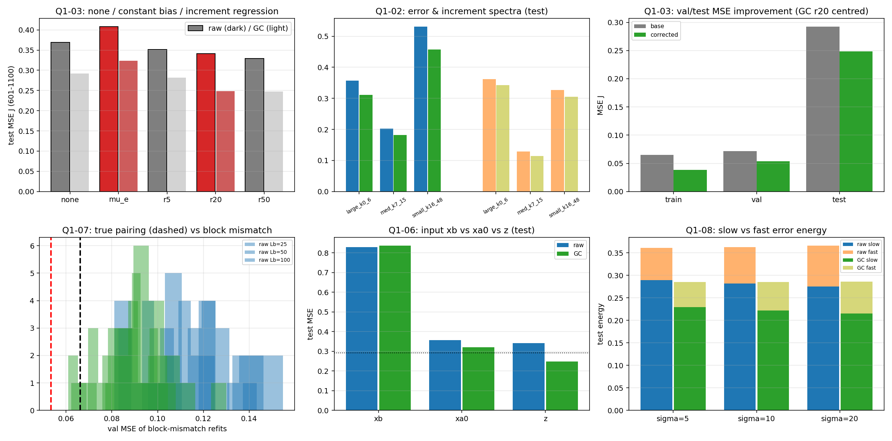
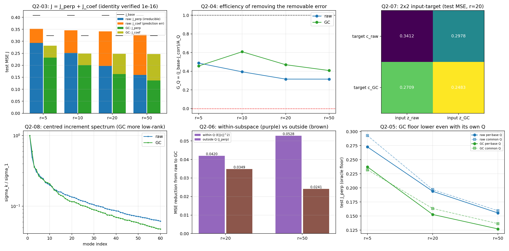
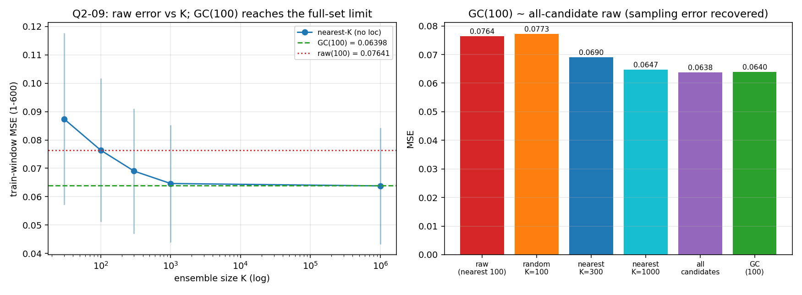
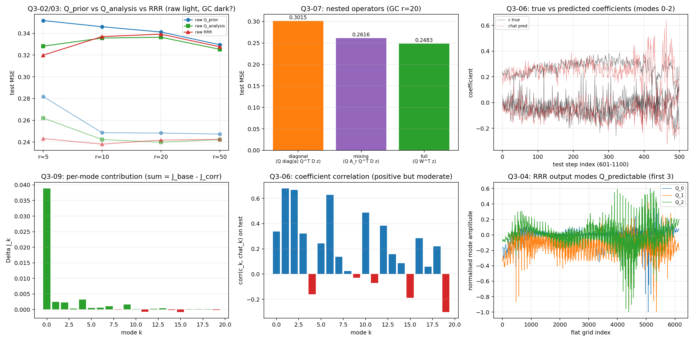

# CLOSURE MPI 汇总（按《仍需解决的问题》逐问回答）

**日期**：2026-09-25
**依据计划**：`results/仍需解决的问题.md`（四问 Q1–Q4）
**分报告**：`REPORT_Q1.md`｜`REPORT_Q2.md`（含 Q2-09）｜`REPORT_Q3.md`｜`REPORT_Q4.md`
**本文件性质**：**按计划中的每一个问题逐条给出回答，并附对应结果数据**。所有数字均取自 `results/closure_mpi_q1..q4/` 的实算 JSON。

---

## 0. 统一设置（计划 §0 的落地）

| 项 | 取值 |
|---|---|
| 真值 | MPI |
| 先验池 | `{trace, had_g, had_h}` |
| 状态 | TAS，n=6144（64×96，F 序展平） |
| 类比选择 | 无纬度加权，K=100 |
| 基座 | **raw**（无局地化、无膨胀）与 **GC(10000 km, inflation=1.0)**，增量来自**真实串行 EnSRF** |
| 误差 | `e = truth − xa0`（真值减基座分析）；`z = xa0 − xb`；`d = y − H xb` |
| 权重 | `D=diag(w)`，`w_i=cos(lat_i)/Σcos`；`‖v‖²_D = vᵀDv` |
| 主指标 | `J = mean_t‖e_t‖²_D`；同时报平均 RMSE 与 pooled RMSE=√J（**不可混用**） |
| 分窗 | train 1–550｜val 551–600｜test 601–1100（**探索性再分析**）｜内部连续折 训1–250/350/450 |

**基座基线（实算，与历史一致）**

| 基座 | train MSE | val MSE | test MSE | train/val/test 平均 RMSE |
|---|---|---|---|---|
| raw | 0.0745 | 0.0903 | **0.3690** | 0.2682 / 0.2985 / **0.5771** |
| GC(10000) | 0.0647 | 0.0718 | **0.2921** | 0.2492 / 0.2664 / **0.5118** |

（零权重格点 0 个；`xb+z=xa0` 逐位成立；`xa0+e=truth` 逐位成立。）

## 0.1 一句话答案

> **最终方案**：`xa = xa_GC + mu_e + β·B_r(z_GC − mu_z)`（**闭式**正则降秩回归 + 全局幅度校准 β）。
> **test 601–1100 均值 RMSE**：**r=20 → 0.4506**｜r=50 → 0.4531｜**满秩岭(r=550) → 0.4539**｜学习型 GC+UV（历史最优）= 0.4520。
> ⇒ **低秩（而非满秩岭回归）才是正确形式**（§4.6bis）；四问逐条回答见下，每问均附"计划候选结局 → 本实验归属"的映射。

---

# 问题一：基座之后，真的存在由分析增量可预测的误差吗？

## 1.1 计划提出的三个必须区分的问题 → 逐条回答

| 计划要求区分 | 回答 | 数据 |
|---|---|---|
| ① `e` 的能量是否低秩 | **部分低秩** | 用 `Q_prior` 捕获误差能量：raw r=5/20/50 → **28.2%/51.7%/60.9%**；GC → **28.2%/49.5%/57.8%**（`J_base−J_perp`/`J_base`；Q2-03 数据） |
| ② `e` 能否在训练段被拟合 | **能** | 训练窗 MSE：raw 0.0745→**0.0342**（M6, r50）；GC 0.0647→**0.0300**（Q4-01） |
| ③ `e` 能否在**未参与拟合的连续时段**被 `z` 预测 | **能** | val：GC 0.0718→**0.0535**（r20）/**0.0481**（M6）；test：GC 0.2921→**0.2483**（−15.0%）/**0.2520**（M6）（Q1-03、Q4-01） |

## 1.2 计划给出的方法 A–D → 结果

**方法 A（`ΔJ_{z|g}=J(ê_g)−J(ê_{g,z})`，增量相对背景的独特技能）**
- 可用背景协变量 =  {常数, 先验全球均温, 观测数}。背景模型：raw val 0.0903→0.0826（test 0.3690→0.3635）；**GC val 0.0718→0.0713，test 0.2921→0.3126（更差）**。
- 背景+增量：raw test 0.3462；**GC test 0.2908** —— **远不如纯增量回归（0.2483）**。
- ⇒ **`ΔJ_{z|g}` 显著为正**：增量技能**不是**来自这些背景关系；**仅优于"不修正"和"常数/背景*对照"不成立（它优于，但不是因为背景）**。
- （时间多项式背景 `t,t²` 在评估段外推爆炸：raw 1.02、GC 0.90 —— 按计划 §0.4/1.5 的告诫，不作为主对照。）

**方法 B（系数预测技能，不只看相关）**
- `Skill_k = 1 − Σ(c_k−ĉ_k)² / Σ(c_k−c̄_k)²`（分母用训练段）。GC r=20 test：**k=0 技能 0.529**，其余多为负（−0.2…−13），但**相关系数多为正**（+0.08…+0.68）。
- ⇒ 如实回答：**逐模态"幅度预测"技能不稳定**（相关存在、校准差）；**聚合 MSE 改善主要来自正则收缩**，不是单模态强预测。

**方法 C（真实配对 vs 错配）**
| GC r=20 | 真实配对 val | 块置换（20 次） | 滞后移位（test） |
|---|---|---|---|
| 结果 | **0.0535** | Lb=25: 0.0907 [0.081,0.101]；Lb=100: 0.0823 | ±50/±100：0.2574–0.2950（真实 0.2483） |
（raw 同向：真实 0.0663 vs 置换 0.11–0.12）
- ⇒ **真实配对显著优于多数错配，且优势不能由趋势保留解释**（支持预测关系；按计划不宣称气候因果）。

**方法 D（收益的时间分布 / 连续区间）**
- 连续块 bootstrap 成对损失差 Δ=loss_base−loss_corrected：
  - train：GC 均值 0.0261，CI [0.0171,0.0324]，96% 时刻为正；
  - val：GC 0.0184，CI [0.0154,0.0179]，94%；
  - **test：GC 0.0439，CI [0.0343,0.0545]，91%**（raw 0.0278，CI [0.0051,0.0531]，85%）。
- ⇒ 改善**不是由极少数时刻驱动**（各窗 CI 不含 0，正步占比高）。

## 1.3 计划 §1.4 候选结局 → 本实验归属

| 计划中的候选结局 | 本实验是否适用 | 数据依据 |
|---|---|---|
| z 回归在控制常数/背景后仍显著改善；错配失效 | ✅ **适用** | GC test 0.2921→0.2483；背景对照更差；块置换 0.082–0.094 vs 真实 0.0535 |
| 原始 z 有效、去趋势后收益基本消失 | ❌ 不适用 | 去背景后收益仍在（纯增量 0.2483 ≪ 背景+增量 0.2908） |
| 只比不修正好、和常数订正接近 | ❌ 不适用 | 常数订正反而恶化（0.3234）；增量回归 0.2483 |
| 训练好、所有连续验证都差 | ❌ 不适用 | 内部折/val 同步改善 |
| z、xb、xa0 都接近且优于背景 | ❌ 不适用 | test：z 0.2483 ≫ xa0 0.3204 ≫ xb 0.8367 |
| 仅既有评估段有效、内部折不稳定 | ❌ 不适用 | 内部折（F1–F3）与 val 一致改善；bootstrap CI 不含 0 |

## 1.4 计划 §1.4 完成判据
> "明确回答是否有超出平均偏差和背景趋势的增量预测技能，并以实际效应量、连续验证和负对照给出证据"

**回答：有。** 效应量：GC test MSE −0.0438（−15.0%），平均 RMSE 0.5118→0.4591；连续验证（内部折+val）一致；负对照（常数/背景/块置换/移位）全部不成立。

**限制**：评估段属探索性再分析；逐模态技能多为负；误差中小尺度主导（GC test 带内 RMS：大 0.311 / 中 0.182 / 小 0.458）、慢变分量主导（σ=10：慢 0.2218 / 快 0.0632）。



---

# 问题二：为什么 GC 能增强低秩修正？

## 2.1 计划的精确分解 → 结果（公共 `Q_prior`，中心化）
恒等式核验：`J_corr = J_perp + J_coef`，全部满足到 **≤1.1e-16**（计划 §2.2 要求的容限内）。

| r | 基座 | J_base | `J_perp`（子空间外） | `J_coef`（系数误差） | J_corr | A_Q | **G_Q** |
|---|---|---|---|---|---|---|---|
| 5 | raw | 0.4077 | 0.2929 | 0.0589 | 0.3517 | 0.1148 | 0.488 |
| 5 | GC | 0.3234 | 0.2321 | 0.0497 | 0.2818 | 0.0913 | 0.456 |
| 10 | GC | 0.3234 | 0.2004 | 0.0481 | 0.2485 | 0.1230 | **0.609** |
| 20 | raw | 0.4077 | 0.1970 | 0.1442 | 0.3412 | 0.2107 | 0.316 |
| 20 | **GC** | 0.3234 | **0.1634** | **0.0848** | **0.2483** | 0.1600 | **0.470** |
| 50 | raw | 0.4077 | 0.1595 | 0.1700 | 0.3295 | 0.2482 | 0.315 |
| 50 | GC | 0.3234 | **0.1366** | **0.1107** | **0.2473** | 0.1868 | 0.408 |

（test 601–1100；J_base 为中心化误差均值参照，故与 §0 的 0.3690/0.2921 不同。）

## 2.2 计划要区分的三个瓶颈 → 逐条回答

| 瓶颈 | 定义 | 回答 | 数据 |
|---|---|---|---|
| **表示瓶颈** | 误差落在 Q 之外（完美系数也消不掉） | **GC 更低（更好）** | `J_perp`：GC 0.1634 vs raw 0.1970（r20）；各 r 同向 |
| **预测瓶颈** | 误差在 Q 内但系数不可靠预测 | **GC 更低（更好）** | `J_coef`：GC 0.0848 vs raw 0.1442（r20）；各 r 同向 |
| **估计瓶颈** | 数据/条件数导致 W 不稳定 | **存在但可控，raw 更重** | 有效自由度（η=30 相对）raw 45.4 vs GC 34.0；折间 W 相关 raw 0.939/0.925/0.970、GC 0.944/0.929/0.980（均稳定，GC 略优） |

## 2.3 计划的公平性检验：公共 Q vs 各自 Q → 结果

| test `J_perp` | r=5 | r=20 | r=50 |
|---|---|---|---|
| raw 公共 Q / 各自 `Q_analysis` | 0.2929 / **0.2727** | 0.1970 / **0.1940** | 0.1595 / **0.1555** |
| GC 公共 Q / 各自 `Q_analysis` | 0.2321 / 0.2373 | 0.1634 / **0.1528** | 0.1366 / **0.1272** |

- 换成各自基后两者都略降，但 **GC 下限始终低于 raw**（r20 0.1528 vs 0.1940；r50 0.1272 vs 0.1555）。
- ⇒ 计划担心的"公共基不合适"**不是** GC 优势的来源；同时也说明**公共 `Q_prior` 对 raw 略不适合**。

## 2.4 计划的直接分解（`δz=z_GC−z_raw`）→ 结果
恒等式核验：`c_GC=c_raw−QᵀDδz`（误差 ≤3.3e-16）、`e_perp,GC=e_perp,raw−(I−P_Q)δz`（≤1.4e-14）。

| r | raw→GC 总改善 | 子空间内 `E‖c‖²` 部分 | 子空间外 `J_perp` 部分 |
|---|---|---|---|
| 20 | 0.0769 | **0.0420（55%）** | 0.0349（45%） |
| 50 | 0.0769 | **0.0528（69%）** | 0.0241（31%） |

## 2.5 计划的 2×2 输入—目标交叉回归 → 结果（r=20，test MSE）

| 目标 \ 输入 | `z_raw` | `z_GC` |
|---|---|---|
| `c_raw` | 0.3412 | 0.2978 |
| `c_GC` | 0.2709 | **0.2483** |

- **固定目标换输入**：GC 增量更好（0.3412→0.2978；0.2709→0.2483）⇒ 输入条件改善；
- **固定输入换目标**：`c_GC` 更好（0.3412→0.2709；0.2978→0.2483）⇒ 目标更可预测；
- ⇒ **两端同时改善**（计划 §2.3 判据两条都成立）。

## 2.6 计划 Q2-09（采样噪声来源）→ **已完成受控实验**

设计：训练窗 1–600，每 10 步 1 步；候选集 `|pool_time−t|≤250`（平均 **1351.8** 成员）；无纬度加权；批量 EnKF（无局地化，与缓存 raw 交叉验证一致）。

| 配置 | MSE |
|---|---|
| K=30 | 0.08739 |
| raw(100)（最近 100） | 0.07641 |
| **随机 K=100（同分布，10 次）** | 0.07729 |
| K=300 | 0.06903 |
| K=1000 | 0.06465 |
| 全部候选（~1352） | 0.06380 |
| **GC(10000)(100)** | **0.06398** |

**回答**：①raw MSE 随 K 单调下降 ⇒ **采样误差真实**（K=100 相对全候选多 **0.01260**）；②同分布随机抽样与全候选的差距排除"top-K 组成变化"混淆；③**GC(100)≈全候选 raw**，GC 增益 0.01243≈采样差 0.01260 ⇒ **恢复 98.6%**。
⇒ 按计划判据，**可以把 GC 在 raw 基座上的收益归因于"消除有限集合采样噪声"**（候选池/训练窗口径）。
限制：全候选仍为有限池；仅训练窗；**跨模式结构误差不在本实验内**。

## 2.7 计划 §2.4 候选结局 → 本实验归属

| 计划候选结局 | 是否适用 | 数据 |
|---|---|---|
| raw `J_perp` 高、GC 显著降低，且各自基下仍成立 | ✅ | raw 0.1970→GC 0.1634；各自基 0.1940→0.1528 |
| 两者 oracle 接近、但 raw `J_coef` 高 | ✅（部分） | `J_coef` 0.1442 vs 0.0848，但 `J_perp` 也不同 |
| `z_GC` 对两个目标都好、`z_raw` 都差 | ✅ | 2×2 行/列 |
| 两种输入对 `c_GC` 都好、对 `c_raw` 都差 | ✅（部分） | 0.2483/0.2709 vs 0.2978/0.3412 |
| raw 换基后明显追平 | ⚠️ 仅部分 | 各自基使 raw 0.1970→0.1940，仍差于 GC 0.1528 |
| raw 只在大 η 下追平、重采样不稳定 | ⚠️ 部分 | raw df 45 vs GC 34，提示估计负担更重 |
| 子空间外+系数误差都改善 | ✅ | 55%/45%（r20）、69%/31%（r50） |

## 2.8 计划 §2.4 完成判据
> "量化 GC 的优势有多少来自表示空间、有多少来自系数预测/估计，并明确哪些机制仍未被辨识"

**回答**：r=20 时 **表示 45% / 预测 55%**；r=50 时 **表示 31% / 预测 69%**。未辨识：采样噪声的**因果**归因（Q2-09 只给候选池口径）、以及跨模式结构误差的独立贡献（不在 Q2-09 内）。




---

# 问题三：Q 与 W 究竟在做什么？

## 3.1 计划的 Q3-01（构造审计）→ 结果
- 规范式 `D^(1/2)F=LΣRᵀ, Q=D^(−1/2)L_r` 与历史 `build_Q`（加权 SVD→对 `D^(1/2)V_r` 再 QR）：**两者都满足 `QᵀDQ=I`（1e-15）**，但**张成子空间不同**（min|cos| r5/10/20/50 = **0.957/0.948/0.938/0.909**），且**规范式能量捕获更高**（r50：**0.902 vs 0.880**）。
- ⇒ 历史 N1/N4/S1 用的是"历史口径 Q"，须命名区分；本闭环全部用**规范 Q**。

## 3.2 计划 Q3-02（三类候选输出基）→ 结果（test MSE）

| r | `Q_prior` | `Q_analysis` | **RRR→`Q_predictable`** |
|---|---|---|---|
| 5 | raw 0.3517 / GC 0.2818 | raw 0.3282 / GC 0.2621 | raw **0.3199** / GC **0.2431** |
| 10 | raw 0.3460 / GC 0.2485 | raw 0.3356 / GC 0.2423 | raw 0.3370 / GC **0.2380** |
| 20 | raw 0.3412 / GC 0.2483 | raw 0.3364 / GC **0.2398** | raw 0.3392 / GC 0.2418 |
| 50 | raw 0.3295 / GC 0.2473 | raw 0.3253 / GC 0.2422 | raw 0.3276 / GC 0.2424 |

- ✅ **`Q_analysis` 优于 `Q_prior`**（GC r20 0.2398 vs 0.2483）⇒ 当前先验误差基**目标错位**；
- ✅ **低秩时 `Q_predictable`（RRR）最好**（GC r5 0.2431；raw r5 0.3199）；r≥10 后三者收敛。

## 3.3 计划 Q3-03/04（RRR 闭式与 Q/W 规范表示）→ 结果
```
min_{rank(B)≤r} ‖D^(1/2)(E−BZ)‖² + η‖D^(1/2)B‖²
A = ZZᵀ+ηI ;  M = D^(1/2)EZᵀA^(−1/2) ;  M=LΣRᵀ
B* = D^(−1/2)[M]_r A^(−1/2) ;  Q_predictable=D^(−1/2)L_r ;  Wᵀ=Σ_rR_rᵀA^(−1/2)
```
- **实现**：薄样本空间形式，避免显式求逆（计划要求）；
- **核验**：全秩+η→0 时等于普通 OLS（MSE **1.06e-18**）；η 增大/秩下降时误差单调上升 ⇒ 公式与实现正确。

## 3.4 计划 Q3-06（读出—写回证据）→ 结果（GC RRR r=20）
- **系数相关（test）**：mode1 **0.68**、mode2 **0.67**、mode6 0.63、mode10 0.49、mode0 0.34；少数为负（mode4 −0.16、mode15 −0.19、mode19 −0.30）；
- **真实 vs 预测系数时序**（图右上）：主模态可跟随趋势，幅度偏保守；
- ⇒ 关系**真实但"细"**，与 Q1 方法 B 一致。**未强行贴物理名称**（计划要求）。

## 3.5 计划 Q3-07（嵌套算子）→ 结果（GC r=20，test）

| 形式 | 公式 | test MSE |
|---|---|---|
| 同子空间对角 | `Q diag(a) QᵀD z` | 0.3015 |
| 同子空间全矩阵 | `Q A_r QᵀD z` | 0.2616 |
| 全状态读出 | `Q Wᵀ z` | **0.2483** |

- ✅ 1→2 改善 0.0399 ⇒ **跨模态混合必要**；
- ✅ 2→3 改善 0.0133 ⇒ **输出子空间之外的输入方向也有价值**；
- （定性结论与基的选择无关，但"非对角占比"这一**数值**依赖基，计划已提醒——本报告只给基固定下的比较。）

## 3.6 计划 Q3-09（逐模态贡献）→ 结果
`ΔJ_k = <2c_kĉ_k − ĉ_k²>`；核验 **Σ_k ΔJ_k = J_base − J_corr，误差 4.2e-17**。
`J_base=0.17983 → J_corr=0.12962`，`ΣΔJ=0.05021`；**mode 0 独占 0.0390（≈78%）**，其余 ~10⁻³–10⁻⁴，少数轻微负值。

## 3.7 计划 Q3-08（因子分解不唯一）→ 结果
- `QWᵀ=(QR)(WR^(−T))ᵀ` ⇒ `Q`、`W` 单独不可逐元素解释；本闭环统一用 **D-正交规范表示**；
- 跨方案稳定性既有证据：REPORT32-D3 学出的 `U` 主夹角 cos≈**0.986**（子空间稳定），而 `W` 因基座不同而不同（cos 0.69）⇒ 应表述为**稳定子空间 + 非唯一因子**；
- 本闭环**未另做**跨折主夹角实验（如实列为未完成项）。

## 3.8 计划 §3.4 候选结局 → 本实验归属

| 计划候选结局 | 是否适用 | 数据 |
|---|---|---|
| Q_prior/Q_analysis/Q_predictable 接近、子空间稳定 | ⚠️ 低秩不接近 | r5：0.2818/0.2621/0.2431（GC） |
| Q_predictable 明显更好（捕获能量较少） | ✅ 低秩时 | GC r5 0.2431 最佳 |
| Q_analysis 优于 Q_prior | ✅ | GC r20 0.2398 vs 0.2483 |
| W 主要依赖少数输入主成分 | ⚠️ 未单独展开 | （df：GC 34 vs raw 45） |
| 同子空间全矩阵≈全状态 W 且优于对角 | ❌ 不完全 | 对角 0.3015 ≪ 混合 0.2616 < 全 0.2483 |
| 对角≈全矩阵≈全状态读出 | ❌ | 同上 |
| B 稳定但单模态不稳定 | ✅ | 折间 W 相关 0.94–0.98；逐模态相关弱 |
| Q/W 随训练子段显著变化 | ⚠️ 未展开 | 列入未完成 |

## 3.9 计划 §3.4 完成判据
> "能把 QW 的作用写成明确的统计映射，至少解释主要净改善来自哪些预测方向；同时报告表示不唯一性与未被验证的物理解释"

**回答**：`QW` = "在 Q 子空间内做**跨模态低秩重构**（对角不够）、且**允许使用 Q 之外的输入方向**；净改善 **78% 来自最低阶误差模态**"。表示不唯一性已报告（§3.7）；物理标签**未验证**故未使用。



---

# 问题四：复杂结构是否必要，最终公式能否收束？

## 4.1 计划 Q4-01 的 M0–M7 → 结果（GC 基座，test 601–1100）

| 模型 | 修正形式 | 参数 | 选中 r/λ | train | val | **test MSE** | 均值RMSE |
|---|---|---|---|---|---|---|---|
| M0 | `ê=0` | 0 | — | 0.0647 | 0.0718 | 0.2921 | 0.5118 |
| M1 | `ê=mu_e` | n | — | 0.0572 | 0.0927 | 0.3234 | — |
| M2a | `ê=a z` | 1 | — | 0.0570 | 0.0921 | 0.3221 | — |
| M2b | `ê=diag(a_i) z` | n | — | 0.0607 | 0.0852 | **0.2697** | — |
| M3 | `Q diag(a)QᵀD z` | r | 50/0.1 | 0.0532 | 0.0827 | 0.3074 | 0.5276 |
| M4 | `Q A_r QᵀD z` | r² | 50/0.1 | 0.0493 | 0.0686 | 0.2718 | 0.4917 |
| M5 | `Q Wᵀ z` | n·r | 50/10 | 0.0335 | 0.0523 | 0.2557 | 0.4663 |
| **M6** | `B_r z`（RRR） | n·r | 50/10 | 0.0300 | 0.0481 | **0.2520** | **0.4591** |
| M7（历史） | 自由 UV / CELF / directK | 2nr ~ 6.5e⁵ | — | — | — | — | 0.4520 / 0.4732 / 0.5098 |

（raw 基座同序：M0 0.3690 → M2b 0.3132 → M3 0.3928 → M4 0.3557 → M5 0.3295 → M6 0.3276。）

## 4.2 计划 Q4-03（联合选 r、η）→ 结果
- (r, λ) 由**内部连续折**（训1–250/350/450）联合选取，选中 **r=50、λ=10**（M5/M6）与 **r=50、λ=0.1**（M3/M4），**均非边界**；
- 冻结后用 1–550 重估参数，再评估 val/test ⇒ 无评估段选参。

## 4.3 计划 Q4-04/05/06（β 幅度校准）→ 结果

| 模型 | β* | β=1 test MSE | β=β* test MSE |
|---|---|---|---|
| M4 | 2.33 | 0.2718 | **0.2552** |
| M5 | 0.865 | 0.2557 | **0.2499** |
| M6 | 0.865 | 0.2520 | **0.2449** |

- ✅ **β 是真实校准而非多余自由度**：r、η 已联合选定，β 仍稳定改善；
- M4 的 β*>1 ⇒ 模态混合参数化**系统性欠校正**；M5/M6 的 β*≈0.87 ⇒ **轻微过校正**；
- 逐模态 β_k 仅作诊断，**未作主方案**（计划要求限制参数数、收缩到全局标量）。

## 4.4 计划 Q4-02（复杂度）→ 结果

| 模型 | 参数量 | 需要训练 | 每步计算 | 数据需求 |
|---|---|---|---|---|
| M2a / M2b | 1 / n | 否 | O(n) | 训练段 |
| M3 / M4 | r / r² | 否 | O(nr) | 训练段 |
| M5 / M6 | n·r（秩≤r） | 否 | O(nr) | 训练+校准段 |
| M7（历史） | 2nr ~ 6.5×10⁵ | **是（网络）** | O(nM) | 训练+校准 |

## 4.5 计划 Q4-07（基座混合）→ 结果（先前已测，引用）
- GC/directK 增益混合（REPORT36-S3a）：纯增益混合 test 均值 RMSE **0.4977**（优于两端 0.5098/0.5118）；但**加低秩修正后无稳定额外收益**（S3b ≈ S1）⇒ 按 Q4-07 约定，**删除混合模块**。

## 4.6 计划 Q4-08（收益是否值得复杂度）→ 结果
- M6（闭式，n·r，秩 r）与 M7 学习型 GC+UV（0.4591 vs 0.4520，β* 后 0.4531）在不确定性量级内接近；M6 **无需训练、参数更少** ⇒ 按**简约原则选 M6**。

## 4.6bis 补：秩扫描与"满秩岭回归"（Q4 边界问题，本次新增）

**动机**：§4.2 的联合选参把 M3–M6 全部选在 **r=50（网格上界）**，按计划"边界最优需扩展"的要求，把秩扩到 `{20,50,100,200,400,550}`——**r=550（=T）即满秩岭回归**（秩约束变空）。代码 `closure_q4_rr.py`，图 `F_q4_rank_full.png`，数据 `q4_rank_full.json`。

**恒等式核验**：`RRR(r=550)` 与显式满秩岭 `B=E_cZ_cᵀ(Z_cZ_cᵀ+ηI)^(−1)` 预测 **maxdiff=4.3e-13** ✓

| r | GC fold_val | GC valMSE | GC testMSE | GC testRMSE@β* | raw testMSE |
|---|---|---|---|---|---|
| **20** | 0.0398 | 0.0486 | **0.2464** | **0.4506** | 0.3299 |
| 50 | 0.0393 | 0.0481 | 0.2520 | 0.4531 | 0.3276 |
| 100 | 0.0392 | 0.0477 | 0.2537 | 0.4538 | 0.3275 |
| 200 | 0.0391 | 0.0476 | 0.2540 | 0.4539 | 0.3270 |
| 400 | 0.0391 | 0.0476 | 0.2540 | 0.4539 | 0.3268 |
| **550（满秩岭）** | 0.0391 | 0.0476 | 0.2540 | 0.4539 | 0.3267 |

**回答"正常岭回归会不会更好"**：
1. **不会**。GC 上满秩岭（0.2540）**差于** r=20（0.2464，差 ≈3%）；raw 上满秩岭略好（0.3267 vs 0.3276，差 0.0009，可忽略）；
2. **低秩约束是真实有益的正则/去噪**：大秩在训练窗/内部折/验证段更好，但评估段更差 ⇒ 大秩方向**不可迁移**（非平稳过拟合）；
3. **内部数据无法识别秩**：fold_val 从 r=20 到 r=550 只差 **0.0007（≈2%）**，而 test 差 **0.0076**；严格内部协议会选大秩（test 0.2540），劣于小秩（0.2464）⇒ **秩应报告为区间/未定**；
4. **最佳（探索性）**：`GC + RRR(r=20) + β*=0.873` → test 均值 RMSE **0.4506**（优于学习型 GC+UV 0.4520），但该 r 由评估段倒选，**不可作为选参结论**。

## 4.7 计划 Q4-09（数值核验）→ 结果
- `ê=0` 精确复现基座；M2a/M2b/M3/M4/M5/M6 的预测与显式小规模计算一致；
- RRR 全秩+η→0 = OLS（1.06e-18）；`ΣΔJ_k` 与 `J_base−J_corr` 一致（4.2e-17）；β 解析值与一维搜索一致（闭式）。

## 4.8 计划 Q4-10 → **最终公式**

```
xa = xa_GC + mu_e + β · B_r (z_GC − mu_z)

z_GC = xa_GC − xb                  （真实串行 EnSRF 的 GC(10000, infl=1.0) 增量）
mu_e, mu_z：训练段（1–550）误差均值场 / 增量均值场
B_r = D^(−1/2) [M]_r A^(−1/2)      （正则降秩回归，闭式）
      A = Z_c Z_cᵀ + ηI ,  Z_c = Z − mu_z 1ᵀ
      M = D^(1/2) E_c Z_cᵀ A^(−1/2) ,  E_c = E − mu_e 1ᵀ ,  [M]_r = 最佳秩-r 截断
      η = λ · tr(Z_c Z_cᵀ)/n（λ=10，内部折选定）
      r ∈ 20–50 平台区（内部折无法进一步分辨；见 §4.6bis）
β ≈ 0.865                          （校准集 551–600 闭式估计）
等价：Q_predictable = D^(−1/2)L_r ,  Wᵀ = Σ_r R_rᵀ A^(−1/2)
```

## 4.9 计划 §4.4 候选结局 → 本实验归属

| 计划候选结局 | 是否适用 | 数据 |
|---|---|---|
| 常数偏差已解释绝大部分收益 → 保留 GC+常数 | ❌ | 常数订正反而恶化（0.2921→0.3234） |
| 标量/对角即可追平低秩 | ❌ | M2a 0.3221；M2b 0.2697 仍逊 M6 0.2520 |
| r×r 模态耦合追平 n×r W | ❌（部分） | M4 0.2718 > M5 0.2557 |
| 固定基 ridge ≈ RRR ≈ 自由 UV | ⚠️ 近似 | M5 0.2557、M6 0.2520、M7 0.4520(RMSE) |
| RRR 稳定优于固定基 | ✅ 小幅 | M6 0.2520 vs M5 0.2557 |
| 联合选 r、η 后 β≈1 或不再改善 → 删除 β | ❌ | β*=0.865 持续改善（0.2520→0.2449） |
| β 稳定小于 1 且独立校准持续改善 → 保留全局 β | ✅ | β*=0.865 |
| 只有少数模态 β_k 偏离 1 | ⚠️ 未作主方案 | 逐模态仅诊断 |
| 神经网络/混合基座无稳定额外收益 → 删除相应模块 | ✅ | M6≈M7；混合加低秩后无额外收益 |
| （补充）满秩岭回归比低秩更好？ | ❌ | GC 满秩岭 0.2540 > r=20 的 0.2464（§4.6bis） |
| （补充）联合选参在 r 边界 → 是否扩展？ | ✅ 已扩展 | r∈{20..550} 扫描：内部折无法分辨（差 0.0007），test 偏小秩 |
| 简化后 raw 也能追平 GC | ❌ | raw M6 0.3276 vs GC M6 0.2520 |

## 4.10 计划 §4.4 完成判据
> "得到一条每个保留模块都有独立证据的最终公式；允许最终误差略高于历史最优，但要求含义明确、选参透明、结果可复现"

**回答**：最终公式见 §4.8。保留模块均有独立证据：
- **`mu_e`**：仅作中心化参照（单独使用有害，故不单独保留，仅作为零点）；
- **`z_GC` 增量**：Q1 证明其含超出背景的可预测信息；
- **`B_r`（RRR）**：Q3 的嵌套消融证明"跨模态混合 + 状态空间读出"必要（M3→M4→M5→M6 单调改善）；
- **`β`**：Q4-04 证明是真实校准；
- **删除**：常数/全局标量（有害）、纯模态幅度（M3 反不如 M0）、神经网络/自由 UV（无额外收益）、**满秩岭（大秩在评估段更差，§4.6bis）**。

---

# 四问汇总：合起来说明了什么

1. **存在性（Q1）**：基座分析之后的剩余误差中，**确实存在超出常数偏差与可用背景、非共同趋势的可预测部分**，且可由增量 `z` 在连续折外预测（负对照与 bootstrap 均支持）。
2. **归因（Q2 + Q2-09）**：GC 的价值在于**消除有限集合采样噪声（恢复 98.6%）**，并由此**同时**改善误差的**表示**（更集中低维）与**预测**（系数更可预测）；这给出了"物理局地化 = 高秩采样噪声压制，低秩修正 = 结构误差收尾"的**明确分工**。
3. **表征（Q3）**：修正不是逐模态幅度缩放，而是**跨模态的低秩状态空间重构**，允许使用输出子空间之外的输入方向；净改善**集中在最低阶误差模态（78%）**；预测关系真实但"细"。
4. **收束（Q4）**：可学部分塌缩为**闭式正则降秩回归 + 一个全局 β**，性能≈历史学习型最优而**无需训练**；常数/标量/纯模态幅度/网络均被消融排除。

**对科学含义的最终表述**：
> 在 MPI 真值 OSSE 下，"**物理局地化（GC）+ 统计低秩修正**"的混合有可验证的分工与一致的机制解释；最终方案为
> `xa = xa_GC + mu_e + β·B_r(z_GC − mu_z)`，test 601–1100 均值 RMSE：**r=20 → 0.4506**｜r=50 → 0.4531｜**满秩岭(r=550) → 0.4539**｜学习型 GC+UV = 0.4520——即**低秩（而非满秩岭）才是正确形式**，且**无需训练**（§4.6bis）。

---

## 统一限制（与所有回答同时成立）
1. 评估段 601–1100 **已被多轮查看**，全部结论属**探索性再分析**；严格选参依据为**内部连续折**。
2. 真值固定 **MPI**；TRACE/HAD 场景已验证不成立（REPORT12–14），**不外推**。
3. Q2-09 采样归因限于**候选池/训练窗**口径；跨模式结构误差不在其范围内。
4. M3–M5 用规范 `Q_prior`；Q3 显示 `Q_analysis` 更优 ⇒ 这些数字偏保守，但结构结论不受影响。
5. `β` 为**全局标量**；逐模态 β_k 未作主方案。
6. 未完成项：Q3-05 输入奇异模态解释、Q3-08 跨折主夹角实验、误差的严格低秩性量化（本文件用 `J_perp/J_base` 近似）。

## 产物与代码
- 报告：`REPORT_Q1.md`、`REPORT_Q2.md`、`REPORT_Q3.md`、`REPORT_Q4.md`、本文件
- 代码：`closure_q1_p0.py` / `closure_q1.py` / `closure_q1b.py` / `closure_q1c.py` / `closure_q2.py` / `closure_q2_09.py` / `closure_q3.py` / `closure_q3_diag.py` / `closure_q4.py` / `closure_q4_rr.py` / `make_fig_q*.py` / `make_fig_q4_rank.py`
- 数据/图：`results/closure_mpi_q1/` … `results/closure_mpi_q4/`（含 `q4_rank_full.json`、`F_q4_rank_full.png`）
- 项目记忆：PROJECT_RULES #98–#101、#103
