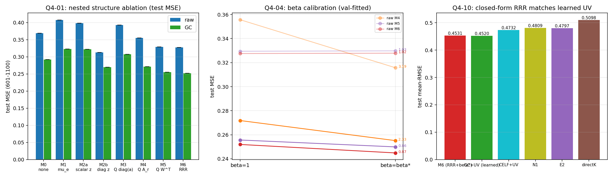

# CLOSURE MPI 汇总：低秩同化修正的科学闭环（Q1–Q4）

**日期**：2026-09-25
**适用**：`/home/lllei/wbgu/agentplay/online_ml/loc_learning/`
**依据计划**：`results/仍需解决的问题.md`
**性质**：Q1–Q4 四份报告的总汇（结论 + 关键数字 + 图 + 最终公式 + 限制）。
**分报告**：`REPORT_Q1.md` / `REPORT_Q2.md`（含 Q2-09）/ `REPORT_Q3.md` / `REPORT_Q4.md`

---

## 0. 一句话结论

> 在 MPI 真值、GC(10000) 基座下，基座分析之后**存在可由分析增量预测的剩余误差**；该修正可收束为一个**闭式正则降秩回归 + 一个全局幅度校准 β**：
> ```
> xa = xa_GC + mu_e + β · B_r (z_GC − mu_z)
> ```
> test 601–1100 均值 RMSE **0.4531**（β=1 时 0.4591），**≈ 历史两阶段学习型 GC+UV（0.4520）**，且**闭式、无需训练、参数更少**。

---

## 1. 统一设置

- 真值 MPI；先验池 `{trace,had_g,had_h}`；状态 TAS n=6144；无纬度加权类比选择（与 `pairs_unw` 同口径）。
- 基座：**raw**（无局地化/无膨胀）与 **GC(10000 km, inflation=1.0)**，增量均来自**真实串行 EnSRF**。
- 误差定义 `e = truth − xa0`（真值减基座分析）；主指标加权 MSE `J=mean‖e‖²_D`，`w_i=cos(lat_i)/Σcos`；同时报平均 RMSE 与 pooled RMSE=√J（**两者不可混用**）。
- 基座 MSE（train/val/test）：raw 0.0745/0.0903/**0.3690**；GC 0.0647/0.0718/**0.2921**（对应平均 RMSE 0.2682/0.2985/**0.5771** 与 0.2492/0.2664/**0.5118**）。
- 评估段 601–1100 **已被多轮查看**，四份报告均将其定位为**探索性再分析**；严格选参依据是内部连续折。

---

## 2. Q1：基座之后是否存在"由增量可预测的剩余误差"？——**是**

**五条证据**
1. **超出常数平均偏差**：训练窗 `mu_e` 在评估段**反而恶化**（GC 0.2921→0.3234；raw 0.3690→0.4077）。
2. **超出可用背景协变量**：加"先验全球均温+观测数"背景在 GC 上**伤害**评估段（0.3126>0.2921）；"背景+增量"0.2908 **远不如纯增量**。
3. **非共同趋势伪相关**：时间块置换（GC 真实 val 0.0535 vs 置换 0.082–0.094）与滞后移位都**显著更差**。
4. **验证段与评估段一致**：GC 增量岭回归 r20 val 0.0718→0.0535、test 0.2921→**0.2483（−15.0%）**。
5. **`z` 是最可迁移输入**：test `z(0.2483) ≫ xa0(0.3204) ≫ xb(0.8367)`。

**统计**：连续块 bootstrap 成对改善 Δ 的 CI 不含 0（GC test Δ=0.0439 [0.0343,0.0545]，91% 时刻为正）。
**如实限制**：逐模态系数技能多为负（相关为正、幅度失配）⇒ 聚合改善**依赖正则收缩**；误差**中小尺度主导**（GC 小带 0.458 vs 中带 0.182）、**慢变分量主导**（σ=10 慢 0.2218 / 快 0.0632）。


---

## 3. Q2：为什么 GC 增强低秩修正？——**表示 + 预测两面同时改善**；**采样噪声归因成立**

**Q2-03/04 误差分解**（公共 `Q_prior`，恒等式 `J_corr=J_perp+J_coef` 满足到 ≤1.1e-16）

| r | 基座 | J_base | `J_perp`（子空间外） | `J_coef`（系数误差） | J_corr | G_Q |
|---|---|---|---|---|---|---|
| 20 | raw | 0.4077 | 0.1970 | 0.1442 | 0.3412 | 0.316 |
| 20 | **GC** | 0.3234 | **0.1634** | **0.0848** | **0.2483** | **0.470** |
| 50 | GC | 0.3234 | 0.1366 | 0.1107 | 0.2473 | 0.408 |

- **表示**：GC 的 `J_perp` 各 r 更低（换成各自 `Q_analysis` 后仍低：r20 0.1528 vs 0.1940）⇒ **GC 误差更集中低维子空间**，非公共基假象。
- **预测**：GC 的 `J_coef` 更低；2×2 交叉回归（r20 test MSE）：`c_raw|z_raw 0.3412 / c_raw|z_GC 0.2978 / c_GC|z_raw 0.2709 / c_GC|z_GC 0.2483` ⇒ **输入与目标两端都改善**。
- **稳定性**：GC 增量更低秩（top5 能量 0.678 vs 0.596；df 34 vs 45）。
- **拆解**：GC 相对 raw 的总改善（r20 0.0769）= 子空间内 0.0420（55%）+ 子空间外 0.0349（45%）；r50 为 69%/31% ⇒ **两面一起**。

**Q2-09 采样噪声受控实验**（训练窗 1–600，候选池平均 1352 成员，无纬度加权）

| 配置 | MSE |
|---|---|
| K=30 | 0.08739 |
| raw(100)（最近 100） | 0.07641 |
| 随机 K=100（同分布，10 次） | 0.07729 |
| K=300 / K=1000 | 0.06903 / 0.06465 |
| 全部候选（~1352） | 0.06380 |
| **GC(10000)(100)** | **0.06398** |

⇒ raw 随 K 单调降（采样误差真实）；**GC(100) ≈ 全候选 raw**，增益 0.01243 ≈ 采样误差 0.01260（**恢复 98.6%**）⇒ 按文档 Q2-09 判据，**GC 在 raw 基座上的收益可归因于消除有限集合采样噪声**（候选池/训练窗口径）。
限制：全候选仍有限池、仅训练窗、**跨模式结构误差不在本实验内**；公共 `Q_prior` 对 raw 略不匹配；raw 需更大正则（df 45 vs 34）。


---

## 4. Q3：Q 与 W 究竟在做什么？

**Q3-02 三类输出基（test MSE，GC）**

| r | `Q_prior` | `Q_analysis` | **RRR → `Q_predictable`** |
|---|---|---|---|
| 5 | 0.2818 | 0.2621 | **0.2431** |
| 10 | 0.2485 | 0.2423 | **0.2380** |
| 20 | 0.2483 | **0.2398** | 0.2418 |

⇒ ①**先验误差基存在目标错位**，应优先用**基座自身剩余误差模态**；②**低秩时"按可预测性选方向"（RRR）价值最大**，r≥10 后三者收敛。

**Q3-03/04 RRR（闭式，薄样本空间实现）**
```
B* = D^(−1/2)[M]_r A^(−1/2) ,  A=ZZᵀ+ηI ,  M=D^(1/2)EZᵀA^(−1/2)
Q_predictable = D^(−1/2)L_r ,  Wᵀ = Σ_r R_rᵀ A^(−1/2)
```
小规模核验：全秩 + η→0 时等于普通 OLS（MSE 1e-18）。

**Q3-07 嵌套算子（GC r20，test）**：对角 `Q diag(a)QᵀDz` 0.3015 **≪** 同子空间混合 `Q A_r QᵀDz` 0.2616 **<** 全状态读出 `Q Wᵀz` **0.2483** ⇒ **跨模态混合必要，且输出子空间之外的输入方向也有价值**。
**Q3-09 逐模态**：`ΣΔJ_k=J_base−J_corr` 核验 4.2e-17；`0.17983→0.12962`，**mode 0 独占 ~78%**。
**Q3-06**：系数相关 mode1 0.68 / mode2 0.67 / mode6 0.63（少数为负）⇒ 关系**真实但细**。
**Q3-08**：因子不唯一（`QWᵀ=(QR)(WR^(−T))ᵀ`），统一 D-正交规范表示；REPORT32-D3 显示子空间稳定而因子不同。


---

## 5. Q4：必要结构与最终公式

**嵌套消融（GC 基座，test 601–1100）**

| 模型 | 结构 | 参数 | 选中 r/λ | train | val | **test MSE** | test 均值RMSE |
|---|---|---|---|---|---|---|---|
| M0 | 不修正 | 0 | — | 0.0647 | 0.0718 | 0.2921 | 0.5118 |
| M1 | 常数 `mu_e` | n | — | 0.0572 | 0.0927 | 0.3234 | — |
| M2a | 全局标量 `a z` | 1 | — | 0.0570 | 0.0921 | 0.3221 | — |
| M2b | 逐格点对角 | n | — | 0.0607 | 0.0852 | **0.2697** | — |
| M3 | 模态幅度 | r | 50/0.1 | 0.0532 | 0.0827 | 0.3074 | 0.5276 |
| M4 | 模态混合 | r² | 50/0.1 | 0.0493 | 0.0686 | 0.2718 | 0.4917 |
| M5 | 全读出 | n·r | 50/10 | 0.0335 | 0.0523 | 0.2557 | 0.4663 |
| **M6** | **RRR** | n·r | 50/10 | 0.0300 | 0.0481 | **0.2520** | **0.4591** |
| **M6+β*** | +幅度校准 | — | β*=0.865 | — | — | **0.2449** | **0.4531** |

**结论**：①常数/全局标量在评估段**有害**（非平稳）；②逐格点对角已获部分收益，但**纯模态幅度 M3 反不如 M0**；③**跨模态混合必要**；④全读出 M5、**RRR M6 最好**；⑤**β 是真实校准而非冗余自由度**（M4 β*=2.33 欠校正；M5/M6 β*≈0.87 轻微过校正）。

**最终公式（推荐）**
```
xa = xa_GC + mu_e + β · B_r (z_GC − mu_z)

z_GC = xa_GC − xb                       （真实串行 EnSRF 的 GC 增量）
mu_e, mu_z：训练段（1–550）误差均值场 / 增量均值场
B_r = D^(−1/2) [M]_r A^(−1/2)           （正则降秩回归，闭式）
      A = Z_cZ_cᵀ + ηI ,  Z_c = Z − mu_z 1ᵀ
      M = D^(1/2) E_c Z_cᵀ A^(−1/2) ,  E_c = E − mu_e 1ᵀ
      η = λ · tr(Z_cZ_cᵀ)/n（λ=10，内部折选定）；r=50
β ≈ 0.865                               （校准集 551–600 闭式估计）
等价：Q_predictable = D^(−1/2)L_r ,  Wᵀ = Σ_r R_rᵀ A^(−1/2)
```

**与历史方法对照（test 均值 RMSE）**
| 方法 | test 均值RMSE | 需训练 |
|---|---|---|
| **M6+β*（本收束）** | **0.4531** | 否（闭式） |
| GC+UV（学习型，历史最优） | 0.4520 | 是 |
| CELF+UV | 0.4732 | 是 |
| E2 / N1 | 0.4797 / 0.4809 | 是 |
| directK | 0.5098 | 是 |
| GC 基座 | 0.5118 | 否 |



---

## 6. 闭环科学逻辑链

> 基座同化产生分析与增量 → **确认剩余误差中存在超出简单背景的可预测部分**（Q1）→ **分解 GC 改变了哪些误差分量与预测条件，并把 raw 基座上的收益归因于消除有限集合采样噪声（98.6%）**（Q2/Q2-09）→ **从误差—增量关系识别可预测子空间，明确"跨模态混合 + 状态空间读出"与最低阶模态的主导贡献**（Q3）→ **用正则降秩回归估计修正系数，仅在必要时做全局幅度校准，以嵌套消融保留最小结构**（Q4）。

---

## 7. 统一限制（如实记录）

1. **评估段 601–1100 已被多轮查看**，全部结论属**探索性再分析**；严格选参依据为内部连续折（训1–250/350/450）。
2. 真值固定为 **MPI**；TRACE/HAD 场景已证不成立（REPORT12–14），本收束**不外推**。
3. `Q2-09` 的采样归因限于**候选池与训练窗**口径；"全部候选"仍是有限池，跨模式结构误差不在该实验内。
4. M3–M5 用规范 `Q_prior`；Q3 显示 `Q_analysis` 更优 ⇒ 这些数字偏保守，但结构结论不受影响。
5. `β` 为**全局标量**；逐模态 β_k 未作主方案。
6. Q3-05（输入奇异模态解释 W）、Q3-08（跨折主夹角）未单独展开。

---

## 8. 产物与代码索引

**报告**：`results/REPORT_Q1.md`｜`results/REPORT_Q2.md`（含 Q2-09）｜`results/REPORT_Q3.md`｜`results/REPORT_Q4.md`｜本文件 `results/CLOSURE_MPI_SUMMARY.md`

**代码**
| 文件 | 作用 |
|---|---|
| `closure_q1_p0.py` | 缓存/定义核对（Q1-01）、Q 构造审计（Q3-01） |
| `closure_q1.py` / `closure_q1b.py` / `closure_q1c.py` | Q1-02..Q1-08 + bootstrap |
| `closure_q2.py` / `closure_q2_09.py` | Q2-02..Q2-08 / Q2-09 采样受控实验 |
| `closure_q3.py` / `closure_q3_diag.py` | Q3 三类基/RRR/嵌套 / 逐模态贡献 |
| `closure_q4.py` | Q4 M0–M6 消融 + β 校准 |
| `make_fig_q1.py`…`make_fig_q4.py`、`make_fig_q2_09.py` | 图件 |

**数据/图**：`results/closure_mpi_q1/`～`closure_mpi_q4/`（`q*_analysis.json`、`F_q*_overview.png`、`F_q2_09_sampling.png`、`base_cache.npz` 等）

**项目记忆**：PROJECT_RULES #97（ANET）、#98（Q1）、#99（Q2+Q2-09）、#100（Q3）、#101（Q4）
