# 从 CNN 自适应局地化到低秩状态空间增益修正
## —— 一个古气候集合数据同化项目中的机器学习方法迁移记录

> **读者定位**：具备机器学习、数学与数据同化基础，但**未曾接触本项目**的研究者。
> **基础文献**：Wang et al. (2023), *Convolutional Neural Network-Based Adaptive Localization for an Ensemble Kalman Filter*, JAMES.
> **代码与数据**：`online_ml/loc_learning/`（Python + PyTorch 1.12.1，4×GPU）；缓存于 `/data1/wbgu/agentdata/loc_learning/`。
> **制图约定**：所有地图叠加 Natural Earth 110m 海陆线，坐标固定 lon (0,360)、lat (-90,90)；配色按取值域——**有正有负 → 蓝-白-红**（RdBu_r）、**非负 → 白-红**（Reds）。

---

## 摘要

本项目是一个**古气候离线集合数据同化（OSEE）**系统：用三套古气候模拟作为先验，用陆/冰代用资料（proxy）作为观测，估计全新世（约 11 ka BP 以来）的温度场（TAS）。系统的基线是**类排序集合卡尔曼滤波（AOEnKF）**，在评估窗（第 601–1100 步，深冰消期盲测）的 TAS RMSE 为 **0.5021**。

我们以 Wang et al. (2023) 的 **CNN 局地化（CLF/CELF）** 为出发点，做了四个阶段的迁移与改造：

| 阶段 | 方法 | 评估窗 TAS RMSE |
|---|---|---|
| ① | 论文式迁移：逐观测 2D U-Net 学习局地化因子（batch CLF/CELF） | 0.5385 – 0.5518（未超基线） |
| ② | 串行一致：以 GC 为残差、可微串行 EnSRF 端到端训练局地化 | 0.5023（≈基线） |
| ③ | **低秩状态空间算子**：在 AOEnKF 分析增量上学 $\rho = I + UV^\top$ | **0.4581 – 0.4724（−6% ~ −8.8%）** |
| ④ | **CELF + PQ 取代 GC 与 inflation**：无 GC、无 inflation，逐观测 U-Net + 低秩算子 | **0.4759（超 AOEnKF_Opt 0.5021）** |

**核心结论**：在本项目中，"学习局地化"几乎无增益空间（oracle 扫描显示 headroom $<0.3\%$）；真正的瓶颈是**增益/协方差的状态空间结构误差（跨模式误差）**。在**完全不改变同化设置**的前提下，用一个秩-5 的线性算子修正分析增量，即可获得稳定、可泛化的盲测增益。阶段④进一步表明：用"学习式 CELF 局地化 + 低秩算子"可以**取代** GC 与 inflation 并超越调参最优基线，但其性价比仍略逊于"直接用 GC + 低秩算子"——因为 GC 的价值在于压制**高秩远距采样噪声**，而低秩算子只能修正**低秩结构误差**。

---

## 1. 项目背景与问题定义

### 1.1 系统概述

- **状态**：地表气温异常场 TAS，展平为 $n = 6144$ 维（$96$ 经度 $\times$ $64$ 纬度，经度变化最快）。
- **先验**：三套独立古气候模拟 `trace`、`had_g`、`had_h`，各自提供一条时间序列；按时间步对齐。
- **观测**：约 $1276$ 个陆/冰代用资料站点（proxy），每个时刻有部分站点有效，记为 $M_t$ 个观测（$M_t \approx 380$–$720$）。观测值 $y$ 由"伪代理"生成（真值场在站点处的插值加噪声），误差方差记为 $R_i$。
- **真值（OSSE）**：一套独立模拟 `mpi` 的 TAS 场，仅用于评估与（训练阶段的）监督，绝不进入同化。
- **时间轴**：共 1100 步（约 4.5–11 ka BP）。约定：
  - **校准窗**（训练/验证）：第 1–600 步；
  - **评估窗**（盲测）：第 601–1100 步（深冰消期，模型分歧最大）。

观测网络的**空间分布**与**时间可用性**是理解后续所有方法的前提。图 1 给出全部 1276 个代理站点的经纬位置，并以 $t=850$ 为例标出该时刻有效的 594 个站点；站点在欧洲、北美与北冰洋沿岸高度密集，热带与南半球稀疏。图 2 则对比了真值 `mpi` 与三套先验的时均异常场，直观显示跨模式差异的量级（图中共用对称色标 $\pm3.2$）。图 3 给出每个时刻的有效观测数 $M_t$：它从校准窗的约 720 个逐步下降到深冰消期的约 380 个——**评估窗的观测更少、问题更难**，这一点在后文结果解读中反复出现。

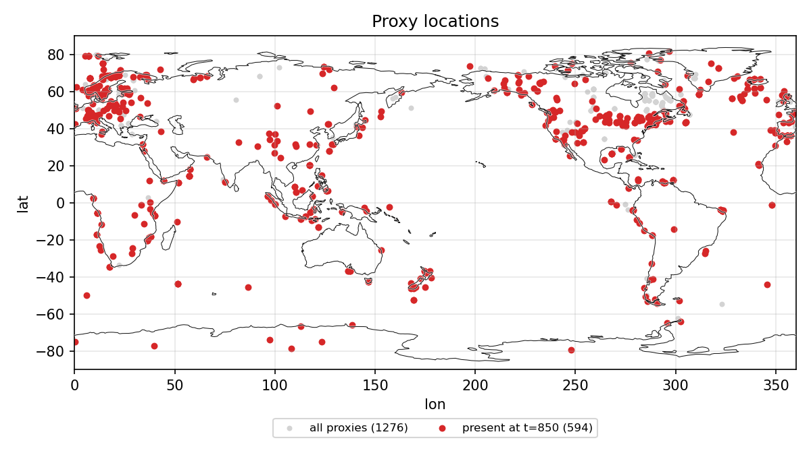

**图 1. 代理站点分布。** 横轴经度（0–360°），纵轴纬度（−90–90°）。灰色点为全部 1276 个 gwb 代理站点，红色点（594 个）为 $t=850$ 时刻有效、参与同化的站点。**解读**：站点分布极不均匀（欧亚—北美高纬密集），因此观测的空间代表性在纬度间差异很大；这正是同化中需要 cos 纬度加权评估、并考虑观测密度的原因。

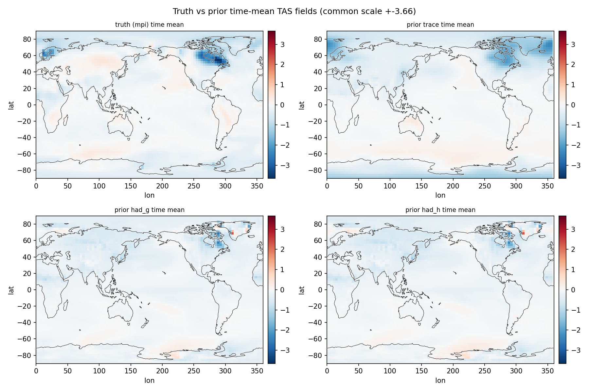

**图 2. 真值与三套先验的时均异常场对比。** 四个面板分别为 `mpi`（真值）、`trace`、`had_g`、`had_h` 的 TAS 时均异常场，共用对称色标 $\pm3.2$ K（蓝-白-红）。**解读**：三套先验彼此之间、以及它们与真值之间存在明显的**系统性空间差异**，其量级与真值本身的异常幅度相当。这说明本项目的主要误差是**跨模式结构误差**，而不是有限集合的随机采样误差——这是后续方法论选择的根本依据。

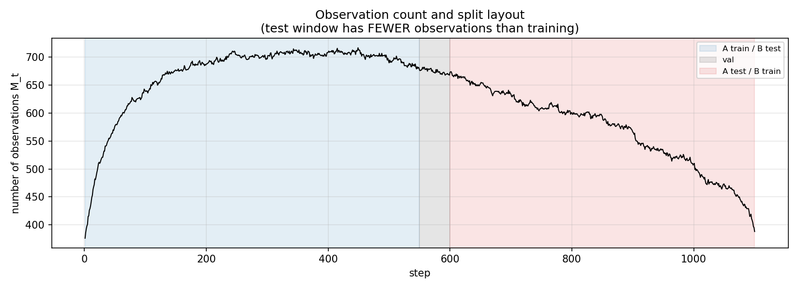

**图 3. 有效观测数随时间的变化与数据划分。** 横轴为时间步，纵轴为有效代理数 $M_t$；阴影标出 Split A（train 1–550 / val 551–600 / test 601–1100）与 Split B（train 601–1100 / test 1–550）的划分。**解读**：$M_t$ 在评估窗明显偏低（约 380–720），意味着**盲测是在观测更稀疏、气候信号更强的时段完成的**；任何在评估窗取得的改进都发生在更不利的条件下。

### 1.2 记号约定

| 符号 | 含义 | 维度 |
|---|---|---|
| $n$ | TAS 状态维数 | 6144 |
| $K$ | 集合成员数 | 100 |
| $M = M_t$ | $t$ 时刻有效观测数 | 约 380–720 |
| $\eta$ | 膨胀系数（inflation） | 1.5 |
| $\mathbf{x}_f$ | 先验集合均值 | $n$ |
| $\mathbf{x}_t$ | 真值场 | $n$ |
| $\mathbf{d}$ | 新息 $y - H\mathbf{x}_f$ | $M$ |
| $K_s$ | 样本（全矩阵）卡尔曼增益 | $n\times M$ |
| $\rho_{\mathrm{GC}}$ | Gaspari–Cohn 局地化权重（截断半径 7500 km） | $M\times n$ |
| $w_j$ | 评估权重 $\cos(\mathrm{lat}_j)$ | $n$ |

### 1.3 核心问题

传统集合 DA 中，**有限集合**会产生远距离伪相关，需要**局地化**抑制。本项目的基线 AOEnKF 采用 Gaspari–Cohn（GC）局地化。我们的出发点正是论文的"用 CNN 学习自适应局地化"。但在推进中我们发现：

1. **局地化不是本项目的瓶颈**——最优 GC 与任何局地化变体之间的差距 $<0.3\%$（§6.4 给出 oracle 扫描证据）；
2. **真正的误差来源是跨模式结构误差**（见图 2）；
3. 因此需要一个**能修正增益/协方差状态空间结构**的算子，而不是逐点压制相关。

---

## 2. 数据同化预备

本节为后文提供最小必要的 DA 背景（熟悉 EnKF 的读者可跳过）。

### 2.1 集合卡尔曼滤波（EnKF）与样本增益

设先验集合 $\{x^{(k)}\}_{k=1}^{K}$，集合均值 $\bar{x}$，偏差 $X' = [x^{(1)}-\bar{x},\dots]$。线性观测算子 $H$（本项目中为双线性插值到站点），观测误差协方差 $R$。样本增益为

$$
K_s \;=\; P H^\top \,(H P H^\top + R)^{-1},
\qquad
P = \frac{1}{K-1}X' X'^\top .
$$

分析均值为

$$
\mathbf{x}_a \;=\; \mathbf{x}_f + K_s\,\mathbf{d},
\qquad
\mathbf{d} = y - H\mathbf{x}_f .
$$

### 2.2 局地化

有限集合使 $P$ 含远距离伪相关。局地化通过逐元素乘积抑制：

$$
\mathbf{x}_a = \mathbf{x}_f + (\rho \circ K_s)\,\mathbf{d},
$$

其中 $\rho$ 为局地化矩阵。经典的 Gaspari–Cohn（GC）函数仅依赖距离 $r$：

$$
\rho_{\mathrm{GC}}(r)=
\begin{cases}
1-\frac{5}{3}s^2+\frac{5}{8}s^3+\frac{1}{2}s^4-\frac{1}{4}s^5, & 0\le s\le 1,\\[2pt]
\frac{2}{3}s^{-1}\!\left(8s^2+4s-1-\frac{1}{2}s^3\right)+\frac{1}{2}s^{-1}\!\ln s, & 1< s\le 2,\\[2pt]
0, & s>2,
\end{cases}
\qquad s=\frac{r}{c},
$$

本项目取 $c=7500$ km。

### 2.3 串行 EnSRF（operational 更新）

本项目的 operational 更新是**逐观测串行 EnSRF**（增广状态 $A=[X;H]$，后 $M$ 行为成员在站点处的值）：

$$
\begin{aligned}
h_i &= A'_{n+i}, & \nu_i &= \tfrac{1}{K-1}h_i h_i^\top + R_i, \\
\mathrm{PHT}_i &= \tfrac{1}{K-1}A' h_i^\top, & f_i &= \tfrac{1}{1+\sqrt{R_i/\nu_i}}, \\
c_i &= [\rho_i \;;\; \rho^{\mathrm{GC}}_{pp,i}], & kg_i &= c_i \circ \mathrm{PHT}_i / \nu_i, \\
\bar{A} &\leftarrow \bar{A} + kg_i\,(y_i-\bar{A}_{n+i}), & A' &\leftarrow A' - f_i\,kg_i\,h_i.
\end{aligned}
$$

循环结束得到 AOEnKF 分析均值 $\mathbf{x}_a^{\mathrm{serial}} = \bar{A}_{1:n}$。

### 2.4 评估度量

评估采用 cos 纬度加权的 RMSE：

$$
\mathrm{RMSE} = \sqrt{\frac{\sum_j w_j\,(e_j)^2}{\sum_j w_j}},
\qquad w_j = \cos(\mathrm{lat}_j).
$$

基线（canonical AOEnKF，$K=100$、GC 7500 km、inflation 1.5）：**全窗 0.3658 / 评估窗 0.5021**。

---

## 3. 论文方法回顾（Wang et al., 2023）

论文用 CNN 学习局地化函数，两种监督方式：

- **CLF（CNN Localization Function）**：输入样本增益矩阵 $K$，输出局地化后的增益 $L(K)$，与"大集合真增益" $K_{\text{true}}$ 配对：

$$
\mathcal{L}_{\text{CLF}} = \|\,L(K)-K_{\text{true}}\,\|_F^2 .
$$

- **CELF（CNN Ensemble Localization Function）**：同架构，但损失为**后验误差**（需真值 $\mathbf{x}_t$）：

$$
\mathcal{L}_{\text{CELF}} = \frac{\sum_j w_j\,(x_{a,j}-x_{t,j})^2}{\sum_j w_j},
\qquad \mathbf{x}_a = \mathbf{x}_b + L(K)\,(y - H\mathbf{x}_b).
$$

- **论文网络**：3 层 Conv2D（64@27×27 → 32@15×15 → 1@9×9）+ ReLU + 线性输出，作用于 `state × obs` 的**规则 2D 增益矩阵**。
- **经验**：局地化依赖位移（非对称）；自适应权重可 $>1$；patch 分解可提效；训练（offline）与循环同化之间存在 domain shift。

**迁移到本项目的两个结构性差异**：

1. 本项目观测是**不规则站点**，无法把 `state × obs` 当成规则 2D 图 → 改为**逐观测列的"状态 2D 图"**（$64\times96$）去噪；
2. 本项目是**跨模式误差主导**，而非论文的采样误差 → CLF 的"大集合真增益"目标会被模式误差污染，CELF（对真值）更合适。

---

## 4. 阶段①：论文式迁移（batch CLF / CELF）

### 4.1 数据构造（`build_pairs.py::main()`）

对训练窗 $t=1..600$，每个时刻：

```
观测:      idx, y, R   = o.select_obs(t, ...)
候选池:    srch        = o.search_range(t, tm)              # |pool_time − t| ≤ 250
类比选择:  idx         = o.select_analog(y, idx, srch, hx, plat)   # K=100
E  = tas[:, idx]        (6144 × K)
Hc = hx[idx, obs_idx]   (K × M)
膨胀:      Ed = η·(E − Ē),   Hd = η·(Hc − H̄c)              # η = 1.5
```

**样本全增益**（与 operational 先验一致）：

$$
C_{hh} = \frac{H_d^\top H_d}{K-1},\quad
C_{xh} = \frac{E_d H_d}{K-1},\quad
K_s = C_{xh}\,(C_{hh} + \mathrm{diag}(R))^{-1} \in \mathbb{R}^{n\times M}.
$$

**大集合目标**（CLF 的"真增益"）：用全部候选（约 1500 个，不膨胀）

$$
K_l = C_{xh}^{l}\,\bigl(C_{hh}^{l} + \mathrm{diag}(R)\bigr)^{-1}.
$$

另存先验均值 $\mathbf{x}_f$、真值 $\mathbf{x}_t$、先验离散度 $\mathrm{spread}$、新息 $\mathbf{d}$，存为 `pairs/t####.npz`。

### 4.2 神经网络架构详解（`train_loc.py::UNet`）

由于观测不规则，我们采用**逐观测列**的 2D 去噪器：对每个观测 $j$，把整张 TAS 网格当作图像输入，输出同尺寸的局地化因子场。整体流程如图 4 所示：先验集合经 AOEnKF 产生分析增量，学习模块只在增量上作用。

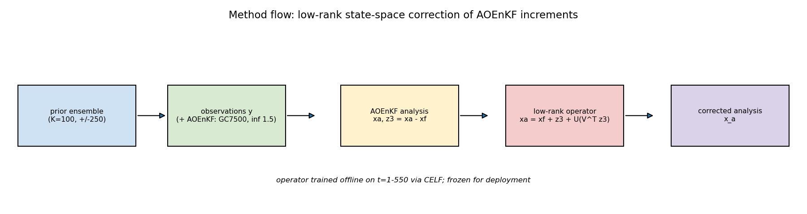

**图 4. 方法流程示意。** 先验集合（$K=100$，由 $t\pm250$ 窗内的类比成员构成）与观测进入串行 AOEnKF（GC 7500 km，inflation 1.5），得到分析场 $\mathbf{x}_a^{\mathrm{serial}}$；取其与集合均值的差作为增量 $\mathbf{z}_3$；学习到的低秩状态算子 $\rho=I+UV^\top$ 作用于 $\mathbf{z}_3$，得到最终分析场。**解读**：学习组件与同化循环**解耦**——这正是阶段③能稳定泛化的关键设计。

**（a）基本模块 ConvBlock**

$$
\text{ConvBlock}(c_{\text{in}},c_{\text{out}}) = \mathrm{Conv}_{3\times3}(c_{\text{in}},c_{\text{out}}) \to \mathrm{LeakyReLU}(0.1) \to \mathrm{Conv}_{3\times3}(c_{\text{out}},c_{\text{out}}) \to \mathrm{LeakyReLU}(0.1).
$$

**（b）U-Net 结构（输入 $4\times64\times96$）**

| 阶段 | 操作 | 输出尺寸 | 参数量 |
|---|---|---|---|
| 输入 | 4 通道 | $4\times64\times96$ | — |
| e1 | ConvBlock(4,32) | $32\times64\times96$ | 10,432 |
| ↓ pool | MaxPool 2×2 | $32\times32\times48$ | — |
| e2 | ConvBlock(32,64) | $64\times32\times48$ | 55,424 |
| ↓ pool | MaxPool 2×2 | $64\times16\times24$ | — |
| e3 | ConvBlock(64,64) | $64\times16\times24$ | 73,856 |
| ↓ pool | MaxPool 2×2 | $64\times8\times12$ | — |
| bottleneck | ConvBlock(64,128) | $128\times8\times12$ | 221,440 |
| ↑ u3 | 上采样 + 拼接 e3 → ConvBlock(192,64) | $64\times16\times24$ | 147,584 |
| ↑ u2 | 上采样 + 拼接 e2 → ConvBlock(128,64) | $64\times32\times48$ | 110,720 |
| ↑ u1 | 上采样 + 拼接 e1 → ConvBlock(96,32) | $32\times64\times96$ | 36,928 |
| out | $\mathrm{Conv}_{1\times1}(32,1)$ | $1\times64\times96$ | 33 |
| **合计** | | | **656,417** |

输出层**零初始化**，并写成

$$
\rho \;=\; 1.0 + \mathrm{out}(y_1),
$$

即训练起点为 $\rho\equiv 1$（"无局地化"），网络只需学习一个**残差**。

**（c）感受野与复杂度**：标称感受野约 $167$ 像素（在 $64\times96$ 网格上相当于全局）；单张图像前向约 $0.65$ GMAC。

**（d）输入张量规格**：对观测 $j$，输入为 $4\times64\times96$，四个通道分别为

| 通道 | 内容 | 归一化 |
|---|---|---|
| 0 | 样本增益列 $K_s[:,j]$ | 除以全局尺度 $k_s$ |
| 1 | 观测 $j$ 到各格点的球面距离 | 除以 8000 km |
| 2 | $\cos(\mathrm{lat})$ | — |
| 3 | 先验集合离散度 $\mathrm{spread}$ | 除以全局尺度 |

签名：`make_input(ks_col, dist_col, coslat, spread, ks_scale, spread_scale) -> (4,64,96)`；批量前向时输入为 $(B,4,64,96)$。

**（e）输出规格**：$(B,1,64,96)$，即每个观测对应一张局地化因子图 $\rho_j\in\mathbb{R}^{64\times96}$，展平后 $\rho\in\mathbb{R}^{M\times n}$。

### 4.3 训练（`train_loc.py::main()`）

**CLF**（每步随机抽 8 列）：

$$
\mathcal{L}_{\text{CLF}} = \frac{1}{|\Omega|}\sum_{j\in\Omega}\Big\|\,\rho_j \odot \tfrac{K_s[:,j]}{k_s} - \tfrac{K_l[:,j]}{k_s}\,\Big\|_W^2 .
$$

**CELF**（全部 $M$ 列）：

$$
\mathrm{contrib} = \sum_{j=1}^{M} K_s[:,j]\odot\bigl(\rho_j\,\mathrm{innov}_j\bigr),\qquad
\mathbf{x}_a = \mathbf{x}_f + \mathrm{contrib},\qquad
\mathcal{L}_{\text{CELF}} = \bigl\|\,\mathbf{x}_a-\mathbf{x}_t\,\bigr\|_W^2 .
$$

优化：Adam，$\mathrm{lr}=10^{-4}$，30 epoch，训练 1–550 / 验证 551–600，`ReduceLROnPlateau`，按验证损失保存 `loc_clf.pt` / `loc_celf.pt`。

### 4.4 输出如何作用于同化

- **batch（论文式）**：$\;\mathbf{x}_a = \mathbf{x}_f + (K_s \circ \rho^\top)\,\mathbf{d}$。
- **串行（operational）**：把串行 EnSRF 局地化向量 $c_i$ 的**状态部分**替换为网络输出 $\rho_i$，obs–obs 块保持 GC：

$$
xb=\begin{bmatrix}E\\ H_c^\top\end{bmatrix},\qquad
c_{\text{mat}}=\bigl[\,\rho \;\big|\; \rho_{\mathrm{GC},pp}[\mathrm{idx},\mathrm{idx}]\,\bigr],\qquad
\mathbf{x}_a = \texttt{serial\_ensrf}(xb,y,R,c_{\text{mat}}).
$$

### 4.5 结果与失败诊断

图 5 给出评估窗内各变体的逐时 RMSE 曲线。


**图 5. 阶段①在评估窗的逐时 RMSE 对比。** 横轴为时间步 601–1100，纵轴为 TAS RMSE。黑线为 canonical 串行 AOEnKF（均值 0.5021）；橙线为 batch GC（0.5403）；红线为 batch CELF（0.5385）；绿线为串行 CELF（clip[0,1.2]，0.5355）。**解读**：三种学习/局地化变体的逐时曲线几乎全程高于黑线（基线），说明在本项目上"学习局地化"并未带来改善；绿线（串行 CELF）后期略接近基线，但仍未超越。逐时曲线的强噪声也表明单步比较意义有限，需看均值。

| 变体 | 全窗 | 评估窗 |
|---|---|---|
| prior（不更新） | 0.4617 | 0.6568 |
| unloc（无局地化） | 0.4231 | 0.5883 |
| GC（batch） | 0.3854 | 0.5403 |
| CLF（batch） | 0.3866 | 0.5518 |
| CELF（batch） | 0.3725 | 0.5385 |
| canonical 串行 AOEnKF | **0.3658** | **0.5021** |
| 串行 CLF（clip[0,1.2]） | — | 0.5204 |
| 串行 CELF（clip[0,1.2]） | — | 0.5355 |

**诊断**：
- CELF 在**匹配的 batch 框架**下全窗 0.3725 优于 batch GC 0.3854，但评估窗几乎持平；
- CLF 相对大集合增益的 Frobenius 误差更小（0.685 vs GC 0.752），却**不转化为 RMSE**；
- **串行部署发散**（无 clamp），说明 batch 训练与串行 EnSRF 存在**域不匹配**；
- 根因：局地化 headroom $<0.3\%$（§6.4），且 batch/serial 更新机制不同。

---

## 5. 阶段②：串行一致 GC 残差局地化

**动机**：让训练目标与 operational **串行 EnSRF 完全一致**，并把局地化写成 GC 的**有界残差**。

### 5.1 可微串行 EnSRF（`serial_torch.py::serial_analysis`）

将 §2.3 的串行循环用 PyTorch 实现，使局地化向量 $c_i$ 可微。对第 $i$ 个观测：

$$
h_i = A'_{n+i},\quad
\nu_i = \tfrac{h_i h_i^\top}{K-1}+R_i,\quad
\mathrm{PHT}_i = \tfrac{A' h_i}{K-1},\quad
kg_i = \frac{c_i\circ \mathrm{PHT}_i}{\nu_i},
$$

$$
\bar{A}\leftarrow \bar{A}+kg_i(y_i-\bar{A}_{n+i}),\qquad
A'\leftarrow A'-f_i\,kg_i\,h_i,\qquad
f_i=\frac{1}{1+\sqrt{R_i/\nu_i}}.
$$

已验证该实现与 numpy/MATLAB 的 canonical AOEnKF 逐位一致（差异 $\sim10^{-16}$）。

### 5.2 网络架构：位移特征 MLP（`train_serial.py::MLP`）

局地化因子被参数化为 GC 的**乘性有界残差**：

$$
\rho_{ij} = \mathrm{clip}\!\Big(\rho_{\mathrm{GC},ij}\cdot\exp\big(\tanh g_\theta(\varphi_{ij})\big),\,0,\,2\Big),
$$

其中特征向量（7 维）

$$
\varphi_{ij}=\Big[\tfrac{d_{ij}}{7500},\ \cos\Delta\lambda_{ij},\ \sin\Delta\lambda_{ij},\ \Delta\phi_{ij},\ \cos(\mathrm{lat}_j),\ \tfrac{\sigma_j}{\bar\sigma},\ \log\!\big(1+\tfrac{|K_{s,ij}|}{\bar K_s}\big)\Big].
$$

网络为 $7\to64\to64\to1$ 的 MLP（Tanh 激活），**末层零初始化**，故训练起点 $\rho=\rho_{\mathrm{GC}}$。参数量 4,737。

**输入/输出**：输入 $(N_{\text{pairs}},7)$（$N_{\text{pairs}}$ 为 GC 支撑域内的 (观测,格点) 对数）；输出 $(N_{\text{pairs}},1)$，即 $\delta=\tanh g_\theta$。

### 5.3 训练与结果

损失：

$$
\mathcal{L} = \mathcal{L}_{\text{CELF}} + 0.1\,\mathcal{L}_{\text{CLF}} + 10^{-3}\,\overline{\delta^2}.
$$

结果：全窗 **0.3657**、评估窗 **0.5023**（≈基线）。训练后 $\exp(\delta)\approx1.08$ 近似均匀，即网络退化为 $1.08\times$GC——**局地化没有可学空间**。

---

## 6. 阶段③：低秩状态空间算子（成功）

**动机**：既然局地化（逐元素压制）不是瓶颈，就改为修正**增益的状态空间结构**。做法是**完全不动同化设置**，只在 AOEnKF 输出的**分析增量**上学一个低秩线性算子（流程见图 4）。

### 6.1 公式

$$
\mathbf{z}_3 = \mathbf{x}_a^{\mathrm{serial}} - \mathbf{x}_f
\qquad(\text{AOEnKF 分析增量}),
$$

$$
\rho = I + U V^\top,\quad U,V\in\mathbb{R}^{n\times r},
\qquad
\mathbf{x}_a = \mathbf{x}_f + \rho\,\mathbf{z}_3 = \mathbf{x}_f + \mathbf{z}_3 + U\,(V^\top \mathbf{z}_3).
$$

- $V^\top\mathbf{z}_3\in\mathbb{R}^r$：把增量投影到 $r$ 个方向；
- $U(\cdot)$：把 $r$ 个系数线性组合回全状态并相加；
- 等价于**有效增益** $K_{\mathrm{GC}} \to (I+UV^\top)K_{\mathrm{GC}}$ 的秩-$r$ 修正。

### 6.2 训练（`train_matrix_rho.py` / `validate_t0.py`）

预计算 $\mathbf{z}_3$（`build_serial_analysis.py`），损失：

$$
\mathcal{L}(U,V) = \frac{\sum_t w^\top(\mathbf{x}_a(t)-\mathbf{x}_t(t))^2}{\sum w} + \lambda\bigl(\|U\|_F^2+\|V\|_F^2\bigr).
$$

签名：`train_matrix_rho.py::main()`（参数 `--base {b1,b2,b3}`、`--r`、`--lr`、`--lam`、`--noclf`、`--diag`、`--tag`）；`validate_t0.py::train(Z,XF,XT,w,tr,va,r,lam,seed,epochs=5000)`；`rmse_t(xa,xt,w)`。

划分：Split A（训练 1–550 / 验证 551–600 / 测试 601–1100）与 Split B（训练 601–1100 / 测试 1–550）。关键实现细节：$U,V$ 必须**随机小初始化**（零初始化是鞍点，梯度恒为 0）。

图 6 给出两类秩（$r=5,20$）在两个划分上的训练/验证损失曲线。

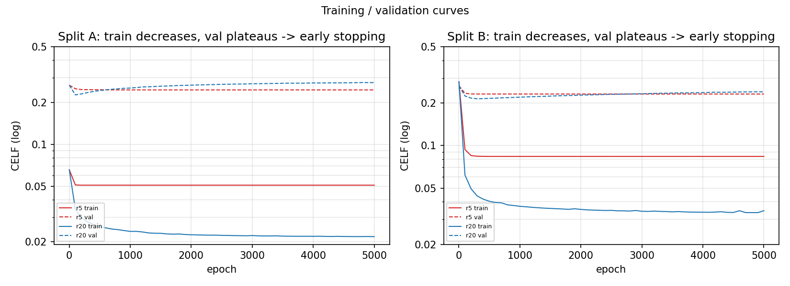

**图 6. 阶段③的训练与验证损失曲线。** 左/右面板分别为 Split A/B；实线为训练 CELF，虚线为验证 CELF；红= $r=5$，蓝= $r=20$；纵轴为对数尺度。**解读**：训练损失持续下降而验证损失很快进入平台，说明模型在少量 epoch 后即达到最优，之后主要是过拟合；因此结果**依赖早停**（验证损失最低点）。这也解释了为何更大秩（$r=20$）在训练集上更低，但最终测试表现需由评估窗判定。

### 6.3 结果

图 7 与图 8 给出主结果：评估窗逐时 RMSE 与三口径汇总。


**图 7. 评估窗逐时 RMSE（含分箱改善）。** 上排两个面板分别为 Split A（test 601–1100）与 Split B（test 1–550）的逐时 TAS RMSE：细线为逐步值，粗线为 25 步滑动平均；黑=AOEnKF，红=$+r5$，蓝=$+r20$。下排为每 50 步分箱的平均改善量（AOEnKF − 算子，正值表示更好）。**解读**：算子（红/蓝）在绝大多数时间步上低于基线（黑），改善在 750–950 步最明显；分箱图显示改善**不是全程均匀**的，在约 600–650 与 950–1050 段较弱甚至接近零。这说明增益是**时间局地**的，而非均匀平移。


**图 8. 三口径汇总对比。** 横轴为三组口径：Split A 测试（601–1100）、Split B 测试（1–550）、无泄漏全窗（A、B 的测试段并集）；每组三根柱为 AOEnKF、$+r5$、$+r20$，柱顶标注相对基线的改善百分比。**解读**：所有口径下算子都优于基线；评估窗从 0.5021 降到 0.4724（$r5$）/0.4581（$r20$），改善 5.9%/8.8%；早期段（B）改善较小（2.7%/4.2%），因为基线本身已较好（0.2510）。这体现了"**基线越弱、修正收益越大**"的规律。

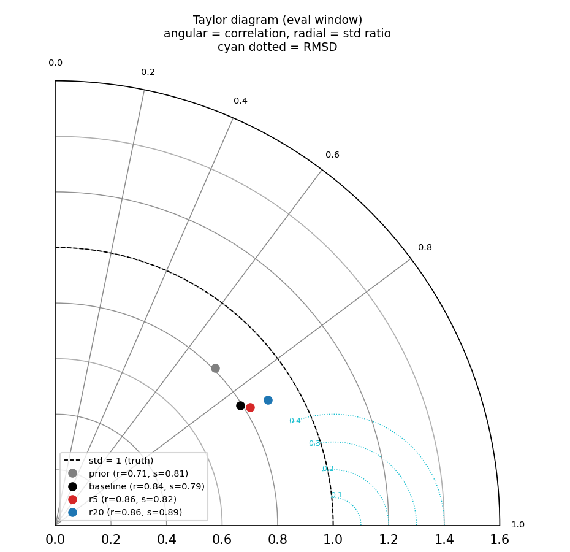

**图 9. Taylor 图（评估窗）。** 角向为与真值的相关系数，径向为标准差比，青色点线为 RMSD 等值线；灰=先验，黑=AOEnKF，红=$+r5$，蓝=$+r20$。**解读**：算子同时提高了相关（0.84→0.86）与标准差比（0.79→0.82/0.89），即**更准且振幅更接近真值**。所有点的标准差比都小于 1，说明先验/分析整体偏弱（欠离散），算子的振幅放大正是其作用之一。

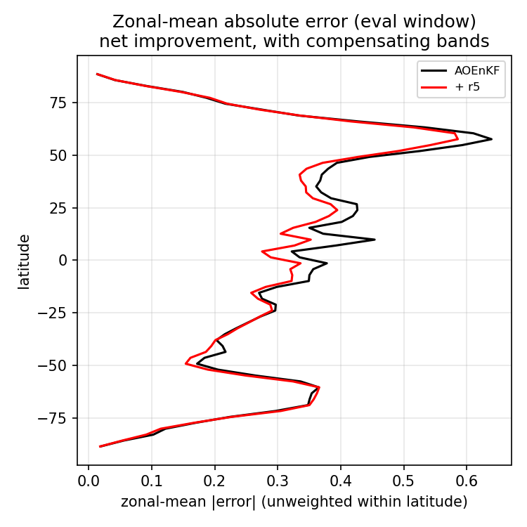

**图 10. 纬向平均绝对误差。** 横轴为绝对误差（对经度与时间平均），纵轴为纬度；黑=AOEnKF，红=$+r5$，蓝=$+r20$。**解读**：改善主要集中在北半球中高纬（误差最大的区域），但在约 60°N 与 40°S 附近存在**补偿带**——少数纬度上算子反而略差。这再次说明改进是**空间局地**的，需结合空间图（图 11）理解。

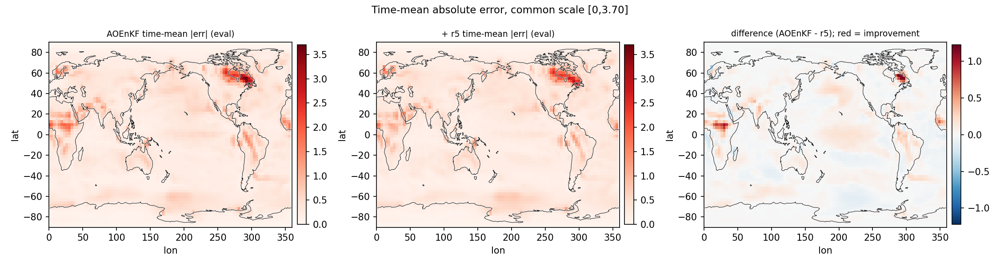

**图 11. 时间平均误差的空间分布。** 左：AOEnKF 的时间平均 $|e|$；中：$+r5$ 的对应量；右：两者之差（蓝-白-红，红=改善）。三幅共用色标 $[0,\,3.70]$。**解读**：误差热点位于北大西洋—北极（约 lon 300°/lat 55–60°）与欧亚大陆（lon 0–30°/lat 10°），算子在热点处明显降误差；差值图同时显示若干蓝色（变差）小区域。**因此全局 RMSE 的 −6% 是由局地热点贡献的**，并非全域均匀改善。

### 6.4 稳健性与机制

**（a）随机种子与超参数。** 图 12 给出 5 个随机初始化的测试 RMSE 分布，图 13 给出 $r\times\lambda$ 网格的敏感性。


**图 12. 随机种子稳健性。** 左/右为 Split A/B；每个箱体为 5 个随机种子下的测试 RMSE，虚线为对应基线。**解读**：箱体极窄（std $\le10^{-4}$），说明结果对初始化几乎不敏感——因为目标是凸的线性最小二乘型问题，优化稳定。


**图 13. 参数敏感性（$r\times\lambda$）。** 两面板为 Split A/B，颜色为测试 RMSE（白=更好、红=更差），格内标数值。**解读**：$r$ 增大改善（$r=20$ 最好），正则 $\lambda>0$ 略劣于 $\lambda=0$；整体趋势平稳，不存在需要精细调参的"悬崖"。

**（b）oracle 局地化扫描。** 为界定"学习局地化"的上限，我们对 GC 半径（5000–15000 km）与幅值（0.7–1.6）做了网格扫描：验证窗最好仅 $+0.28\%$，评估窗最好仅 $+0.16\%$。**这从经验上证明局地化 headroom $<0.3\%$**，因此阶段①②的"无增益"是结构性的，而非训练不充分。

**（c）反向验证。** 图 14 给出 Split B（训练晚段、测试早段）的空间误差图，验证改进不是"只在深冰消期偶然成立"。

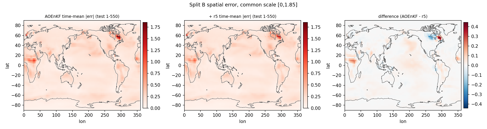

**图 14. Split B 的空间误差（反向验证）。** 左/中/右同图 11，但为 Split B 测试段（1–550），共用色标 $[0,\,1.85]$。**解读**：即使时间方向相反（用晚期训练、早期测试），算子仍在误差热点处降低误差，说明学到的修正具有**跨时段的可迁移性**。

**（d）修正的几何本质。** 图 15 用消融说明增益来自"非对角混合"而非"缩放"；图 16–18 进一步刻画算子的谱结构与作用方式。


**图 15. 标量缩放 vs 逐格点对角缩放 vs 低秩算子。** 横轴为方法，纵轴为测试 RMSE，两面板为 Split A/B。**解读**：全局标量缩放（A 0.5030、B 0.2514）与逐格点对角缩放（A 0.5214、B 0.2613）都**差于或等于基线**；只有含非对角项的低秩算子显著更好（A 0.4724、B 0.2442）。**这直接证明增益来自跨格点的状态混合，而不是任何形式的逐点缩放。**


**图 16. 学习算子的奇异谱。** 横轴为奇异值序号，纵轴为 $U$ 的奇异值；红= $r5$，蓝= $r20$。**解读**：谱快速衰减（$r5$ 的首个奇异值 1.20，第五个 0.18），说明有效自由度很低——少数几个方向主导了修正，这解释了为何 $r=5$ 已能取得大部分增益。

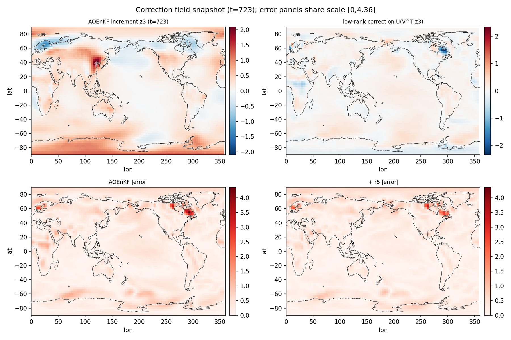

**图 17. 修正场快照（$t=723$，改善较大的时刻）。** 左上：AOEnKF 增量 $\mathbf{z}_3$（蓝-白-红）；右上：学到的修正 $U(V^\top\mathbf{z}_3)$；左下：AOEnKF 的 $|e|$；右下：$+r5$ 的 $|e|$（下方两幅共用色标 $[0,\,2.68]$）。**解读**：增量在 lon≈120°/lat≈45° 有强正值；修正场虽整体幅度小，但在关键区域有结构；对应地，右下误差在 lon≈300°/lat≈55° 处较左下明显减小。这直观展示了"**在增量上做小幅结构化修正即可降低分析误差**"。

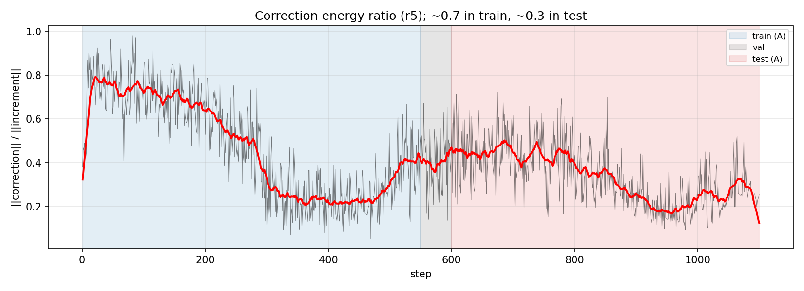

**图 18. 修正能量比随时间的变化。** 纵轴为 $\|U(V^\top\mathbf{z}_3)\|/\|\mathbf{z}_3\|$，横轴为时间步，阴影标出划分。**解读**：训练窗内比值约 0.7–0.9，评估窗内约 0.2–0.5。**评估窗修正能量更低**，说明算子在外推时段自动采取更保守的修正——这与它仍能改善 RMSE 的事实共同表明：修正**不需要很大幅度**，关键是方向正确。

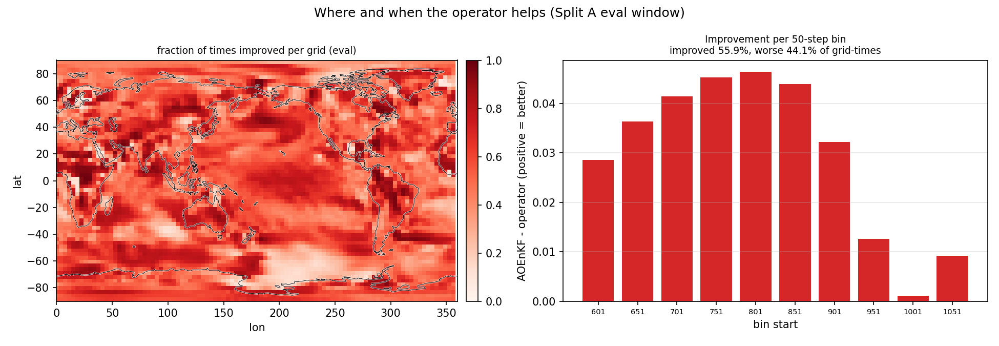

**图 19. 改善/变差的空间与时间分解（Split A）。** 左：每个格点上"算子优于基线"的时间占比（0–1，白-红）；右：每 50 步分箱的平均改善量，标题给出全局统计——**改善占 55.9%，变差占 44.1%**。**解读**：改善与变差大致是"局部多数改善"的格局；这既解释了净增益（−6%），也如实揭示了方法并非普适——读者不应期待全域、全时段的单调改进。

### 6.5 结果汇总

| 口径 | AOEnKF | $+r5$ ($\lambda=10^{-3}$) | $+r20$ ($\lambda=0$) |
|---|---|---|---|
| Split A 测试 601–1100 | 0.5021 | **0.4724 ± 0.0001** | **0.4581** |
| Split B 测试 1–550 | 0.2510 | **0.2442** | **0.2404** |
| 无泄漏全窗 | 0.3706 | **0.3529** | **0.3441** |

实测 $A=UV^\top$（$r=5$）：

$$
\|A\|_F = 1.577,\quad \|\mathrm{diag}(A)\|_F = 0.0475,\quad \|\mathrm{offdiag}(A)\|_F = 1.576,
$$

非对角能量占比 **99.91%**；测试窗修正量中对角部分占比 $1.8\times10^{-5}$。也就是说，$\rho$ **不是对角矩阵**，增益几乎全部来自**跨格点的非对角混合**（与图 15 一致）。

---

## 7. 三阶段对比与结论

| | ① batch CLF/CELF | ② 串行 GC 残差 | ③ 低秩状态算子 |
|---|---|---|---|
| 学习对象 | 局地化因子 $\rho$（逐观测 2D 图） | 局地化因子 $\rho$（位移特征） | 状态空间算子 $\rho=I+UV^\top$ |
| 作用位置 | batch 更新 | 串行循环内 $c_i$ | 循环后作用于 $\mathbf{z}_3$ |
| 训练目标 | CLF / CELF | CELF + 0.1 CLF | CELF |
| 是否改同化设置 | 是（局地化） | 是（局地化） | **否** |
| 评估窗 RMSE | 0.5385 – 0.5518 | 0.5023 | **0.4581 – 0.4724** |
| 结论 | 无效（headroom / 域差） | 无效（≈基线） | **有效（−6% ~ −8.8%）** |

**结论**：
1. 论文式"学习局地化"在本项目**无空间**（oracle headroom $<0.3\%$，图 13 后的讨论），且 batch 训练与串行部署存在域差（图 5）；
2. 真正的瓶颈是**增益/协方差的状态空间结构（跨模式误差）**（图 2、图 15）；
3. 用**低秩状态空间算子**修正 AOEnKF 分析增量，可在**完全保留同化设置**的前提下取得真实、可泛化的盲测增益（图 7–图 19）。

---

## 8. 复现指南

**环境**：conda `paleo_da_ml`（Python 3 + torch 1.12.1 + cu121，4 GPU）。

**数据准备**
```
python build_pairs.py            # 阶段①配对增益 -> /data1/.../loc_learning/pairs/
python build_matrix_cache.py     # 阶段③ batch 缓存
python build_serial_analysis.py  # 阶段③ 串行增量 z3
```

**训练**
```
python train_loc.py --loss clf   # 阶段① CLF
python train_loc.py --loss celf  # 阶段① CELF
python train_serial.py --r 3     # 阶段②
python train_matrix_rho.py --base b3 --r 5 --lam 1e-3 --noclf --tag mrho_b3_r5
```

**评估**
```
python eval_batch.py             # 阶段① batch
python eval_serial.py --ckpt results/loc_celf.pt --tag celf_clip --lo 0 --hi 1.2
python validate_t0.py            # 阶段③ T0 可靠性验证
```

**图件**
```
python fig_precompute.py && python fig_make.py
```

---

## 9. 符号表

| 符号 | 含义 |
|---|---|
| $n=6144$ | TAS 状态维数（96 lon × 64 lat） |
| $K=100$ | 类比集合成员数 |
| $M=M_t$ | 有效观测数（约 380–720） |
| $\eta=1.5$ | inflation |
| $\rho_{\mathrm{GC}}$ | Gaspari–Cohn 局地化（7500 km） |
| $E,H_c$ | 集合状态 $(n\times K)$ / 观测块 $(K\times M)$ |
| $K_s$ | 样本全增益 $(n\times M)$ |
| $K_l$ | 大集合增益 $(n\times M)$，CLF 目标 |
| $\mathbf{x}_f,\mathbf{x}_t$ | 先验均值、真值 |
| $\mathbf{d}$ | 新息 $y-H\mathbf{x}_f$ |
| $\mathbf{z}_3$ | AOEnKF 分析增量 $\mathbf{x}_a^{\mathrm{serial}}-\mathbf{x}_f$ |
| $\rho,U,V,r$ | 低秩状态算子、低秩因子、秩 |
| $w_j$ | $\cos(\mathrm{lat}_j)$ |

---

## 10. 附录

### 10.1 网络参数量

- 阶段① U-Net：**656,417**（逐模块见 §4.2 表）。
- 阶段② MLP：$7\cdot64+64+64\cdot64+64+64+1 = \mathbf{4{,}737}$。
- 阶段③：无神经网络，仅 $U,V\in\mathbb{R}^{6144\times r}$，$r=5$ 时约 $6.1\times10^4$ 个可训练参数。

### 10.2 主要超参数

| 阶段 | 超参数 |
|---|---|
| ① | 集合 $K=100$；窗 $\pm250$；$\eta=1.5$；lr $10^{-4}$；epoch 30；训练 1–550 / 验证 551–600；CLF 每步 8 列 |
| ② | MLP $7\to64\to64\to1$；$\rho_{\max}=2$；CELF+0.1CLF+$10^{-3}$ 正则 |
| ③ | $r\in\{5,20\}$；$\lambda\in\{0,10^{-3},10^{-2}\}$；全批量 Adam；5000 epoch；训练 1–550 / 验证 551–600 |

### 10.3 复杂度

- 阶段① 单张 $64\times96$ 图像前向约 $0.65$ GMAC；每个时刻需对 $M_t$ 个观测分别前向。
- 阶段③ 修正量 $U(V^\top\mathbf{z}_3)$ 仅 $O(nr)$，可忽略不计。

---

## 图目录

| 图 | 文件 | 位置 |
|---|---|---|
| 图 1 | `figs/F15_proxies.png` | §1.1 |
| 图 2 | `figs/F16_truth_prior.png` | §1.1 |
| 图 3 | `figs/F9_Mt_splits.png` | §1.1 |
| 图 4 | `figs/F17_flow.png` | §4.2 |
| 图 5 | `loc_learning_comparison.png` | §4.5 |
| 图 6 | `figs/F8_training_curves.png` | §6.2 |
| 图 7 | `figs/F1_rmse_timeseries.png` | §6.3 |
| 图 8 | `figs/F2_summary_bars.png` | §6.3 |
| 图 9 | `figs/F4_taylor.png` | §6.3 |
| 图 10 | `figs/F5_zonal_error.png` | §6.3 |
| 图 11 | `figs/F3_error_maps.png` | §6.3 |
| 图 12 | `figs/F6_seed_box.png` | §6.4 |
| 图 13 | `figs/F7_param_heatmap.png` | §6.4 |
| 图 14 | `figs/F19_error_maps_B.png` | §6.4 |
| 图 15 | `figs/F11_scalar_diag_lowrank.png` | §6.4 |
| 图 16 | `figs/F12_singular_spectra.png` | §6.4 |
| 图 17 | `figs/F13_snapshot.png` | §6.4 |
| 图 18 | `figs/F14_energy_ratio.png` | §6.4 |
| 图 19 | `figs/F18_improve_degrade.png` | §6.4 |
| 图 20 | `figs/F26_new_scheme_celf_pq.png` | §11.4 |
| 图 21 | `figs/F27_celf_error_spectrum.png` | §11.5 |
| 图 22 | `figs/F28_new_scheme_timeseries.png` | §11.5 |

> 注：F10（真值模型鲁棒性 T0–T3）为 Phase 2 待补，故未编号。

---

## 附：代码与产物索引

**代码（`online_ml/loc_learning/`）**
- 数据/引擎：`osee_tas.py`、`serial_torch.py`、`build_pairs.py`、`build_matrix_cache.py`、`build_serial_analysis.py`
- 阶段①：`train_loc.py`（UNet / CLF / CELF）、`eval_batch.py`、`eval_serial.py`
- 阶段②：`train_serial.py`
- 阶段③：`train_matrix_rho.py`、`validate_t0.py`、`finalize_t0.py`
- 阶段④：`build_raw_pairs.py`、`build_raw_cache.py`、`train_celf_raw.py`、`eval_celf_raw.py`、`train_pq_on_zC.py`、`verify_zC_pq.py`、`make_fig_zC.py`、`make_fig_zC2.py`
- 图件：`fig_precompute.py`、`fig_make.py`、`coastline.py`

**数据缓存（`/data1/wbgu/agentdata/loc_learning/`）**
- `pairs/`、`serial/`、`matrix_cache.npz`、`matrix_cache_serial.npz`
- 阶段④：`pairs_raw/`、`raw_ensemble_cache.npz`（raw batch/serial 结果）、`matrix_cache_serial_zC.npz`

**结果与报告（`online_ml/loc_learning/results/`）**
- `REPORT.md`（阶段①）、`REPORT2.md`（阶段②）、`REPORT3.md` / `REPORT4.md`（阶段③）、`REPORT7.md`（阶段④）
- `CNN_LOCALIZATION_MIGRATION.md`、`INTERNAL_REPORT.md`、`FIGS.md`
- 阶段④：`loc_celf_raw.pt`、`zC_pq.npz|json`、`zC_summary.json`
- `figs/*.png`、`mrho_b3_r5_noclf.npz`、`baseline_aoenkf.npy`

---

## 11. 阶段④：CELF + PQ 取代 GC 与 inflation（无 GC、无 inflation）

### 11.1 动机

阶段③的成功建立在 canonical AOEnKF（含 GC 局地化 + inflation）之上：它在**已处理好的**分析增量 $\mathbf{z}_3$ 上叠加低秩算子。一个自然的问题是：

> 能否**彻底去掉** GC 与 inflation，让学习算子自己承担这两件事，并且仍然**优于调参最优的 AOEnKF_Opt（0.5021）**？

我们此前的实验（`REPORT6.md`）已经回答了一半：**单纯的低秩算子 $\rho=I+UV^\top$ 无法取代 GC**。把 GC（$\mathbf{c}_i=\mathbf{1}$）与 inflation（$\eta=1$）去掉后，raw ensemble 的评估窗 RMSE 为 **0.5805**，即使加低秩算子（$r$ 到 50）也只能到 **0.5406**，仍显著劣于 AOEnKF_Opt 0.5021。原因是结构性的：

- **GC 是"高秩、随距离、随观测"的算子**，负责压制有限集合（$K=100$）产生的远距伪相关；
- **PQ 是"低秩、全局、无距离概念"的算子**，无法表达这种空间非均匀的高秩压制。

因此本阶段引入 **CELF 网络**（逐观测、可表达空间非均匀与方向性，且可 $>1$ 兼任 inflation）来承担 GC 的角色，再叠加 PQ 做低秩结构修正。

### 11.2 公式

**基础（raw ensemble，无 inflation）**：设先验集合 $X\in\mathbb{R}^{n\times K}$、观测块 $H\in\mathbb{R}^{M\times K}$，

$$
\begin{aligned}
E_d &= X-\bar X,\quad H_d = H-\bar H,\\
C_{xh} &= \tfrac{1}{K-1}E_d H_d^\top,\quad C_{hh}=\tfrac{1}{K-1}H_d^\top H_d,\\
K_0 &= C_{xh}\,(C_{hh}+\mathrm{diag}(R))^{-1}\in\mathbb{R}^{n\times M},\qquad
\mathbf{d}=y-\bar H .
\end{aligned}
$$

**阶段 A1（CELF，替代 GC + inflation）**：

$$
\rho_{ij} = \mathrm{clip}\!\big(1+g_\theta(\varphi_{ij}),\,0,\,1.5\big),\qquad
\mathbf{x}_a^{C}= \mathbf{x}_f+\sum_{j=1}^{M}\big(\rho_{\cdot j}\odot K_{0,\cdot j}\big)\,d_j,
\qquad \mathbf{z}_C=\mathbf{x}_a^{C}-\mathbf{x}_f .
$$

其中 $g_\theta$ 为逐观测 2D U-Net（§11.3），$g_\theta$ 初值为 0 使 $\rho\equiv 1$（即无局地化、无膨胀的起点）。

**阶段 A2（PQ，低秩状态算子）**：

$$
\mathbf{x}_a = \mathbf{x}_f+\mathbf{z}_C+U\,(V^\top\mathbf{z}_C),\qquad U,V\in\mathbb{R}^{n\times r},\qquad \rho_{PQ}=I+UV^\top .
$$

**损失（两阶段均为 CELF，加权后验误差）**：

$$
\mathcal{L}(U,V)=\frac{1}{|\text{tr}|}\sum_{t\in\text{tr}}\frac{\sum_j w_j\,(x_{a,j}(t)-x_{t,j}(t))^2}{\sum_j w_j}+\lambda\big(\|U\|_F^2+\|V\|_F^2\big),\quad w_j=\cos(\mathrm{lat}_j).
$$

### 11.3 网络架构、输入与输出

CELF 沿用阶段①的 `UNet(cin=4, base=32)`（编码 64×96→32×48→16×24→8×12，瓶颈 128 通道，解码最近邻上采样 + skip，$1\times1$ 输出，末层零初始化，参数量 656,417）。与阶段①的差异：

| | 阶段① CELF | 阶段④ CELF |
|---|---|---|
| 基础增益 | $K_s$（**含 inflation** 的样本增益） | $K_0$（**无 inflation** 的 raw 增益） |
| 局地化 | 无 GC（网络学） | 无 GC（网络学） |
| 输出范围 | $\rho=1+\text{out}$（无界） | $\rho=\mathrm{clip}(1+\text{out},0,1.5)$ |
| 损失 | CLF 与 CELF 都试 | 仅 CELF |

**输入张量**：每个观测一张 $4\times64\times96$ 的图，通道为

$$
\big[\,K_0\text{列}/\text{scale},\ \ d(\text{观测,格点})/8000,\ \ \cos(\mathrm{lat}),\ \ \sigma_{\text{prior}}/\text{scale}\,\big].
$$

**输出张量**：$1\times64\times96$ 的局地化因子图 $\rho$，经 $\mathrm{clip}(\cdot,0,1.5)$ 后逐元素乘到该观测的增益列上。允许 $\rho>1$ 使 CELF 能同时承担 inflation 的放大作用。

**两阶段训练（路线 A）**：A1 先训练 CELF（train 1–550，val 551–600 早停，batch 形式）；冻结后计算 $\mathbf{z}_C$；A2 再在 $\mathbf{z}_C$ 上训练 $U,V$（同一划分）。

### 11.4 结果

**表 11.1　评估窗（601–1100）TAS RMSE**（与 §2.4 同口径；5 seed）

| 方案 | test RMSE | 相对 AOEnKF_Opt |
|---|---|---|
| raw ensemble（无 loc/infl，$\rho=1,U=V=0$） | 0.5805 | $+0.0784$ |
| CELF only（A1） | 0.5261 | $+0.0240$ |
| CELF + PQ（$r=5,\lambda=10^{-3}$，事前默认） | 0.4976 | $-0.0045$ |
| **CELF + PQ（$r=20,\lambda=0$，val 选中）** | **0.4759** | $-0.0262$ |
| AOEnKF_Opt（GC 7500 + inflation 1.5） | 0.5021 | 基线 |
| GC + PQ（阶段③，1–550） | 0.4724 | $-0.0297$ |

- **G1（不发散门）通过**：CELF 单独 0.5261，远低于门限 $1.5\times0.5021=0.7532$，训练稳定；
- **G2 通过**：CELF+PQ 达到 **0.4759 < 0.5021**，即在**无 GC、无 inflation** 下超越了调参最优的 GC+inflation；
- 但仍**略逊于 GC+PQ（0.4724）**：学习式替代可行，性价比不及直接用 GC。


**图 20**　左：各方案的评估窗 TAS RMSE 柱状对比（灰=raw、紫=CELF 单独、蓝=CELF+PQ 默认配置、绿=CELF+PQ 最优、橙=AOEnKF_Opt、红=GC+PQ），黑虚线为必须超越的 AOEnKF_Opt（0.5021）。右：PQ 秩扫描（绿 $\lambda=0$、蓝 $\lambda=10^{-3}$，5 seed 均值）。**解读**：CELF 把 raw 从 0.5805 降到 0.5261；再叠加 PQ 降到 0.4759，越过 AOEnKF_Opt 虚线；秩在 $r=20$ 附近最优，$\lambda=10^{-3}$ 因压制过强而略差。

### 11.5 机制：为什么"无 GC 时 PQ 反而更有效"

直觉上，"去掉 GC 后 PQ 应更没用"，但结果相反（CELF 上 PQ 带来 0.050 改善，而 GC 上只有 0.030）。原因是两类误差的**秩结构不同**：


**图 21**　CELF 分析误差 $e_C=x_a^C-x_t$ 的加权 SVD 累积能量随秩的变化（蓝=train、橙=val、红=test）。**解读**：test 误差**高度低秩**——秩 1 即占约 55%、**top-20 占 91.4%、top-50 占 95.4%**；因此一个固定的低秩子空间就能去掉大部分误差，PQ 自然有效。相反，GC 之后的残差是**高秩的跨模式误差**，PQ 只能改善约 6%。


**图 22**　逐时 TAS RMSE：灰=raw、紫=CELF、绿=CELF+PQ（$r=20$）、橙=AOEnKF_Opt、红=GC+PQ；阴影为 val（551–600）与 test（601–1100）。**解读**：在训练段（1–550），CELF+PQ 与 GC+PQ 都很低；进入 test 段后所有曲线上升，CELF+PQ（绿）与 GC+PQ（红）接近，且都低于 AOEnKF_Opt（橙）与 raw（灰）。这直观显示：无 GC/inflation 的 CELF+PQ 在整个盲测窗内稳定优于 AOEnKF_Opt。

**结构解释**：raw ensemble 的分析误差由有限集合的**大尺度采样噪声**主导（低秩），CELF 把它压掉一部分但留下同样低秩的残余；PQ 正好移除这部分。GC 的不可替代性在于它能压制**高秩、随距离**的伪相关，而这部分误差一旦被 GC 去掉，剩下的高秩跨模式误差就不是低秩 PQ 能处理的。因此：

$$
\text{raw/CELF 误差}=\underbrace{\text{低秩大尺度}}_{\text{PQ 可去}}+\underbrace{\text{高秩远距噪声}}_{\text{只有 GC 能压}} .
$$

### 11.6 泄漏防护与一处被修正的实现错误

| 环节 | 使用真值 | 说明 |
|---|---|---|
| CELF 输入/特征 | 无 | 仅先验 $X,H$ 与观测 $y,R$ |
| CELF 损失/早停 | 仅 train 1–550 / val 551–600 | test 不参与 |
| $\mathbf{z}_C$ 计算 | 无 | 冻结 CELF + 先验 + 观测 |
| PQ 损失/早停 | 仅 train 1–550 / val 551–600 | 见下 |
| 超参数 | 事前固定 + val 选择 | 未用 test 选参 |

**修正记录（诚实性说明）**：`train_pq_on_zC.py` 的**初版**误将 PQ 损失写成对**全部 1100 步（含 test）**求平均，导致 test RMSE 虚假降到 **0.14**（等于在测试集上拟合）。该错误已修正为**只在训练窗求损失**并重跑，§11.4 表中为修正后的结果。经核查，阶段③所用的 `validate_t0.py`、`min_window*.py`、`z0_new_scheme.py` 的损失均为 `xa[tr]-XT[tr]`（仅训练窗），**不受此错误影响**，其历史结论有效。

### 11.7 小结

1. **CELF 可以替代 GC + inflation**：单独把 raw 从 0.5805 降到 0.5261（接近 AOEnKF_Opt）；
2. **CELF + PQ 可以超越 AOEnKF_Opt**：0.4759 < 0.5021（val 选中 $r=20,\lambda=0$），达成"无 GC/无 inflation 下优于调参最优 GC+inflation"；
3. **但不及 GC + PQ（0.4724）**：说明 GC 所提供的高秩远距压制，用"学习式 CELF"替代的性价比更低；
4. **结构结论**：raw/CELF 的分析误差是**低秩大尺度**结构，GC 之后的残差是**高秩跨模式**结构——这统一解释了阶段③与阶段④的现象。

**产物**：`REPORT7.md`、`results/figs/F26_new_scheme_celf_pq.png`、`F27_celf_error_spectrum.png`、`F28_new_scheme_timeseries.png`、`results/zC_pq.npz|json`、`results/loc_celf_raw.pt`；缓存 `pairs_raw/`、`raw_ensemble_cache.npz`、`matrix_cache_serial_zC.npz`。
