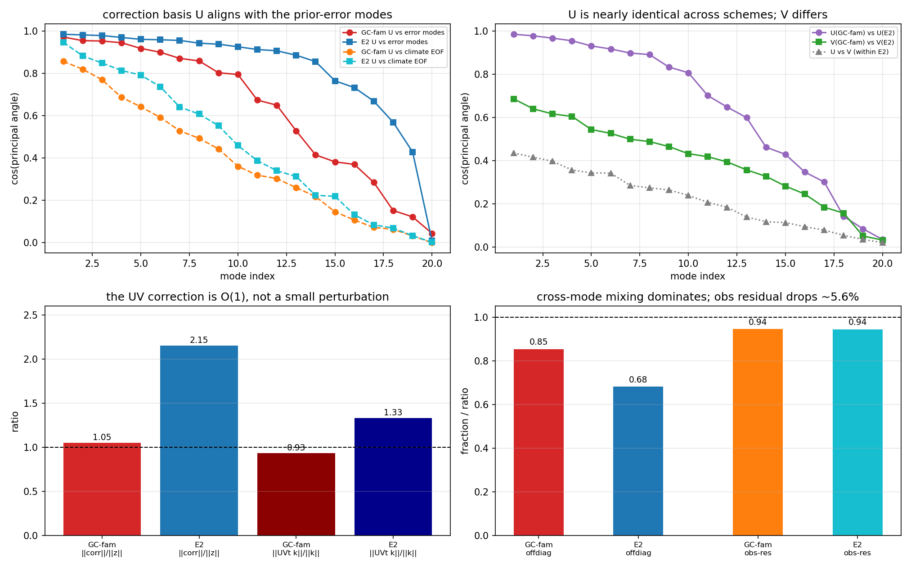
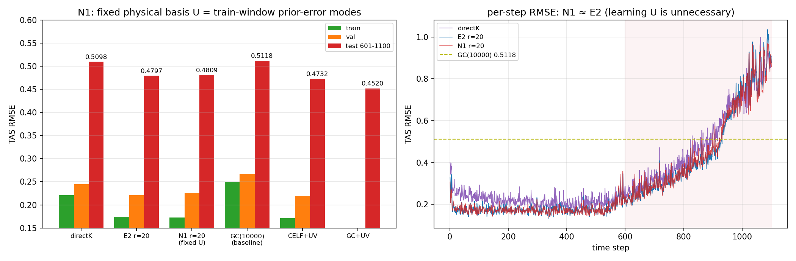

# N1 方案：固定"物理基 U"、只学编码器的低秩增益修正

**日期**：2026-09-21
**代码**：`train_n1_fixedU.py`、`eval_n1.py`、`make_fig_F58.py`
**诊断依据**：REPORT32 / F57（UV 如何作用于 Kalman 增益的 D1–D5 分析）
**口径**：MPI 真值、TAS-only、cos-lat 加权；train 1–550 / val 551–600 / test 601–1100

---

## 1. 背景与定位

在既有的"状态空间低秩修正"（UV）家族中，分析统一写作

```
xa = xb + z + U (Vᵀ z)         # z 为某个基座分析增量
```

REPORT32 的 D1–D5 诊断给出两个决定性事实：

| 诊断 | 结果 | 含义 |
|---|---|---|
| **D3** | `U`(GC族+UV) 与 `U`(E2) 的主夹角 cos ≈ **0.986, 0.979, 0.968, …** | 两个完全不同基座的方案学出的"修正方向"**几乎相同** ⇒ `U` 是**数据决定、与基座无关的规范基** |
| **D2** | `U` vs **训练窗先验误差模态**：cos 0.97–0.99 | 该规范基正是"**我们真正要修正的误差**"的主空间结构 |

⇒ **推论：`U` 不需要由网络学习**。把它固定为训练窗先验误差的主模态 `Q_r`，只学编码器 `W`，应当几乎不损失性能，同时**参数量减半、物理可解释**。本文档即该方案（**N1**）。



*图 F57：左上 `U` 与误差模态/气候 EOF 的对齐；右上 `U` 跨方案几乎相同而 `V` 不同；左下修正幅度为 O(1)；右下跨模态混合主导且观测残差下降 5.6%。*

---

## 2. 变量与记号

| 符号 | 含义 | 维度 |
|---|---|---|
| `n` | 状态维数（TAS 网格 64×96 展平） | 6144 |
| `M_t` | 当步活跃观测（gwb 伪代理）数 | 388–720 |
| `r` | 低秩维数 | 20 |
| `s` | 固定尺度 `ks_scale ≈ 0.00911`（`mean(|K0|)` 的跨时刻均值） | 标量 |
| `K0_t` | 无局地化、无 inflation 的**样本 Kalman 增益** `C_xh(C_hh+R)⁻¹` | `n × M_t` |
| `d_t` | 新息 `y_t − H xf_t` | `M_t` |
| `xf_t` | 类比集合均值（先验均值） | `n` |
| `xᵗ_t` | 真值（MPI） | `n` |
| `oi_t` | 当步活跃代理在 1276 代理表中的索引 | `M_t` |
| `spread_t` | 当步先验离散度 | `M_t` |
| `D` | 代理点→格点的球面距离矩阵（haversine） | `1276 × n` |
| `φ_j` | 第 j 个观测的输入特征图 | `4 × 64 × 96` |
| `g_θ(φ_j)` | U-Net 输出的**增益残差列** | `n` |
| `dx_raw` | 未施加低秩修正的原始增量 | `n` |
| `Q_r` | **固定的物理基**：训练窗先验误差的前 r 个模态 | `n × r` |
| `W` | **可学习**编码器（N1 唯一的低秩参数） | `n × r` |
| `xa` | 最终分析场 | `n` |

---

## 3. 计算流程（逐步公式）

### 3.1 逐观测输入特征（4×64×96）
```
ch0 = K0_t[:, j] / ks_scale          # 该观测的 raw 增益列（归一化）
ch1 = D[oi_t[j]] / 8000              # 观测 j 到各格点的距离场（km/8000）
ch2 = cos(lat)                        # 纬度权重场
ch3 = spread_t[j] / spread_scale      # 该观测的先验离散度（归一化）
φ_j = stack(ch0, ch1, ch2, ch3)  ∈ R^{4×64×96}
```
（全部为几何/先验量，**不含真值**，无泄漏）

### 3.2 U-Net 前向
```
g_θ(φ_j) ∈ R^{6144}          # 逐观测输出一张 64×96 场并展平
```
- U-Net 结构见 `results/CELF结构.md`（约 6.5×10⁵ 参数，末层零初始化）；
- 本方案 **warm-start**：`θ ← results/loc_celf_directK.pt`。

### 3.3 增益合成
```
K_mod[:, j] = K0_t[:, j] + s · g_θ(φ_j)          （s = ks_scale 固定）
```

### 3.4 未修正的原始增量 `dx_raw`（逐观测累加，详解）

**（i）出发点：标准 EnKF/Kalman 更新**
```
xa_raw = xf + K (y − H xf) = xf + K d ,      K = K_mod ∈ R^{n×M_t},  d = d_t ∈ R^{M_t}
```
即"先验均值 + 增益 × 新息"。这里的 `K_mod` 就是 §3.3 得到的增益矩阵。

**（ii）矩阵形式**（整体一次乘完）
```
dx_raw = K_mod · d_t          ∈ R^n
```

**（iii）逐观测展开**（把矩阵乘法按观测列拆开）
```
dx_raw = Σ_{j=1}^{M_t}  K_mod[:, j] · d_t[j]
```
- `K_mod[:, j] ∈ R^n`：第 `j` 个观测的**增益列**——表示"该观测每 1 单位新息会在**状态空间**里产生怎样的更新空间型"；
- `d_t[j] ∈ R`：第 `j` 个观测的**新息标量**（`y_j − (H xf)_j`）；
- `K_mod[:, j] · d_t[j]`：把第 `j` 个观测的信息**按其空间型、按新息大小**注入状态；
- 对当步**全部活跃观测**求和 ⇒ 得到"**未施加任何低秩修正**的原始分析增量"。

**（iv）逐格点形式**（对第 `i` 个格点的值）
```
dx_raw[i] = Σ_{j=1}^{M_t}  K_mod[i, j] · d_t[j] ,     i = 1..n
```
即每个格点等于"所有观测的增益值 × 对应新息"之和。

**（v）维度检查**
```
K_mod[:, j] :  n × 1
d_t[j]      :  标量
K_mod[:, j] · d_t[j]  :  n × 1
Σ_{j=1..M_t} (…)      :  n × 1   ✓  （与状态同维）
```

**（vi）代码实现**（在 `(M_t, n)` 布局上向量化，避免逐观测循环）
```python
K0t   = K0.T                          # (M_t, n)
g     = field_all_for(...)            # (M_t, n)  逐观测 U-Net 输出
Kmod  = K0t + ks_scale * g            # (M_t, n)  = 每个观测一条增益列（转置存储）
dx_raw = (Kmod * d[:, None]).sum(axis=0)   # (n,)
```
- `d[:, None]`：把每个观测的新息广播到该观测的整条增益列上；
- `.sum(axis=0)`：沿"观测维"求和 ⇒ 等价于 §3.4(iii) 的 `Σ_j K_mod[:,j] d_t[j]`。

**（vii）与最终分析的关系**
```
xa = xf + dx_raw + Q_r (Wᵀ dx_raw)
   = xf + (未修正增量) + (低秩修正)
```
即 `dx_raw` 正是"**若不做低秩修正时的分析增量**"——单独使用 `xa = xf + dx_raw` 就对应 **directK 基座（test 0.5098）**；N1 在其上再叠加 `Q_r(Wᵀ dx_raw)`。

### 3.5 固定物理基 `Q_r` 的构造（含 SVD 全过程详解）

> **一句话回答**：`Q_r` = 对"cos-lat 加权的先验误差矩阵"做 SVD，取**前 r 个奇异值对应的空间模态（右奇异向量）**，再换成"cos-lat 加权正交"的同一子空间的一组基。因为"加权误差协方差 = EwᵀEw = V Σ² Vᵀ"，**奇异值平方 `σ_k²` 就是特征值**，所以也可等价地说："取加权误差协方差矩阵的前 r 个特征值对应的特征向量"。

**（i）构造误差矩阵**（仅用训练窗 1–550，**无泄漏**）
```
E ∈ R^{T×n} ,   T = 550（时间）,  n = 6144（状态）
E[t, i] = xf_t[i] − xᵗ_t[i]         # 第 t 时刻、第 i 个格点的"先验误差"
```
即：**每一行是一个时刻的误差场**，共 550 行。

**（ii）cos-lat 加权**（把每个格点的误差按其纬度可信度缩放）
```
w_i = cos(lat_i)（原始值，不归一化） ,   s_i = √w_i
Ew[t, i] = s_i · E[t, i]    ⇒   Ew = E · diag(s)
```

**（iii）奇异值分解（SVD）** —— 对加权后的矩阵 `Ew`（T×n）做分解：
```
Ew = U Σ Vᵀ
   U ∈ R^{T×q}          ：左奇异向量（时间系数，每个时刻在各模态上的幅度），UᵀU = I
   Σ = diag(σ₁ ≥ σ₂ ≥ …) ∈ R^{q×q} ：奇异值（按降序）
   V ∈ R^{n×q}          ：右奇异向量（**空间模态**，每列是一张长度 n 的场），VᵀV = I
```
- **为什么右奇异向量 V 就是空间模态**：`E` 的行是时间、列是状态；SVD 把它写成
  `Ew[t, :] = Σ_k U[t,k] · σ_k · V[:,k]`，即"每个时刻的误差场 = 若干空间模态 `V[:,k]` 的线性组合"，
  系数是 `U[t,k] σ_k`。所以 `V` 的每一列就是一张空间误差型。
- 实现上用 `torch.svd_lowrank(Ew, q=40)`，只求**前 40 组**奇异三元组（不必做满 SVD，省算力）。

**（iv）等价的特征分解（回答"取前 r 个特征值"）**
```
Ewᵀ Ew = (E·diag(s))ᵀ(E·diag(s)) = Eᵀ diag(w) E = V Σ² Vᵀ
```
所以：
- `V` 的列 = **加权误差协方差矩阵 `Eᵀ diag(w) E` 的特征向量**；
- `σ_k²` = 对应的**特征值** = 第 k 个空间模态所携带的（加权）误差能量；
- 因此"对 E 做加权 SVD" ≡ "对 `Eᵀ diag(w) E` 做特征分解"，**"前 r 个奇异值" ⇔ "前 r 个特征值"**。

**（v）取前 r 个模态**
```
V_r = V[:, : r] ∈ R^{n×r}
```
- 由于模态按 `σ₁ ≥ σ₂ ≥ …` 排序，`V_r` 张成的是**"占加权误差能量最多的 r 维子空间"**；
- 本方案取 `r = 20`。

**（vi）改成"cos-lat 加权正交"基（只换基，子空间不变）**
```
Q_r = qr( diag(s) · V_r ) 的 Q 因子  /  diag(s)      ∈ R^{n×r}
```
- **性质**：`Q_rᵀ diag(w) Q_r = I_r`（在 cos-lat 加权内积下正交归一）；
- **子空间不变**：`span(Q_r) = span(V_r)`。原因：若 `a = Σ_k c_k (s ⊙ v_k) ∈ span(diag(s)V_r)`，则 `a / s = Σ_k c_k v_k ∈ span(V_r)`——"除以 `s`"是**线性**变换，不改变集合的张成；
- 好处：让后面的编码器 `W` 有统一量纲（便于解释/正则），且不损失表达力（`W` 可吸收任意缩放）。
- （数值核验：`span(V_r)` 与代码产出的 `span(Q_r)` 主夹角 cos 全为 **1.000**；`Q_rᵀdiag(w)Q_r − I` 的范数为 **0.0**。）

**（vii）为什么固定、为什么 r=20**
- **固定**：REPORT32-D3 表明 `U` 跨方案一致（cos≈0.986…）——它是**数据决定的规范基**，无需学习；
- **r=20**：REPORT32-D2 中 `U` 与前 20 个误差模态的对齐 cos 仍达 0.93–0.99，覆盖主导误差能量。

**（viii）编码与写回（可学习部分）**
```
c    = Wᵀ dx_raw        ∈ R^r          # 把增量投到"误差子空间坐标"（W∈R^{n×r} 可学习）
corr = Q_r c            ∈ R^n          # 沿误差主方向写回状态空间
```

### 3.6 最终分析场
```
xa = xf_t + dx_raw + corr
   = xf_t + dx_raw + Q_r (Wᵀ dx_raw)
```

---

## 4. 物理 / 数学解释

把上述作用**逐列**写出来（`K` 为基座增益，N1 中即 `K_mod`）：

```
K_eff[:, j] = K[:, j] + Q_r (Wᵀ K[:, j])
            = K[:, j] + Q_r · (该观测增益列在 W 基下的 r 维坐标)
```

- **含义**：用编码器 `W` 读出"该观测增益列"的低维坐标，再**沿跨模态误差的主方向 `Q_r`** 写回一个修正；
- **等价表述**：Kalman 增益 `K = P Hᵀ (H P Hᵀ + R)⁻¹` 中，本方法只修正**分子**（状态-观测**交叉协方差** `P Hᵀ`），分母（`H P Hᵀ + R`）不变 ⇒ "**交叉协方差的秩-r 状态空间修正**"；
- **为何有物理依据**：`Q_r` 是真实误差的统计主结构（D2：cos 0.97–0.99），且跨基座稳定（D3：cos 0.99）——即"误差方向是客观的，只有配比随观测变化"。

---

## 5. 训练目标与协议

### 5.1 损失（cos-lat 加权 MSE）
```
L = Σ_j w_j (xa_j − xᵗ_j)² ,     w_j = cos(lat_j) / Σ_k cos(lat_k)
```
实现上等价于 `mean_j[ W_j (·)² ]`（`W = coslat/mean(coslat)`），即训练损失 = `RMSE_t²`。

### 5.2 优化
```
参数组：U-Net θ → lr 1e-4 ；编码器 W → lr 1e-3（小随机初值）
优化器：Adam；梯度裁剪 ‖·‖ ≤ 5；ReduceLROnPlateau(0.5, patience 3) 监控 val
轮数：30 epochs × 200 随机训练步；保存 val 最优的 (θ, W)
初始化：θ ← directK checkpoint；W ~ N(0, 1e-3²)（⇒ corr≈0，起点≈directK）
```

> 注：`W` 需**小随机**初始化（零初始化会落在鞍点，梯度恒为 0 学不动）。

---

## 6. 结果

| 方案 | 低秩参数 | train 1-550 | val 551-600 | **test 601-1100** |
|---|---|---|---|---|
| directK（基座） | — | 0.2206 | 0.2449 | 0.5098 |
| E2 r=20（**学** U,V） | `2nr` | 0.1741 | 0.2206 | **0.4797** |
| **N1 r=20（固定 U=Q_r，只学 W）** | `nr` | 0.1726 | 0.2259 | **0.4809** |
| **GC(10000)（基线）** | — | 0.2492 | 0.2664 | **0.5118** |
| CELF+UV | — | 0.1710 | 0.2190 | 0.4732 |
| GC(10000)+UV | — | — | — | 0.4520 |



*图 F58：左为 train/val/test 对比；右为 directK / E2 / N1 的逐时 RMSE 曲线（N1 与 E2 几乎重合，均低于 GC(10000) 基线）。*

### 结论
1. **固定 `U` 不损失性能**：N1 `0.4809` vs E2 `0.4797`，差 `0.0012`（运行内波动量级）⇒ 验证了"`U` 是数据决定的规范基、无需学习"。
2. **优于基线 `GC(10000)`（0.5118）**：改善 **−0.031（相对 −6.0%）**。
3. **N1 的优势**：参数量**减半**（`nr` vs `2nr`）；`Q_r` **物理可解释**（训练窗误差主模态），`U` 不再是黑箱。
4. **局限**：仍弱于两阶段 `CELF+UV`(0.4732) 与 `GC(10000)+UV`(0.4520)。

---

## 7. 与既有方案的关系

| 实验 | 基座 | 作用对象 | 算子 | `U` | test |
|---|---|---|---|---|---|
| stage③/④ UV | GC / CELF | 增量 z | `(I+UVᵀ)z` | 学习 | 0.4724 / 0.4732 |
| REPORT20/21 迭代 | CELF / GC | `z_i` | 同上，迭代 | 学习 | 0.4732 / 0.4520 |
| E2 | directK | `dx_raw` | `(I+UVᵀ)z` | 学习 | 0.4797 |
| **N1（本文档）** | directK | `dx_raw` | `xb+z+Q_r(Wᵀz)` | **固定=误差模态** | **0.4809** |

---

## 8. 产物索引

| 文件 | 说明 |
|---|---|
| `train_n1_fixedU.py` | 训练（构建 `Q_r` + warm-start + 联合训练 θ,W） |
| `eval_n1.py` | 全窗（1100 步）评估，输出 train/val/test |
| `results/loc_celf_n1r20.pt` | best-val 权重（含 model、W、Q） |
| `results/n1r20_rmse.npy` | 逐时 RMSE（1100） |
| `results/figs/F58_n1_fixedU.png` | 结果图 |
| `results/figs/F57_uv_gain_diag.png` | 机制诊断图（REPORT32） |
| `results/REPORT32.md` / `results/REPORT33.md` | 诊断报告 / N1 结果报告 |
| `/data1/wbgu/agentdata/loc_learning/train_n1r20.log` | 训练日志 |
