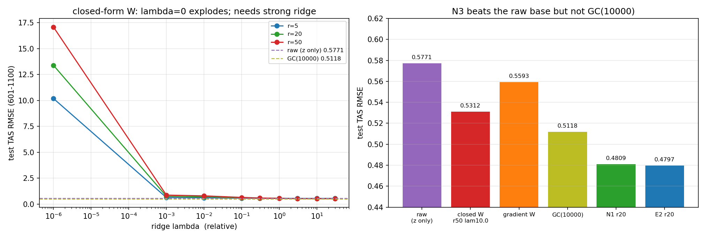

# REPORT 34：N3——纯 raw 增益 + 固定物理基 + **闭式** `W`（无 GC / 无 CELF）

**日期**：2026-09-22
**代码**：`oenkf_directW.py`、`make_fig_F59.py`；数据：`results/oenkf_directW.json`；图：`results/figs/F59_oenkf_directW.png`
**方案**：基座用 `pairs_unw_mpi` 的 **raw 增益**（类比选择、无 GC、无 inflation、无 CELF 网络），在其增量上只做"固定物理基 + 线性修正"，且 **`W` 不训练、直接由最小二乘闭式给出**。

## 1. 公式
```
基座增量：  z_t = K0_t · d_t                                  （raw，无局地化）
固定物理基：Q_r = 训练窗 (xf − xᵗ) 的 cos-lat 加权 SVD 前 r 个模态
最终分析：  xa = xf + z_t + Q_r (Wᵀ z_t)

闭式解（对训练窗最小化 cos-lat 加权 MSE）：
    e_t = xᵗ_t − xf_t − z_t                        （基座分析误差）
    S_zz = Σ_{t=1..550} z_t z_tᵀ                (n×n)
    S_ze = Σ_{t=1..550} z_t (Q_rᵀ D e_t)ᵀ         (n×r)
    W    = (S_zz + λ·tr(S_zz)/n · I)⁻¹ S_ze
```
- 因为 `Q_r` 是 cos-lat 加权正交基（`Q_rᵀ D Q_r = I`），故上述推导为精确的最小二乘正规方程；
- 仅需累加两个矩阵 + 解一次 `n×n` 线性系统（**无需训练循环、无需网络**）。

## 2. 结果

### raw 基线（只用 z）
| | train | val | test |
|---|---|---|---|
| raw (z only) | 0.2682 | 0.2985 | **0.5771** |

### 闭式 W（λ 扫描；λ 为相对值，乘 `tr(S_zz)/n`）
| r | λ=0 | 1e-3 | 1e-2 | 0.1 | 0.3 | 1.0 | 3.0 | 10 | 30 |
|---|---|---|---|---|---|---|---|---|---|
| 5 | 10.05 | 0.634 | 0.615 | 0.575 | 0.562 | 0.555 | 0.552 | **0.5516** | 0.5536 |
| 20 | 13.95 | 0.756 | 0.707 | 0.609 | 0.576 | 0.552 | 0.539 | **0.5341** | 0.5352 |
| 50 | 15.97 | 0.872 | 0.799 | 0.647 | 0.594 | 0.557 | 0.539 | **0.5312** | 0.5317 |

**（test RMSE；λ=0 时解爆炸 → 单位数/十几）**

### 汇总（test 601–1100）
| 方案 | train | val | test |
|---|---|---|---|
| raw（z only） | 0.2682 | 0.2985 | 0.5771 |
| **闭式 W（r=50, λ=10）** | 0.2022 | 0.2521 | **0.5312** |
| 梯度训练 W（r=50，val 早停） | 0.1932 | 0.2603 | 0.5593 |
| GC(10000)（基线） | 0.2492 | 0.2664 | 0.5118 |
| N1 r=20（directK 基 + 固定基 + 学 W） | 0.1726 | 0.2259 | 0.4809 |
| E2 r=20 | 0.1741 | 0.2206 | 0.4797 |
| CELF+UV / GC(10000)+UV（参照） | — | 0.2190 | 0.4732 / 0.4520 |



## 3. 结论
1. **"直接计算 `Wᵀ`"可行，但必须强正则化**：λ=0 时闭式 LS **爆炸**（test 13–16）——问题是**欠定**的（训练窗仅 550 步，而 `W∈R^{n×r}` 有 `6144×r` 个参数）；取 `λ ≈ 10·tr(S_zz)/n` 后正常，且是 val 最优。
2. **闭式 W 优于梯度 W**：最优闭式 **0.5312** vs 梯度版 0.5593（差 0.028）——闭式是训练目标的**精确最优解**，而梯度版受 val 早停/优化路径限制。
3. **优于 raw 基线**：0.5771 → **0.5312（−0.046，相对 −8.0%）** ⇒ "固定误差模态基 + 线性最优编码器"在**完全没有局地化/学习增益**的 raw 增量上**确实能拉回约 8%**。
4. **但仍敌不过 GC(10000)（0.5118）**：raw 基座本身太弱（0.5771 vs GC 0.5118），秩-r 线性修正无法补上"局地化的高秩远距压制"这块差距；更远逊于 CELF/GC 系 + UV（0.47/0.45）。
5. 与 REPORT32 的机制一致：UV/`W` 修正的是"误差主方向上的配比"，**它不能替代 GC 的高秩压制**，只能在**已经足够好的基座**上做**低秩收尾**（这也解释了为何 N1/E2 只在 directK 基上有效）。

## 4. 产物
- 代码：`oenkf_directW.py`、`make_fig_F59.py`；数据/图：`results/oenkf_directW.json`、`results/figs/F59_oenkf_directW.png`
- 日志：`/data1/wbgu/agentdata/loc_learning/oenkf_directW.log`
