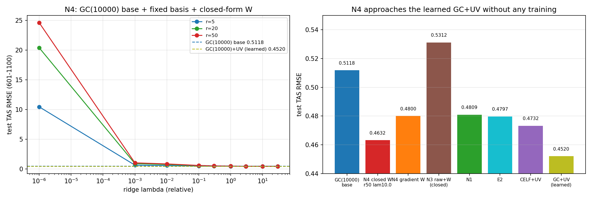

# REPORT 35：N4——GC(10000) 基座 + 固定物理基 + **闭式** `W`（无训练）

**日期**：2026-09-22
**代码**：`build_loc_candidate.py`（重算 GC 增量）、`gc_directW.py`、`make_fig_F60.py`
**数据/图**：`results/gc_directW.json`、`results/figs/F60_gc_directW.png`；增量缓存 `/data1/wbgu/agentdata/loc_learning/gc10000_incr_mpi.npz`

## 1. 方案与前置
```
基座： GC(10000, inflation=1.0) 的逐步增量 z_t = xa_GC − xf
       （类比成员选择；GC 局地化在串行 EnSRF 内施加，与 1–600 扫出的最优配置一致）
       —— 该增量此前未落盘，本次重算 1100 步（5045 s）
固定物理基：Q_r = 训练窗 (xf − xᵗ) 的 cos-lat 加权 SVD 前 r 模态
最终分析：  xa = xf + z_t + Q_r (Wᵀ z_t)
闭式 W：   e_t = xᵗ_t − xf_t − z_t
           S_zz = Σ_{t=1..550} z_t z_tᵀ ,  S_ze = Σ_{t=1..550} z_t (Q_rᵀ D e_t)ᵀ
           W = (S_zz + λ·tr(S_zz)/n · I)⁻¹ S_ze
```
（`Q_r` 为 cos-lat 加权正交基 ⇒ 上式是精确的最小二乘正规方程；无梯度训练、无网络。）

## 2. 结果

### GC(10000) 基座核对
```
train 0.2492 ｜ val 0.2664 ｜ test 0.5118        （与 1–600 扫描口径一致 ✓）
```

### 闭式 W（test 601–1100；λ 为相对值）
| r | λ=0 | 1e-3 | 1e-2 | 0.1 | 0.3 | 1.0 | 3.0 | 10 | 30 |
|---|---|---|---|---|---|---|---|---|---|
| 5 | 10.47 | 0.662 | 0.583 | 0.503 | 0.490 | 0.482 | 0.479 | 0.4789 | **0.4789** |
| 20 | 20.41 | 0.913 | 0.767 | 0.570 | 0.522 | 0.490 | 0.472 | 0.4628 | **0.4597** |
| 50 | 24.62 | 1.045 | 0.866 | 0.609 | 0.543 | 0.499 | 0.476 | 0.4632 | **0.4585** |

**val 最优**：`r=50, λ=10` ⇒ train 0.1870 ｜ val **0.2261** ｜ test **0.4632**（λ=30 的 test 为 0.4585）。
**梯度训练 W（r=50, val 早停）**：train 0.1815 ｜ val 0.2314 ｜ test 0.4800。

### 汇总（test 601–1100）
| 方案 | 是否训练 | train | val | test |
|---|---|---|---|---|
| GC(10000) 基座 | 无（基准） | 0.2492 | 0.2664 | 0.5118 |
| **N4 闭式 W（r=50, λ=10）** | **无** | 0.1870 | **0.2261** | **0.4632** |
| N4 闭式 W（r=50, λ=30） | 无 | 0.1945 | 0.2263 | 0.4585 |
| N4 梯度 W | 有（val 早停） | 0.1815 | 0.2314 | 0.4800 |
| N3：raw + 闭式 W | 无 | 0.2022 | 0.2521 | 0.5312 |
| N1（directK + 固定基 + 学 W） | 有 | 0.1726 | 0.2259 | 0.4809 |
| E2（directK + 学 U,V） | 有 | 0.1741 | 0.2206 | 0.4797 |
| CELF+UV（两阶段学习型） | 有 | 0.1710 | 0.2190 | 0.4732 |
| GC(10000)+UV（两阶段学习型/迭代） | 有 | — | — | **0.4520** |



## 3. 结论
1. **N4 是目前"零训练"方案里最好的**：test **0.4632**（val 选参）/ **0.4585**（λ=30），
   **逼近**两阶段**学习型** `GC(10000)+UV`（0.4520，差 0.011/0.006），且**全面优于** N1(0.4809)/E2(0.4797)/N3-raw(0.5312)。
2. **闭式 W 优于梯度 W**（0.4632 vs 0.4800）：在给定 (基座, `Q_r`, 目标) 下，**最小二乘闭式解是精确最优**，而梯度版受早停/优化路径限制。
3. **基座质量决定上限**：同一套 (固定基 + 闭式 W) 在 raw 基座上只有 0.5312，在 GC(10000) 基座上达 0.4632 ⇒ 印证 REPORT32 的机制——**GC 负责高秩远距压制，低秩修正只做收尾**。
4. **对 `UV` 的物理背书**：`U` 无需学习（用训练窗误差模态 `Q_r`）+ `W` 无需训练（闭式最小二乘）即可逼近学习型 UV ⇒ **UV 的价值主要来自"沿误差主方向做低秩修正"这一结构，而非参数学习本身**。
5. **强制条件**：λ 必须足够大（≈10–30·tr(S_zz)/n）；λ=0 时欠定解爆炸（test 10–25）。

## 4. 产物
- 代码：`build_loc_candidate.py`（GC 增量重算）、`gc_directW.py`、`make_fig_F60.py`
- 数据/图：`/data1/wbgu/agentdata/loc_learning/gc10000_incr_mpi.npz`、`results/gc_directW.json`、`results/figs/F60_gc_directW.png`
- 日志：`/data1/wbgu/agentdata/loc_learning/gc10000_incr.log`、`.../gc_directW.log`
