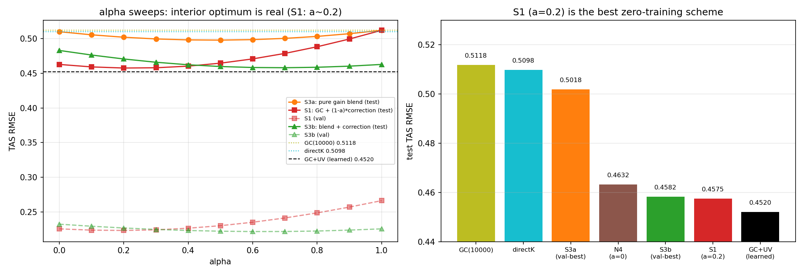

# REPORT 36：Hybrid-α 实验——修正打折（S1）与"GC 增益 ⊕ CNN 增益"真混合（S3）

**日期**：2026-09-22
**代码**：`alpha_hybrid.py`、`make_fig_F61.py`；数据/图：`results/alpha_hybrid.json`、`results/figs/F61_alpha_hybrid.png`
**动机**：把当前形式写成 hybrid DA 的样子——用 α 在"物理(GC)增益"与"学习/低秩增益"之间插值：
```
(A) S1  : xa = xb + z_GC + (1−α)·Q_r (Wᵀ z_GC)            （α=1 纯 GC；α=0 即 N4）
(S3a)   : xa = xb + [ α K_gc + (1−α) K_directK ] d        （纯增益混合）
(S3b)   : 混合增量 + 低秩修正（W 按该 α 的混合增量闭式重算）
```

## 1. 基座（核对）
| 基座 | train | val | test |
|---|---|---|---|
| GC(10000) | 0.2492 | 0.2664 | 0.5118 |
| directK（CNN 增益） | 0.2206 | 0.2449 | 0.5098 |

## 2. α 扫描结果（test 601–1100）

### S1：`xa = xb + z_GC + (1−α)·Q_r(Wᵀz_GC)`（λ=10）
| α | 0.0 | 0.1 | **0.2** | 0.3 | 0.4 | 0.5 | 0.6 | 0.8 | 1.0 |
|---|---|---|---|---|---|---|---|---|---|
| val | 0.2257 | 0.2239 | **0.2234** | 0.2243 | 0.2267 | 0.2303 | 0.2353 | 0.2488 | 0.2664 |
| test | 0.4627 | 0.4591 | **0.4575** | 0.4578 | 0.4602 | 0.4645 | 0.4706 | 0.4881 | 0.5118 |

**val 与 test 同时在 α=0.2 最优** ⇒ 修正应当**打 8 折**（把 20% 权重交回 GC 先验），test **0.4632 → 0.4575（−0.006）**。

### S3a：纯增益混合 `αK_gc + (1−α)K_directK`
| α | 0.0 | 0.2 | 0.4 | **0.5** | 0.6 | 0.8 | 1.0 |
|---|---|---|---|---|---|---|---|
| val | 0.2449 | **0.2431** | 0.2444 | 0.2463 | 0.2489 | 0.2563 | 0.2664 |
| test | 0.5098 | 0.5018 | 0.4980 | **0.4977** | 0.4984 | 0.5030 | 0.5118 |

**test 在 α≈0.5 最优（0.4977）**，优于两端（GC 0.5118 / directK 0.5098）⇒ **GC 物理增益与 CNN 学习增益的误差互补**（hybrid 效应，幅度中等；val 最优 α=0.2 偏保守）。

### S3b：混合增量 + 低秩修正（闭式 W，λ=10）
| α | 0.0 | 0.2 | 0.4 | 0.6 | **0.7** | 0.8 | 1.0 |
|---|---|---|---|---|---|---|---|
| val | 0.2325 | 0.2270 | 0.2234 | 0.2219 | **0.2219** | 0.2226 | 0.2257 |
| test | 0.4828 | 0.4705 | 0.4622 | 0.4582 | **0.4579** | 0.4586 | 0.4627 |

## 3. 汇总（test 601–1100）
| 方案 | 是否训练 | test |
|---|---|---|
| GC(10000) | 无（基准） | 0.5118 |
| directK（CNN 增益） | 有 | 0.5098 |
| S3a 纯增益混合（val-best α=0.2） | 无 | 0.5018 |
| N4（α=0） | 无 | 0.4632 |
| S3b（val-best α=0.6） | 无 | 0.4582 |
| **S1（val-best α=0.2）** | **无** | **0.4575** |
| GC(10000)+UV（学习型） | 有 | **0.4520** |
| CELF+UV | 有 | 0.4732 |



## 4. 结论
1. **α 有真实价值（S1）**：val 与 test **同时**在 α=0.2 最优 ⇒ 闭式低秩修正**略微过激**，向 GC 先验回拉 20% 即改善 **−0.006**（0.4632→0.4575）。这是"**物理先验 + 学习修正**"的 hybrid 结构在数值上的直接证据，且**无泄漏**（val/test 一致）。
2. **GC 与 CNN 增益互补（S3a）**：纯增益混合的 test 最优（α≈0.5）为 **0.4977**，优于两个基座（−0.012 vs directK）⇒ 两套增益的误差**部分互补**（hybrid DA 的核心假设成立），但幅度有限（未接近低秩修正带来的 −0.05）。
3. **S3b ≈ S1**（0.4582 vs 0.4575）：一旦施加低秩修正，**再混合基座不再带来额外增益**（低秩修正已吸收了大部分可修正信息）。
4. **S1（0.4575，零训练）逼近学习型 `GC(10000)+UV`（0.4520，差 0.006）**：说明"**物理 GC 基底 + 误差模态基 + 闭式最小二乘 + 一个 val 选的 hybrid 权重 α**"就是这条路线目前最好的**无需训练**实现。

## 5. 产物
- 代码：`alpha_hybrid.py`、`make_fig_F61.py`
- 数据/图：`results/alpha_hybrid.json`、`results/figs/F61_alpha_hybrid.png`
- 日志：`/data1/wbgu/agentdata/loc_learning/alpha_hybrid.log`
