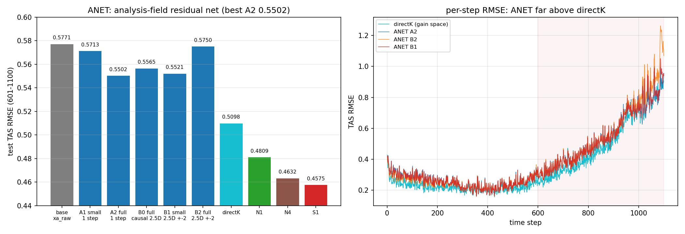

# REPORT 37：ANET——在标准 EnKF 分析场上直接学残差 `xa = xa_raw + f_θ(xa_raw)`

**日期**：2026-09-22
**代码**：`train_anet.py`；图：`make_fig_F62.py`；数据：`results/anet_results.json`、`results/anet_*_rmse.npy`
**形式**：
```
xa_raw = xb + K0 d      （标准 EnKF，无 GC、无 inflation）  test 0.5771
xa     = xa_raw + f_θ(input)
输入：仅分析场（按通道做训练窗标准化）；输出：1 通道残差场
```

## 1. 配置与结果

| 配置 | 网络 | 时间输入 | 参数量 | train | val | **test** |
|---|---|---|---|---|---|---|
| base | — | — | — | 0.2682 | 0.2985 | 0.5771 |
| **A1** | 小 U-Net | 单时刻 | 164k | 0.2573 | 0.2891 | 0.5713 |
| **A2** | 大 U-Net | 单时刻 | 840k | 0.2533 | 0.2863 | **0.5502** |
| **B0** | 大 U-Net | **因果 2.5D** `t−2..t` | 841k | 0.2543 | 0.2866 | 0.5565 |
| **B1** | 小 U-Net | **对称 2.5D** `t−2..t+2` | 165k | 0.2522 | **0.2841** | 0.5521 |
| **B2** | 大 U-Net | 对称 2.5D | 841k | 0.2464 | 0.2853 | 0.5750 |
| （参照）directK（增益空间学残差） | 大 U-Net | 逐观测增益特征 | ~650k | 0.2206 | 0.2449 | **0.5098** |
| （参照）N1 | 大 U-Net+固定基 | — | — | 0.1726 | 0.2259 | 0.4809 |
| （参照）N4 | 闭式 W | — | — | 0.1870 | 0.2261 | 0.4632 |
| （参照）S1 | 闭式 W + α | — | — | 0.1924 | 0.2234 | 0.4575 |

（test = 601–1100，cos-lat 加权 TAS RMSE）



## 2. 结论
1. **该形式可行、有小幅增益**：最优 **A2 = 0.5502**（相对基线 0.5771 **−0.027**）；但**全部变体都 ≥0.55**，远逊 directK(0.5098) 与低秩系（0.457–0.481）。
2. **时间上下文（2.5D）不稳健**：
   - B0（因果，0.5565）与 A2（0.5502）比**没有优势**；
   - B1（小网 ±2，0.5521）≈ A2；**B2（大网 ±2）val 最好(0.2853) 而 test 最差(0.5750 ≈ 基线)** ⇒ 过拟合 + 非平稳（未来步的"平滑"信息不可迁移）。
3. **网络连训练窗都拟合不好**：ANET 的 train 0.246–0.257，明显高于 directK(0.2206)/N1(0.1726)——说明**"分析场"这个输入本身对残差的信息量有限**，不是优化问题。
4. **与既有诊断一致**（REPORT10 的 P0′）：CELF 残差**由增量/观测预测远好于由状态场预测**（0.486 vs 0.807）。本实验正面确认了这一点：**`f(xa)` 可行但弱**，因为 `xa` 不唯一决定误差（同一 `xa` 可来自不同 `(xb, z)`，而误差的信息来自 `d`）。

## 3. 对我们问题链的定位
> 问题：**"标准 EnKF 上能否用 U-Net 直接学残差 `f(xb+Kd)`？"**
> 答案：**能，但收益有限（−0.027），且不如在"增益/增量空间"学（directK −0.067、N1 −0.096、低秩系 −0.11以上）。** 根因：残差的信息在**观测新息**里，而分析场把它"混进了先验"。

## 4. 产物
- 代码：`train_anet.py`、`make_fig_F62.py`
- 数据/图：`results/anet_results.json`、`results/anet_{A1,A2,B0,B1,B2}_rmse.npy`、`results/figs/F62_anet.png`
- 权重：`results/loc_anet_{A1,A2,B0,B1,B2}.pt`
- 日志：`/data1/wbgu/agentdata/loc_learning/anet_gpu{0,1}.log`
