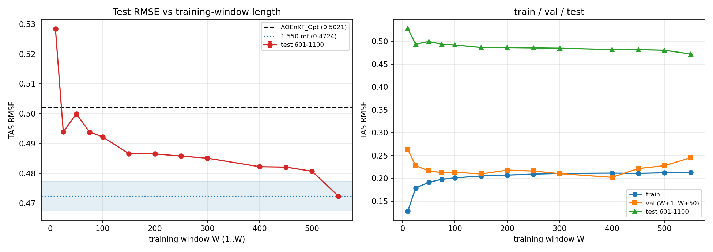
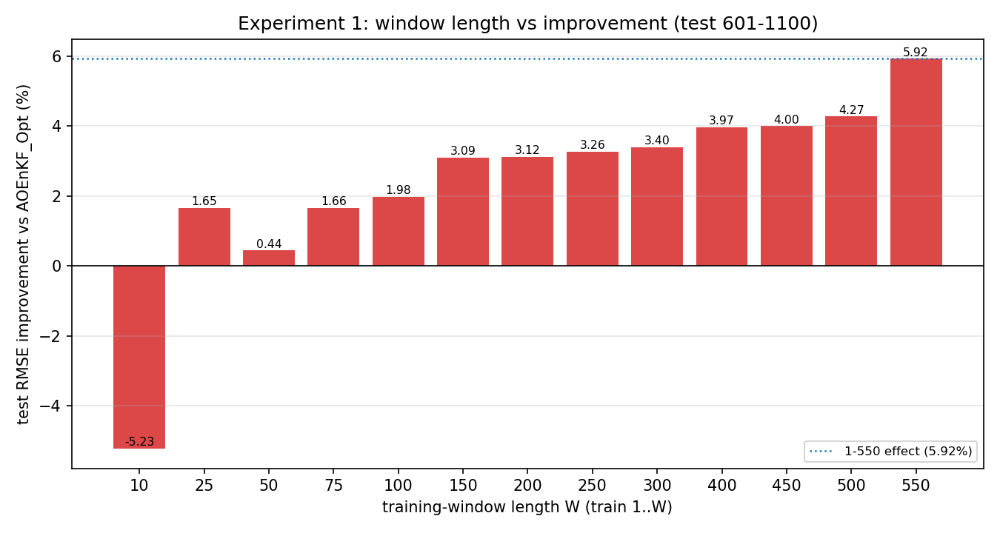
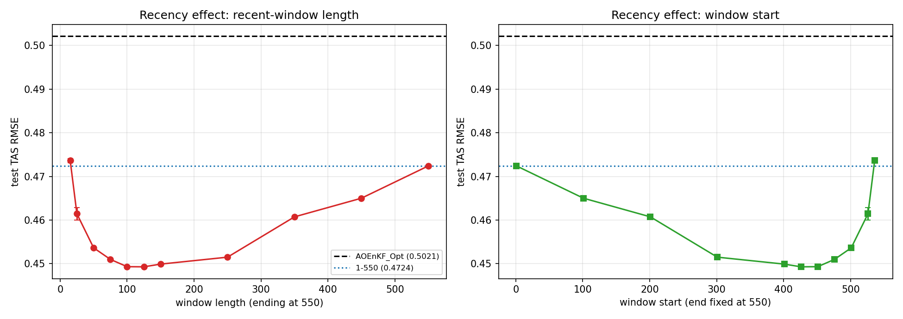
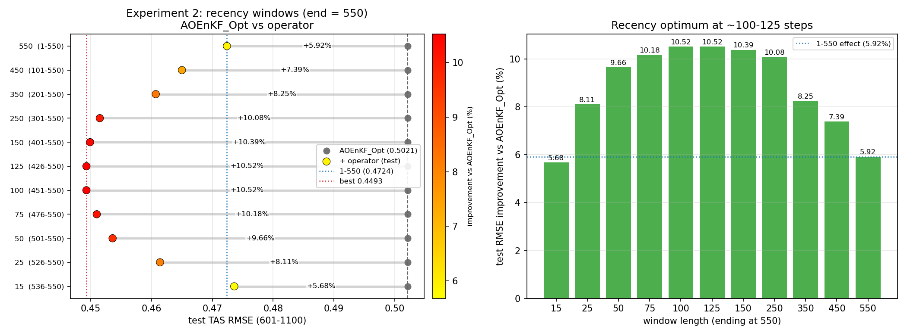

# 最小连续训练窗实验（min-window）

> 日期：2026-09-13 | 目录：`online_ml/loc_learning/`
> 目的：找出能复现（或超过）现有效果（train 1–550 → 评估窗 601–1100 的 TAS RMSE 0.4724）的**最小连续训练窗**。
> 固定协议：r=5、λ=1e-3、CELF、5 个随机种子、z3 用缓存；测试窗 601–1100 **只做最终评估**。

---

## 1. 协议

```
实验一（从 1 开始）：train = 1..W，val = W+1..W+50（紧邻），test = 601..1100
实验二（靠近测试窗）：train = a0+1..550，val = 551..600（紧邻），test = 601..1100
```

- AOEnKF_Opt（不修正的 canonical AOEnKF）test = **0.5021**；现有效果（1–550）= **0.4724**。
- 每个 (窗口, seed) 记录 train / val / test 的 RMSE；val 仅用于早停与"是否过拟合"的检查。
- 无任何基于测试集的选择；5 个种子的 std 均 ≤ 0.002。

---

## 2. 实验一：从 1 开始的最短窗（W = 1..W）

| W | train | val | **test** | 相对 AOEnKF_Opt |
|---|---|---|---|---|
| 10 | 0.1285 | 0.2631 | 0.5284 | −5.23% |
| 25 | 0.1788 | 0.2278 | 0.4939 | +1.65% |
| 50 | 0.1912 | 0.2160 | 0.4999 | +0.44% |
| 75 | 0.1979 | 0.2125 | 0.4938 | +1.66% |
| 100 | 0.2009 | 0.2133 | 0.4922 | +1.98% |
| 150 | 0.2052 | 0.2095 | 0.4866 | +3.09% |
| 200 | 0.2070 | 0.2179 | 0.4865 | +3.12% |
| 250 | 0.2092 | 0.2159 | 0.4858 | +3.26% |
| **300** | 0.2106 | 0.2102 | **0.4851** | **+3.40%** |
| 400 | 0.2114 | 0.2021 | 0.4822 | +3.97% |
| 450 | 0.2108 | 0.2213 | 0.4821 | +4.00% |
| 500 | 0.2121 | 0.2277 | 0.4807 | +4.27% |
| **550** | 0.2133 | 0.2452 | **0.4724** | **+5.92%** |

**结论（实验一）**：
- **W=300 达不到现有效果**（0.4851 vs 0.4724，差 0.0127）；W=400/500 仍达不到（0.4822/0.4807）。
- **从 1 开始的窗必须用满 550 步**才达到 0.4724。
- 极短窗（W=10）反而有害；W≥25 才开始稳定优于 AOEnKF_Opt。
- train 与 val 接近（多数 W 差 <0.02），无严重过拟合；W=10 除外（train 0.13 vs val 0.26）。



**图 F20.** 左：test RMSE 随 W（从 1 开始）的变化，含 AOEnKF_Opt（0.5021）与 1–550 参考（0.4724）及 ±0.005 带；右：train/val/test 随 W。**解读**：test 随 W 大致单调改善，但 500→550 出现明显跳变（0.4807→0.4724），提示最后一段（501–550）贡献很大——引出实验二。



**图 F22.** 实验一：窗口长度 W 与"相对 AOEnKF_Opt 的改良效果（%）"的柱状图（每根柱标注数值，蓝点线为 1–550 的 +5.92%）。**解读**：W=10 为负（−5.23%），W≥25 转正，随 W 增大逐步升至 W=550 的 +5.92%；W=300 仅 +3.40%。

---

## 3. 实验二：靠近测试窗的窗（end=550，变起点）

| train | 长度 | train | val | **test** | 相对 AOEnKF_Opt |
|---|---|---|---|---|---|
| 1–550 | 550 | 0.2133 | 0.2452 | 0.4724 | +5.92% |
| 101–550 | 450 | 0.2106 | 0.2385 | 0.4650 | +7.39% |
| 201–550 | 350 | 0.2076 | 0.2328 | 0.4607 | +8.25% |
| 301–550 | 250 | 0.2049 | 0.2268 | 0.4515 | +10.08% |
| 401–550 | 150 | 0.2019 | 0.2254 | 0.4499 | +10.39% |
| **426–550** | **125** | 0.2011 | 0.2246 | **0.4493** | **+10.52%** |
| **451–550** | **100** | 0.2005 | 0.2248 | **0.4493** | **+10.52%** |
| 476–550 | 75 | 0.1942 | 0.2251 | 0.4510 | +10.18% |
| 501–550 | 50 | 0.1852 | 0.2275 | 0.4536 | +9.66% |
| 526–550 | 25 | 0.1690 | 0.2336 | 0.4614 | +8.11% |
| 536–550 | 15 | 0.1500 | 0.2408 | 0.4736 | +5.68% |



**图 F21.** 左：test RMSE 随"最近窗长度"（终点固定 550）；右：随"窗起点"。**解读**：**起决定性作用的是"离测试窗有多近"，而不是窗有多长**。最近的 100–150 步（426–550 / 451–550）给出 **0.4493**，比用满 1–550（0.4724）还要好 0.023；甚至只用最近 15 步就达到现有效果（0.4736）。



**图 F23.** 实验二（靠近测试窗的窗，终点固定 550）的汇总。**左**：每个窗口的 test RMSE（彩点，颜色=改善幅度）相对 AOEnKF_Opt 0.5021（灰点）的 dumbbell 图，标注改善%；蓝点线=1–550(0.4724)、红点线=最好(0.4493)。**右**：改善%随窗口长度的柱状图（蓝点线=1–550 的 5.92%）。**解读**：全部窗口都优于 AOEnKF_Opt；改善随"最近窗长度"先升后降，在 **100–125 步达到最优 +10.52%**，短到 15 步仍 +5.68%（≈1–550 水平），拉长到 550 反而只有 +5.92%。

---

## 4. 结论

1. **若窗必须从 1 开始**：最小需 **W=550** 才达到 0.4724；W=300 只有 +3.40%，达不到。
2. **若允许选取最近的一段连续窗**（更合理）：
   - 达到"现有效果"（≈0.4724）只需最近 **~15 步**；
   - 达到"最好效果"只需最近 **~100–125 步**（**0.4493，+10.5%**），比现有 1–550 方案更好；
   - 继续拉长到 550 反而**变差**（0.4724），说明**较老的校准段稀释了修正**。
3. **修正具有强"近邻性"（非平稳）**：最能迁移到评估窗（深冰消）的是紧邻它的校准段；这与"局地化矩阵需要多气候态覆盖"的 rho_opt 结论不同——因为我们的学习对象是**分析增量的低秩修正**，其可迁移成分是**近期regime的结构性偏差**。

## 5. 建议

- 在本测试窗（601–1100）下，**操作窗口应取最近的 ~100–150 步**（如 401–550 或 451–550），可把评估窗 TAS RMSE 从 0.4724 进一步降到 **0.4493**（相对 AOEnKF_Opt −10.5%）。
- 若目标是"少用真值"：最近 **~25 步**即可优于现有效果（0.4614），最近 **~15 步**约等于现有效果（0.4736）。
- 后续可验证：在 Split B（反向，test 1–550）上是否同样由"靠近测试窗的近期段"最优，以确认这是普遍规律还是单向时间效应。

## 6. 产物

- `min_window.py`、`min_window_shifted.py`
- `results/min_window.npz|json`（实验一全量：U,V、逐时 RMSE、loss 历史、每 seed）
- `results/min_window_shifted.npz|json`（实验二全量）
- `results/figs/F20_min_window.png`、`results/figs/F21_recency_window.png`、`results/figs/F22_exp1_length_vs_improvement.png`、`results/figs/F23_recency_summary.png`
- 本报告 `results/REPORT5.md`
