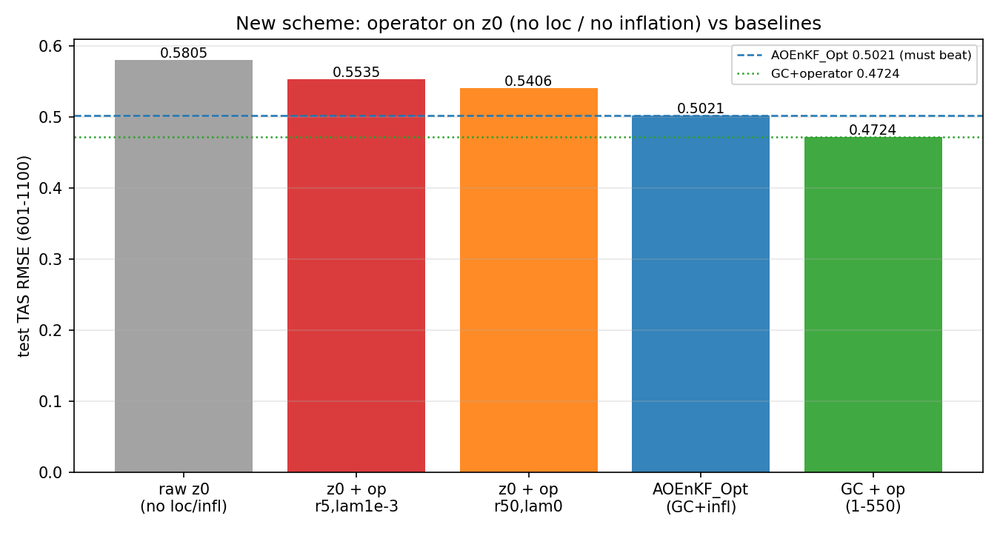
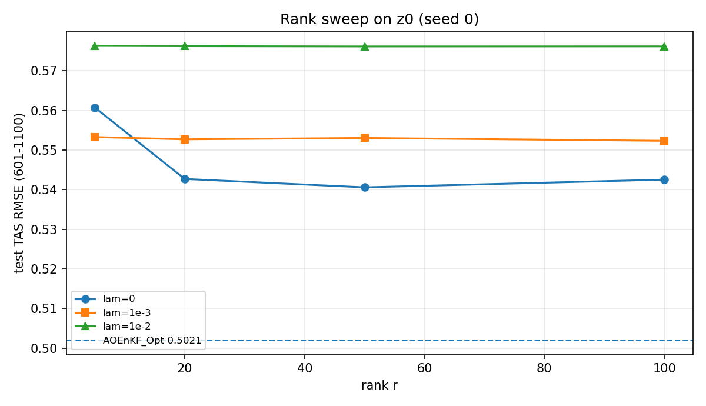

# 新方案：低秩算子直接作用于"无 loc / 无 inflation"的 AOEnKF

> 日期：2026-09-13 | 目录：`online_ml/loc_learning/`
> 目的：检验 `(I+UVᵀ)` 能否**取代** canonical AOEnKF 的局地化（GC 7500 km）与 inflation（1.5），即直接在"无 loc、无 inflation"的标准 AOEnKF 上学习修正，并**优于调参后的最优 AOEnKF_Opt（评估窗 0.5021）**。
> 判定：**否——低秩算子能把 raw z0 从 0.5805 改善到 0.5406，但仍显著劣于 AOEnKF_Opt 的 0.5021，无法取代 loc+inflation。**

---

## 1. 定义

```
AOEnKF_Opt（基线）: K=100 类比集合 + GC 7500 km + inflation 1.5（串行 EnSRF）
                    test 601-1100 TAS RMSE = 0.5021

新方案           : K=100 类比集合 + 无局地化(cmat=1) + 无膨胀(eta=1)
                    → z0 = xa_raw - xf
                    → xa = xf + z0 + U (V^T z0)        # 严格只用 (I+UV^T)
```

公式（逐观测串行 EnSRF，新方案）：

```
A' = A - Abar                         # eta = 1（无 inflation）
h_i = A'[n+i]; nu_i = (1/(K-1)) h_i·h_i + R_i
PHT_i = (1/(K-1)) A' h_i
kg_i = PHT_i / nu_i                   # c_i = 1（无 loc）
Ab  = Ab + kg_i (y_i - Ab[n+i]);  A' = A' - f_i kg_i h_i
z0 = Ab[1:n] - xf ;  xa = xf + z0 + U (V^T z0)
```

训练：CELF + λ(‖U‖²+‖V‖²)，Adam lr=1e-3，5000 epoch，U,V 随机小初始化；
划分与最初 operator **完全相同**：train 1–550 / val 551–600 / test 601–1100。

---

## 2. 结果（test 601–1100 TAS RMSE）

| 方案 | train | val | **test** |
|---|---|---|---|
| raw z0（U=V=0，无 loc/infl） | 0.2693 | 0.2997 | **0.5805** |
| z0 + operator（r=5, λ=1e-3, 5 seeds） | 0.2304 | 0.2745 | **0.5535 ± 0.0003** |
| z0 + operator（r=50, λ=0） | — | — | **0.5406** |
| z0 + operator（r=100, λ=0） | — | — | 0.5425 |
| **AOEnKF_Opt（GC+infl）** | — | — | **0.5021** ← 必须被超越 |
| GC + operator（原方案，1–550） | 0.2133 | 0.2452 | 0.4724 |

秩扫描（seed 0，test）：

| r | λ=0 | λ=1e-3 | λ=1e-2 |
|---|---|---|---|
| 5 | 0.5607 | 0.5533 | 0.5763 |
| 20 | 0.5427 | 0.5527 | 0.5762 |
| 50 | **0.5406** | 0.5530 | 0.5761 |
| 100 | 0.5425 | 0.5523 | 0.5762 |



**图 F24.** raw z0、z0+算子（r5/r50）、AOEnKF_Opt、GC+算子 的 test RMSE 对比；蓝虚线=必须超越的 0.5021，绿点线=原方案 0.4724。**解读**：算子把 raw z0 从 0.5805 降到 0.5406（+0.040），但**仍高于 0.5021**；差距 0.038 未被补回。



**图 F25.** 秩扫描（seed 0）：test RMSE 随 r 的变化。**解读**：r 从 5 增到 50 有改善（0.5607→0.5406），r=100 不再改善（0.5425）→**饱和**；λ=0 在大 r 时最好。即使 r=100 也远高于 0.5021。

---

## 3. 结论与诊断

1. **判据未通过**：新方案最好 0.5406 > 0.5021，**无法取代 loc+inflation**。
2. **算子确有作用但不足**：raw z0 0.5805 → +算子 0.5406（补回约 0.040），而 loc+infl 的总贡献是 0.5805−0.5021 = **0.078**，算子只补回了约一半。
3. **秩饱和**：r=50 后不再改善，说明瓶颈不是秩，而是**全局静态低秩算子无法表达局地化的空间非均匀、逐观测的采样噪声压制**（局地化本质是一个 n×M 级的、随距离/观测变化的结构，而非少数全局方向）。
4. **与之前结论一致**：局地化 headroom <0.3%（GC 已近最优），且"学局地化"（阶段①②）无法超越 GC；本实验进一步表明，**去掉 loc+infl 后，低秩算子也补不回**。
5. **λ 行为**：r=5 时 λ=1e-3 最好；r≥20 时 λ=0 最好（更大秩需要更小正则）。

---

## 4. 产物

- `build_serial_analysis_z0.py`：生成 z0（无 loc/infl），1544 s。
- `z0_new_scheme.py`：训练/扫描/评估。
- `/data1/wbgu/agentdata/loc_learning/matrix_cache_serial_z0.npz`
- `results/z0_new_scheme.npz|json`（U,V、逐时 RMSE、5 seeds、秩扫描）
- `results/figs/F24_z0_scheme_bars.png`、`results/figs/F25_z0_rank_sweep.png`
- 本报告 `results/REPORT6.md`

## 5. 结论一句话

**低秩 `(I+UVᵀ)` 能部分修复"无 loc/无 inflation"的 AOEnKF（0.5805→0.5406），但补不回 loc+inflation 的全部作用，评估窗仍显著劣于 AOEnKF_Opt（0.5021）——该形式无法取代 loc+inflation。**
