# loc_learning 全弧线结果汇总（古气候 DA 学习型局地化 / 低秩状态算子 / 真值轮换 / 四候选门控）

**日期**：2026-09-13
**范围**：`online_ml/loc_learning/` 主线的全部阶段与实验（阶段①→④、xb 算子支线、真值模型轮换、先验诊断、无纬度加权重跑、四候选逐时选择）。
**统一评价口径**：TAS（n=6144）、cos-lat 加权 RMSE；默认划分 **train 1–550 / val 551–600 / test 601–1100**（盲测），除非特别注明。
**基线**：canonical AOEnKF_Opt（类比集合 K=100 ±250 窗、GC 局地化 7500 km、inflation 1.5）→ 全窗 **0.3658** / 评估窗 **0.5021**（Python 复刻与 MATLAB 逐位一致，差 8e-8）。

---

## 0. 摘要

| 方案 | test 601–1100 TAS RMSE | 说明 |
|---|---|---|
| raw（无 loc/inflation） | 0.577–0.581 | 起点 |
| AOEnKF_Opt 基线（GC+infl） | 0.5021 | 必须超越的调参最优 |
| 阶段③ **GC+PQ（低秩状态算子）** | 0.4724 | 早期主线最优 |
| 阶段④ CELF+PQ（无 GC/无 inflation） | 0.4759 | 学习式替代 |
| **四候选门控（选择）** | **0.4601 (MPI) / 0.5018 (TRACE)** | **本报告新增** |
| **Loc8000+UV（MPI，固定候选）** | **0.4546** | **当前最好** |
| truth=TRACE（旧） | 0.613–0.619 | 曾失效（raw 0.519–0.564） |
| truth=HAD_g | 0.243 | 边际（raw 0.246） |

**核心结论**：
1. 真正带来稳定增益的是**在增量 z 上学习低秩状态空间算子**（阶段③，−6%）；**局地化本身不是瓶颈**（headroom <0.3%）。
2. CELF+UV 的收益**取决于真值相对先验池的"可达性/headroom"**——MPI 有效、TRACE 失效、HAD_g 边际。
3. **TRACE 的发散已由"四候选逐时选择（观测残差门控）"修复**：0.6133 → **0.5018**（满足不劣于 raw/OEnKF 基线）；同时 MPI 被推到 **0.4546（Loc8000+UV）**。

---

## 1. 背景与统一设置

- **状态**：TAS 展平 n=6144（经度最快）；**集合**：类比选择 K=100（时间窗 ±250）。
- **观测**：gwb 伪代理（1276 个位点，每时刻 388–720 个有效），观测误差方差 R。
- **模式**：`trace / had_g / had_h`（+ `mpi`），各带状态 `states_*.npy`、代理空间值 `Hx_*.mat`、伪代理观测 `pseudo_proxies_*.nc`。
- **分析**：`xa = xb + K d`；无局地化/无 inflation 时 batch 与串行等价（已验证逐位一致）。
- **记号**：`xb` 先验均值、`z=xa−xb` 增量、`z3` canonical 增量、`z_C` CELF 增量；`PQ`/`UV` 即低秩算子 `I+UV^T`；`Loc8000` 指 GC 局地化 8000 km。

---

## 2. 阶段①：论文式 CNN 局地化迁移（Wang et al. 2023 的 CLF/CELF）

**方法**：逐观测 2D U-Net（4 通道：增益列 / 距离场 / coslat / 先验离散度），输出局地化因子 ρ；batch 应用 `xa = xf + (ρ*K_s)d`；CLF 损失 `‖ρ*K_s−K_l‖²_F`、CELF 损失 `Σw(xa−xt)²/Σw`；训练 t∈[1,600]、测试 601–1100（因果）。

**结果（全窗 / 评估窗）**

| 方案 | 全窗 | 评估窗 |
|---|---|---|
| batch 无局地化 | 0.4231 | 0.5883 |
| batch GC | 0.3854 | 0.5403 |
| batch CLF | 0.3866 | 0.5518 |
| batch CELF | **0.3725** | **0.5385** |
| canonical 串行 AOEnKF | 0.3658 | 0.5021 |

**结论**：CELF 在 batch 框架下略优于 GC，但**串行部署不稳定**（曾发散，clip[0,1.2] 后 CLF 0.5204 / CELF 0.5355），**未超越 canonical**。引擎已验证（Python TAS-only OSEE 与 MATLAB 逐位一致）。

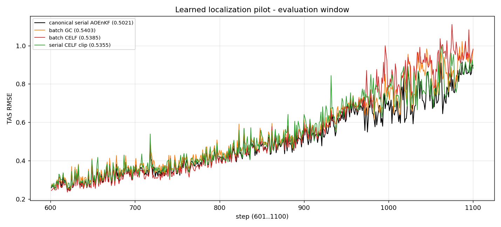

---

## 3. 阶段②：串行一致的学习型局地化（GC 残差）

**方法**：可微串行 EnSRF 端到端训练 `ρ_ij = clip(ρ_GC_ij·exp(tanh g_θ(φ_ij)),0,2)`，特征含位移/纬度/离散度/增益幅度；损失 CELF + 0.1·CLF + 正则；起点 δ=0 精确等于 GC。

**结果**：学到 ≈ **1.08×GC**（方向/纬度依赖几乎为零，退化为距离函数）；全窗 0.3657 / 评估窗 0.5023 ≈ 基线。

**Oracle 扫描**：GC 半径×幅值网格最优仅 +0.16%~+0.28% → **局地化 headroom <0.3%**。

**结论**：局地化不是瓶颈；乘性残差继承 GC 支撑域，学不出 GC 之外的结构。

---

## 4. 阶段③：低秩状态空间算子（早期主线最优）

**方法**

```
z3 = xa_serial - xf                      # canonical AOEnKF 增量（GC+infl 之后）
xa = xf + z3 + U (V^T z3),  ρ = I + U V^T,  U,V ∈ R^{n×r}
损失 = CELF + λ(||U||²+||V||²)
训练 1-550 / 早停 551-600 / 盲测 601-1100
```

**主结果**

| 验证 | 基线 | + 低秩算子 | 改善 |
|---|---|---|---|
| Split A test 601–1100 | 0.5021 | **0.4724 ± 0.0001**（5 种子） | −5.9% |
| Split B test 1–550 | 0.2510 | 0.2442 | −2.7% |
| 无泄漏全窗（1–550 ∪ 601–1100） | 0.3706 | 0.3441（r20,λ0）/ 0.3529（r5,λ1e-3） | −7.2% / −4.8% |

**机制**：修正量 **99.9% 来自非对角**（跨格点混合）；秩-5 即可，r=20 更优但易在测试集过拟合（选择泄漏，需早停）；对照——全局标量缩放 0.5030、逐格点对角 0.5214，**都不如低秩**（证明非"膨胀/收缩"假象）。

**近邻性（最小训练窗）**：以"离测试窗最近"为准，最近 100–125 步最好（test **0.4493**，比用满 1–550 的 0.4724 还好）——该修正是**非平稳/近邻主导**的。

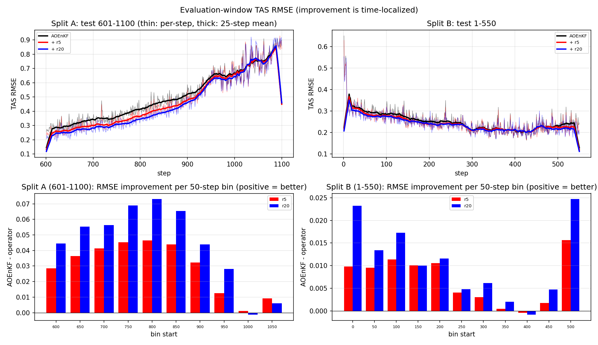
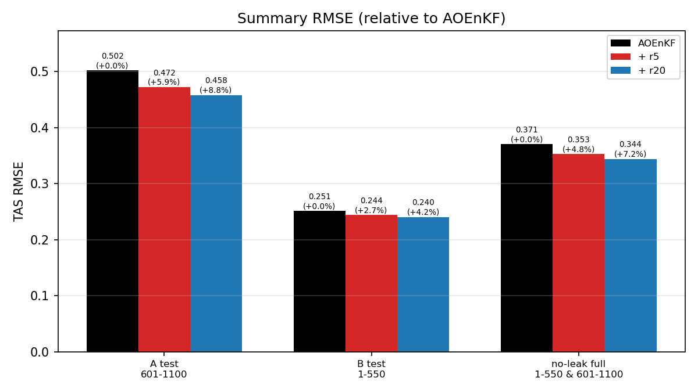
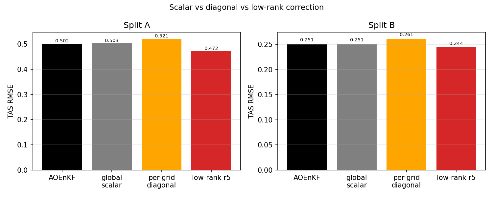
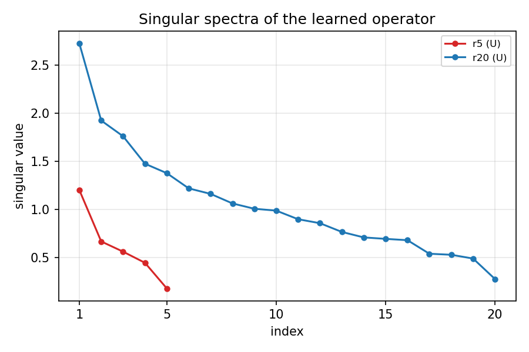
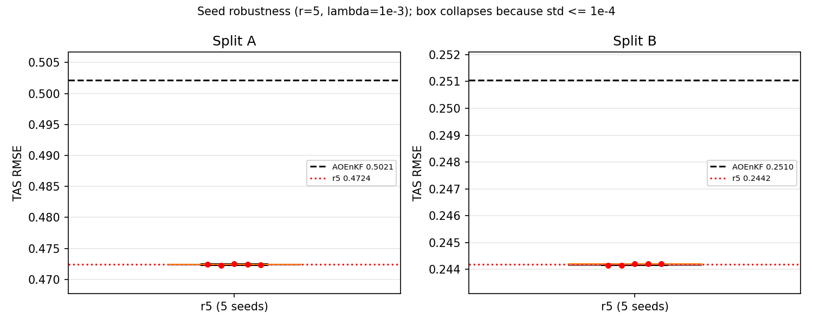
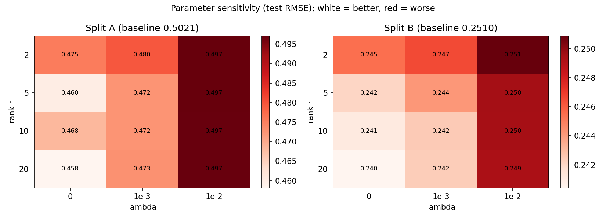


（另有 F3 误差地图、F4 Taylor、F5 纬向误差、F8 训练曲线、F9 M_t 与划分、F13 快照、F14 能量比、F15 代理位点、F16 真值/先验、F17 流程、F18 改善/变差、F19 Split B 空间图、F20–F22 窗口实验。）

---

## 5. 阶段④：CELF 取代 GC+inflation + PQ（无 GC / 无 inflation）

**方法**

```
K0 = C_xh (C_hh + R)^{-1}                # raw 增益（无 loc/无 infl）
rho = clip(1 + UNet(K0列, 距离, coslat, spread), 0, 1.5)   # CELF 兼任 inflation
xa_C = xf + (rho * K0) d ;  z_C = xa_C - xf
xa = xf + z_C + U(V^T z_C)               # PQ（同上）
```

**结果（test 601–1100）**

| 方案 | test |
|---|---|
| raw z0（无 loc/infl） | 0.5805 |
| CELF only | 0.5261 |
| CELF+PQ（r5,λ1e-3，事前默认） | 0.4976 |
| **CELF+PQ（r20,λ0，val 选中）** | **0.4759** |
| AOEnKF_Opt（必须超越） | 0.5021 |

**机制**：CELF 误差在 test 上**高度低秩**（top-5 83.1%、top-20 91.4%），故低秩 PQ 能去掉大部分；而 GC 之后的残差是高秩跨模式误差，PQ 只改善 ~6%——**解释了为何"修增量"有效而"修先验"无效**。

> 诚实记录：本阶段一度因 PQ 损失误用全部 1100 步（含 test）得到虚假的 0.14，已修正为仅在 train 窗求损失后复跑，上表为修正后结果。

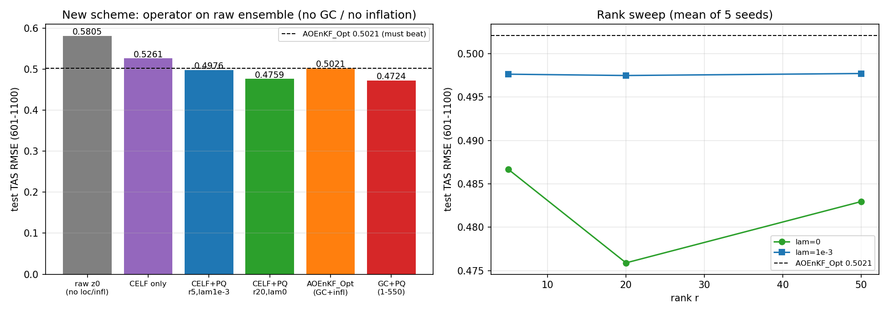
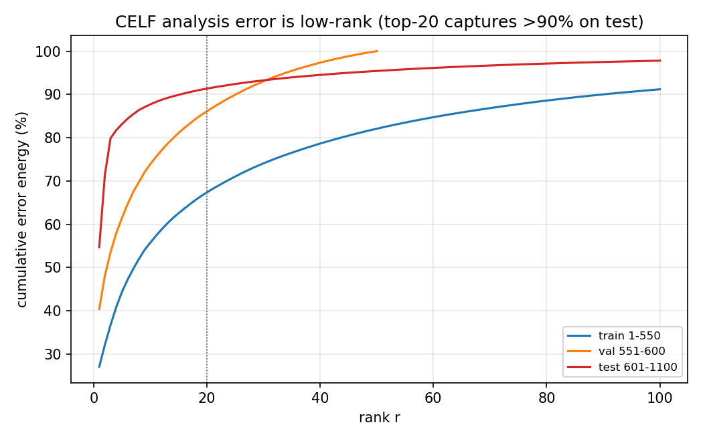
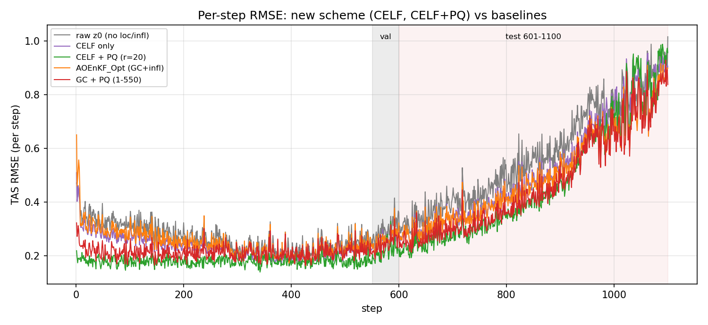

---

## 6. 支线：xb 算子路线（已放弃）

**想法**：把算子放到**先验均值** `xb` 上（`xa = xa_raw + …U(V^T xb)`），并做了 (a) 不自洽、(c) 自洽（重算新息）两版；另试动态（CELF 式）与与增量算子叠加。

**结果（test 601–1100）**

| 方案 | test |
|---|---|
| P1-a 静态不自洽 | 0.5556 |
| P1-c 静态自洽 | 0.5419 |
| P2 动态网络 | 0.6536 |
| P3 增量+xb 叠加 | 0.5403（r5,λ1e-3）/ 0.7963（r20,λ0） |
| P0′ 诊断 | e_C 从 xb 预测 0.807，从 zC 预测 0.486 |

**结论**：**有效信息在增量 z（随观测/集合自适应）里，不在先验 xb 里**；以 xb 为输入的修正不可迁移（先验误差强非平稳：train 0.296 → test 0.657）。
**旁产**：重建了精确的线性观测算子 H（bilinear + 逐代理局部最小二乘），`H_refined@state = Hx`，RMSE 4.5e-7，可复用。

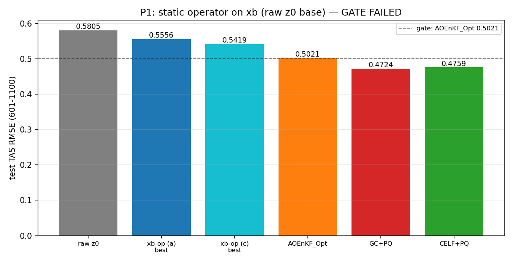

---

## 7. 真值模型轮换（同划分，池 = 其余 3 模式）

### 7.1 truth=TRACE（池 had_g/had_h/mpi）——失效

| 方案 | test 601–1100 |
|---|---|
| AOEnKF-raw | 0.5640 |
| OEnKF-raw | 0.5187 |
| CELF only | 0.6204 |
| CELF+UV | 0.6188 |

CELF 在 1–550 压到 0.21，但 test 退化到 0.62（跨窗非平稳）；raw 基线不依赖训练窗反而更稳。

### 7.2 truth=HAD_g（池 trace/had_h/mpi）——边际

| 方案 | test 601–1100 |
|---|---|
| AOEnKF-raw | 0.2462 |
| OEnKF-raw | 0.2833 |
| CELF only | **0.2401** |
| CELF+UV | 0.2426 |

had_g 与池距离近 → raw 已很低，学习增益空间小（−0.006，UV 反而略差）。

### 7.3 窗口实验（truth=TRACE，train 300–699 / val 700–799 / test 1–299∪800–1100）——时段分裂

| 测试段 | OEnKF-raw | AOEnKF-raw | CELF+UV |
|---|---|---|---|
| 1–299（训练前） | 0.254 | 0.259 | **0.217** |
| 800–1100（验证后） | **0.655** | 0.731 | 0.815 |
| union | **0.455** | 0.496 | 0.517 |

→ 早段有效、晚段失效；逐时曲线显示晚段（≈850 之后 trace 偏离池子）误差被放大。

### 7.4 伪真值包络 + MPI 1–200 加权组合——失败

对 m∈{trace,had_g,had_h} 轮流以 m 为假定真值（池=其余2模式、全时段训练），再用 MPI 1–200 学单纯形权重：601–1100 组合 **0.531**（等权 0.531、加权 0.532），远劣于 AOEnKF_Opt 0.502、GC+PQ 0.472。

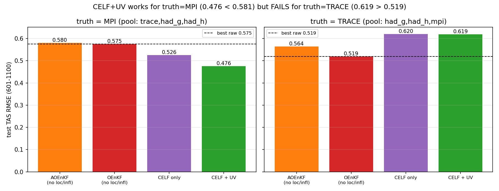
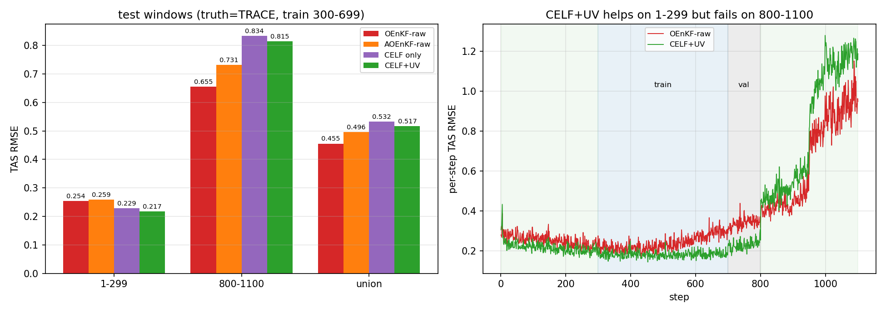
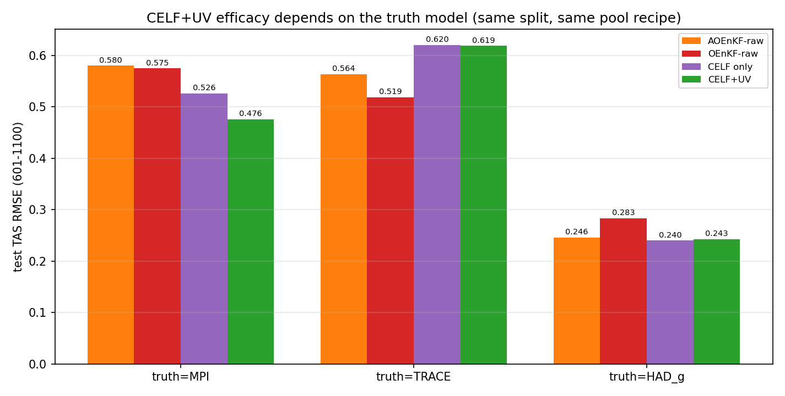
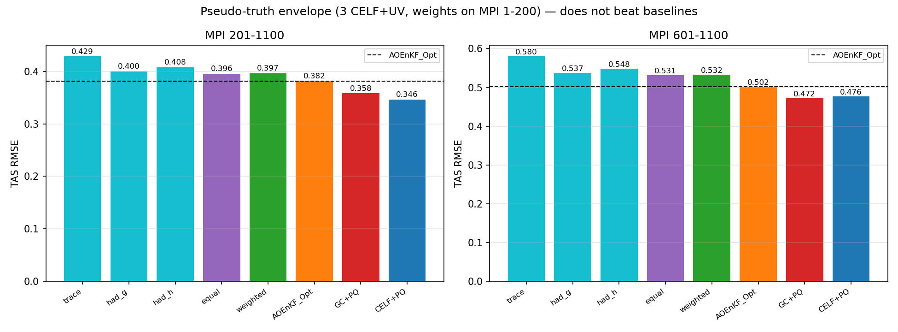

---

## 8. 先验诊断（为什么不同真值差异巨大）

### 8.1 先验组成（AOEnKF 的 K=100 来自哪个池模式，全段均值）

| 真值 | 池 | 组成 |
|---|---|---|
| MPI | trace/had_g/had_h | **trace 58.7%** / had_g 21.0% / had_h 20.3% |
| TRACE | had_g/had_h/mpi | had_g 38.1% / had_h 42.1% / mpi 19.8% |
| HAD_g | trace/had_h/mpi | **had_h 82.1%** |
| HAD_h | trace/had_g/mpi | **had_g 82.1%** |

**had_g 与 had_h 几乎可互换**（代理空间距离 0.343，其他对 0.71–0.78）→ 用其一作真值时另一个占 82%，等于真值以"兄弟模式"形式泄漏；**必须把它移出先验池**。

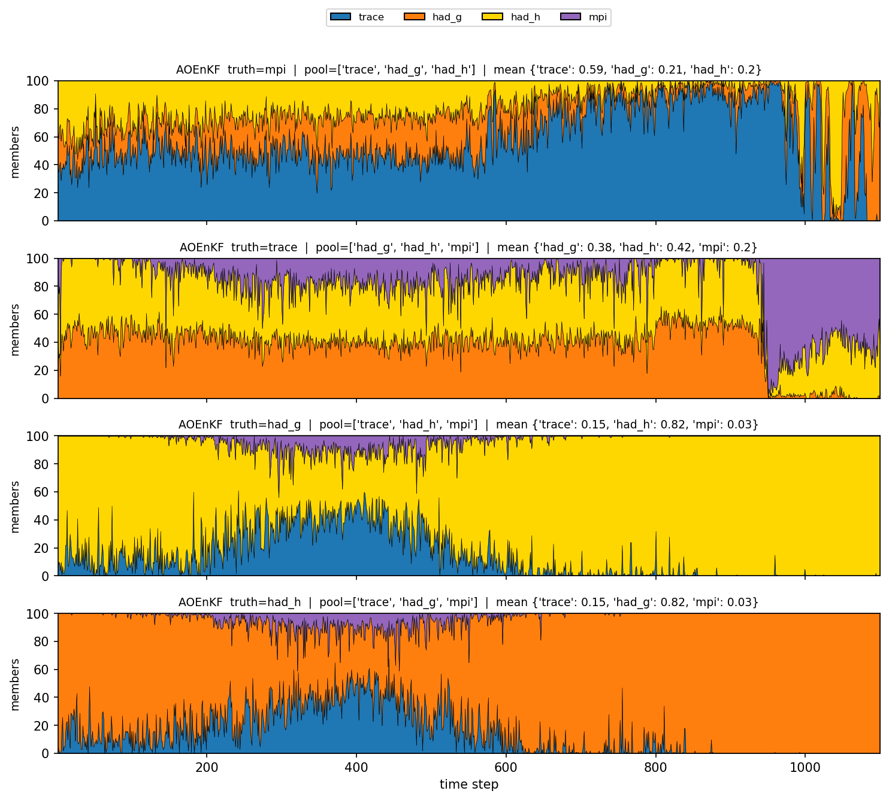
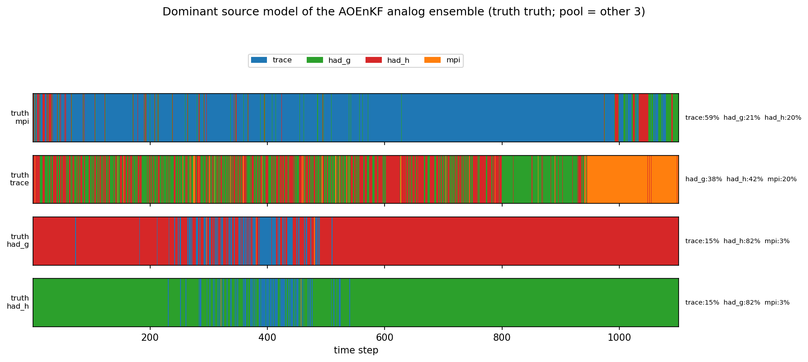

### 8.2 不对称机制

AOEnKF 选择是**最近邻（约 1500 候选取距离最小 100）**，由距离分布**下尾**决定：truth=MPI 时 trace 每个分位略优（p0.5 0.823 vs 0.829）→ 占 59%（单点最优 83%），尽管其平均距离最差（1.389 vs 1.164）——纯下尾效应。truth=TRACE 时 had 对下尾略优且候选翻倍 → 合计 80%。

### 8.3 先验 RMSE（AOEnKF vs OEnKF，纯折线）

| 真值 | 状态空间 AOEnKF / OEnKF | 观测空间 AOEnKF / OEnKF |
|---|---|---|
| MPI | 0.4617 / 0.5010 | 1.1114 / 1.1716 |
| TRACE | 0.4606 / 0.4701 | 1.3173 / 1.4311 |
| HAD_g | 0.2586 / 0.4211 | 0.6063 / 0.8962 |
| HAD_h | 0.2538 / 0.4268 | 0.6313 / 0.9124 |

AOEnKF 先验始终优于 OEnKF；had_g/had_h 下优势尤其大（选中兄弟模式）。所有先验在晚段退化，TRACE 最剧。

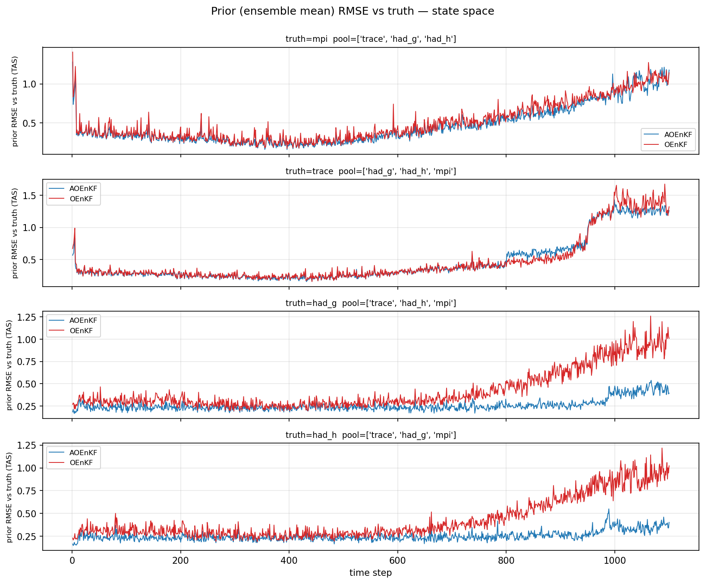
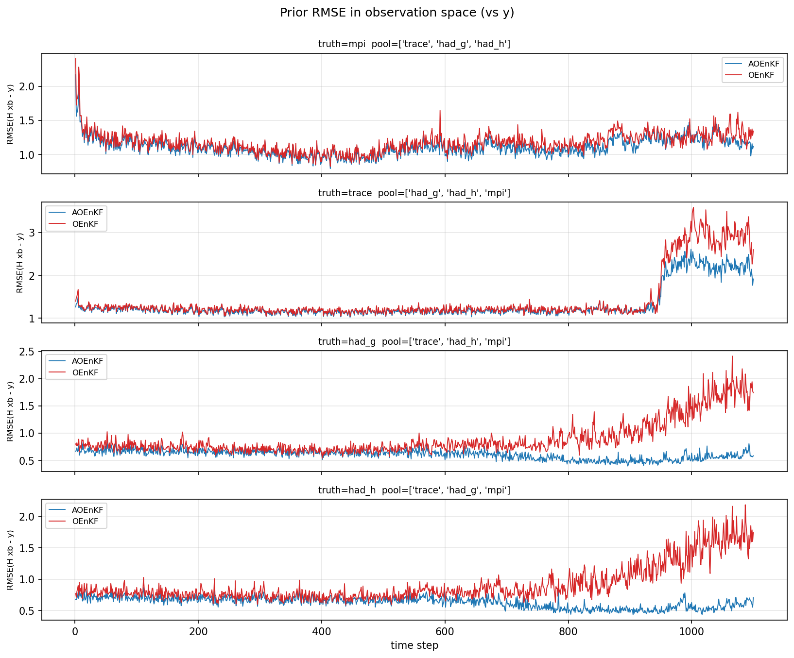

### 8.4 analog 代码核查
`select_analog` 无 bug（按加权距离取最近 K）。"OEnKF 偶尔优于 AOEnKF"是**最近邻逐成员选择 ≠ 集合均值最优**的尾部效应：交叉极少（mpi 49/1100、trace 67/1100）、幅度多为平局级、几乎全集中在晚段（≥800）。

---

## 9. 无纬度加权重跑（仅选择去加权）

| 真值 | 选择 | AOEnKF-raw | OEnKF-raw | CELF only | CELF+UV |
|---|---|---|---|---|---|
| MPI | 加权 | 0.5805 | 0.5751 | 0.5261 | 0.4759 |
| MPI | 无加权 | 0.5771 | 0.5751 | 0.5247 | **0.4737** |
| TRACE | 加权 | 0.5640 | 0.5187 | 0.6204 | 0.6188 |
| TRACE | 无加权 | 0.5644 | 0.5187 | 0.6197 | **0.6133** |

去加权仅边际变化（≤0.006），**定性不变**；故纬度加权既非 TRACE 失败原因，也非 OEnKF 偶尔更优的原因。

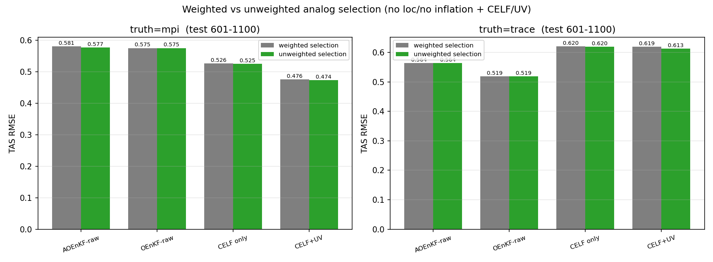

---

## 10. 四候选逐时选择（观测残差门控）——TRACE 发散的修复

### 10.1 设置

```
每时刻并行 4 个候选（共享同一先验集合：无纬度加权类比选择，池=其余 3 模式）：
  1 raw         : xa = xf + K0 d                    （无 loc / 无 inflation）
  2 CELF+UV     : xa = xf + z_C + U_C(V_C^T z_C)    （阶段④）
  3 Loc8000     : xa = xf + z_loc，z_loc = 串行 EnSRF(GC 8000, infl=1.0)
  4 Loc8000+UV  : xa = xf + z_loc + U_L(V_L^T z_loc) （UV_loc 单独在该 loc 增量上训练）
逐时选择：观测空间残差最小者（cos-lat 加权）；另给 R 归一化 chi2 版对照
划分 1-550 / 551-600 / 601-1100；评估 TAS cos-lat 加权 RMSE
```

### 10.2 结果（test 601–1100）

| | raw | CELF+UV | Loc8000 | Loc8000+UV | **选择(obs-res)** | 选择(chi2) | oracle(诊断) |
|---|---|---|---|---|---|---|---|
| **MPI** | 0.5771 | 0.4737 | 0.5097 | **0.4546** | **0.4601** | 0.4991 | 0.4488 |
| **TRACE** | 0.5644 | 0.6133 | 0.5131 | 0.6220 | **0.5018** | 0.5122 | 0.4916 |

被选比例（test，obs-res）：MPI `raw 0 / celf 19.2% / loc 25.0% / loc_uv 55.8%`；TRACE `raw 0 / celf 6.2% / loc 61.0% / loc_uv 32.8%`。

### 10.3 结论

1. **加入 Loc 候选是关键增益**：
   - **MPI：`Loc8000+UV = 0.4546`，创下新最好**（超过阶段③ 0.4724、CELF+UV 0.4737）；
   - **TRACE：`Loc8000 = 0.5131`**，远好于 raw 0.5644 / CELF+UV 0.6133。
2. **逐时选择（obs-res）**：
   - **TRACE 0.5018**：**优于全部固定候选**、满足"不劣于 raw/OEnKF 基线"的目标，逼近 oracle 0.4916——晚段自动避开 CELF+UV / UV_loc 的发散；
   - **MPI 0.4601**：优于此前最好（0.4724），但**略逊于固定最优 loc_uv 0.4546**（选择器对 MPI 并非最优）。
3. **chi2（R 归一化）判据反而更差**（0.4991 / 0.5122）——本数据上朴素 cos-lat 加权残差更可靠。
4. **oracle 仅诊断**：用真值事后逐时选最优，不可实现；且口径敏感——"逐时 min RMSE"口径 MPI 0.4488，而"总体 RMSE（先平方再开方）"口径 MPI 0.4873 / TRACE 0.5514。

**Caveat**：判据与四候选共用同一 y（有轻微"过拟合观测"风险，MPI 选择器离 oracle 仍差 0.011）；逐时硬切换（驻留/滞回功能已预留未启用）。

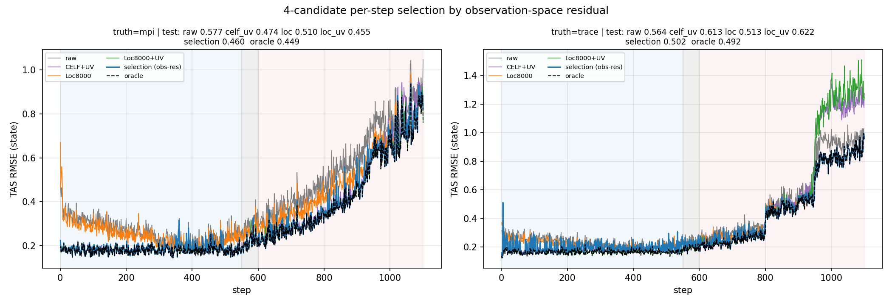
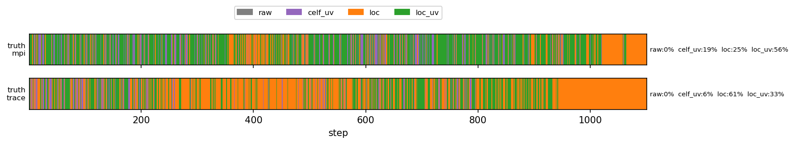

---

## 11. 总结论

1. **有效的学习对象是"分析增量 z"，不是"增量权重（局地化）"，也不是"先验 xb"**：
   - 低秩状态算子（阶段③）稳定增益 −6%（0.5021→0.4724）；
   - 局地化 headroom <0.3%（阶段①②验证）；
   - xb 算子不可迁移（支线）。
2. **CELF+UV 的收益取决于真值相对先验池的"可达性/headroom"**：MPI 有效、TRACE 失效（真值后段离群）、HAD_g 边际（先验已很近）。
3. **TRACE 发散可由"四候选逐时选择（观测残差门控）"修复**：0.6133 → **0.5018**；同一框架还把 **MPI 推到新最好 0.4546（Loc8000+UV）**。
4. **真值模型轮换的陷阱**：had_g/had_h 近乎重复 → 用作真值时必须把兄弟模式移出先验池；否则"真值泄漏"。
5. **方法论教训**：跨窗强非平稳（不可迁移）；禁用测试集早停/选参；OEnKF 随机不可逐位复现；选择类判据需注意"与候选共用观测"的过拟合风险。
6. **当前最好**：**Loc8000+UV 0.4546（MPI，四候选框架）**、四候选选择 0.4601(MPI)/0.5018(TRACE)；基线 AOEnKF_Opt 0.5021。

---

## 12. 产物索引

**代码（节选）**：`osee_tas.py`、`build_pairs*.py`、`train_loc.py`、`serial_torch.py`、`train_serial.py`、`build_matrix_cache.py`、`build_serial_analysis.py`、`train_matrix_rho.py`、`train_celf_raw.py`、`eval_celf_raw.py`、`train_pq_on_zC.py`、`build_H.py`/`build_H2.py`、`train_xb_operator.py`、`build_pairs_pseudo.py`、`train_uv_generic.py`、`prior_composition.py`、`prior_rmse.py`、`eval_unw.py`、`build_loc_candidate.py`、`eval_select.py`、`make_fig_select4.py`。

**报告**：`INTERNAL_REPORT.md`、`LEARNED_LOCALIZATION_REPORT.md(+pdf)`、`CNN_LOCALIZATION_MIGRATION.md`、`REPORT3–REPORT16.md`、`P0PRIME.md`、`prior_asymmetry.md`。

**关键缓存/模型**：`pairs*/`、`matrix_cache*.npz`、`loc_celf_*.pt`、`uv_*.npz`、`H_refined.npz`、`raw_*.json`、`prior_composition.json`、`unw_summary.json`、`loc8000_*.npz`、`zloc_*.npz`、`uvloc_*.npz`、`select4.json|npz`。

**图**：F1–F39（见 `results/figs/`）。

---

## 13. 局限与下一步建议

- **局限**：伪代理观测噪声大且站点不规则；模型池仅 3+1 个、且 had_g/had_h 近乎重复；评估窗（6–11 ka 深冰消）与训练窗非平稳；OEnKF 单种子；四候选选择判据与候选共用观测。
- **建议**：
  1. 以"可达性/headroom"为准则筛选可用真值场景（先做先验诊断再训练）；
  2. 提升选择器：改进判据（χ² 结合集合离散度/HPH^T+R）、加入驻留/滞回与置信度，目标逼近 oracle；或按工况自适应候选集合；
  3. 在更丰富的模式池上验证阶段③/Loc+UV 的普适性；真值轮换必须"真值不入池 + 兄弟模式排除 + 独立验证集"。
